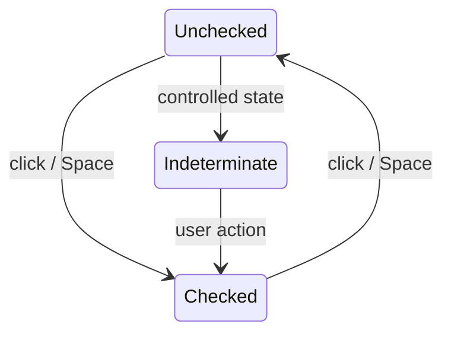

<Callout type="idea" title="文件定位">

Checkbox 把复杂的键盘、选中和表单语义交给 Radix。包装层只决定尺寸、颜色和 Check 图标，不重新实现状态逻辑。

</Callout>

## 这个文件负责什么

- 支持受控与非受控 checked。
- 支持键盘与焦点管理。
- 显示选中指示器。
- 兼容 disabled 和 aria-invalid。
- 透传 Radix Root 属性。

## 执行思路

1. Root 接收 checked/defaultChecked。
2. 用户点击或按空格改变状态。
3. Radix 更新 data-state。
4. Indicator 根据状态显示图标。

## 与其他模块的关系

| 模块 | 关系 |
| --- | --- |
| `@radix-ui/react-checkbox` | 行为与无障碍。 |
| `lucide-react` | CheckIcon。 |
| `FormControl` | 可作为表单受控字段。 |

## 导出 API

| 导出 | 类型 | 用途 |
| --- | --- | --- |
| `Checkbox` | `component` | 完整复选框。 |

## 组合结构

```tsx title="usage.tsx"
<div className="flex items-center gap-2">
  <Checkbox id="terms" />
  <Label htmlFor="terms">Accept terms</Label>
</div>
```



## 带注释源码

> 原始路径：`frontend/src/components/ui/checkbox.tsx`。以下仅增加学习性注释，不改变程序行为。

```tsx title="checkbox.tsx" lineNumbers
import * as React from "react"
import * as CheckboxPrimitive from "@radix-ui/react-checkbox"
import { CheckIcon } from "lucide-react"

import { cn } from "@/lib/utils"

// Radix Root 负责 checked、indeterminate、键盘和表单语义。
function Checkbox({
  className,
  ...props
}: React.ComponentProps<typeof CheckboxPrimitive.Root>) {
  return (
    <CheckboxPrimitive.Root
      data-slot="checkbox"
      className={cn(
        "peer border-input dark:bg-input/30 data-[state=checked]:bg-primary data-[state=checked]:text-primary-foreground dark:data-[state=checked]:bg-primary data-[state=checked]:border-primary focus-visible:border-ring focus-visible:ring-ring/50 aria-invalid:ring-destructive/20 dark:aria-invalid:ring-destructive/40 aria-invalid:border-destructive size-4 shrink-0 rounded-[4px] border shadow-xs transition-shadow outline-none focus-visible:ring-[3px] disabled:cursor-not-allowed disabled:opacity-50",
        className
      )}
      {...props}
    >
      {/* Indicator 只在 checked/indeterminate 状态出现。 */}
      <CheckboxPrimitive.Indicator
        data-slot="checkbox-indicator"
        className="grid place-content-center text-current transition-none"
      >
        <CheckIcon className="size-3.5" />
      </CheckboxPrimitive.Indicator>
    </CheckboxPrimitive.Root>
  )
}

export { Checkbox }
```

## 阅读重点

- 复选框必须与可见 Label 关联，单独图标框没有足够语义。
- Radix 状态可能包含 indeterminate，不要只假设 boolean。
- 受控组件需要同时传 checked 与 onCheckedChange。
- 错误状态应由字段容器同时展示文字说明。
