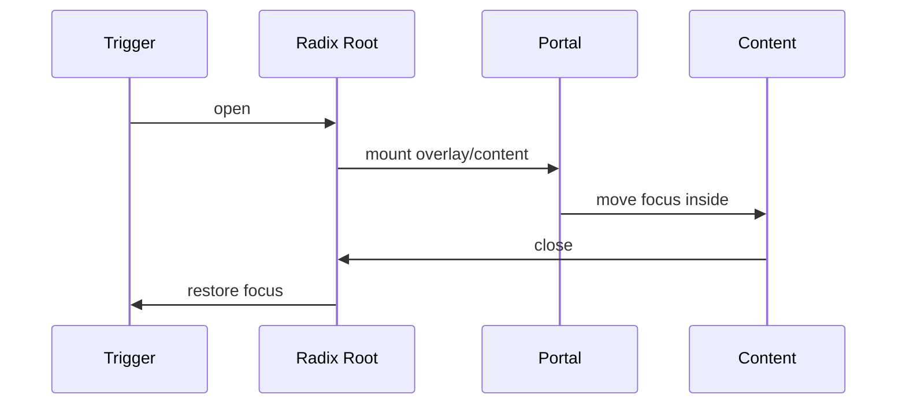

<Callout type="idea" title="文件定位">

Dialog 用于必须先处理才能返回主界面的模态任务，例如删除确认。Radix 负责焦点捕获、Escape 关闭、ARIA 关联和 Portal；包装层负责动画与布局。

</Callout>

## 这个文件负责什么

- 提供受控/非受控 open 状态。
- 把浮层渲染到 Portal。
- 显示遮罩和居中内容。
- 锁定并恢复焦点。
- 提供可访问 Title/Description。
- 提供默认关闭按钮。

## 执行思路

1. Trigger 请求打开 Root。
2. Portal 挂载 Overlay 与 Content。
3. Radix 将焦点移入 Dialog。
4. 用户提交、点击关闭或按 Escape。
5. 关闭后焦点返回 Trigger。

## 与其他模块的关系

| 模块 | 关系 |
| --- | --- |
| `@radix-ui/react-dialog` | 模态行为与无障碍。 |
| `DeleteConfirmation` | 账户删除确认。 |
| `Admin/Items dialogs` | CRUD 表单浮层。 |
| `cn` | 位置与动画样式。 |

## 导出 API

| 导出 | 类型 | 用途 |
| --- | --- | --- |
| `Dialog` | `component` | 状态根。 |
| `DialogTrigger` | `component` | 打开触发器。 |
| `DialogPortal` | `component` | Portal。 |
| `DialogOverlay` | `component` | 遮罩。 |
| `DialogContent` | `component` | 模态内容与默认关闭按钮。 |
| `DialogHeader/Footer` | `component` | 布局容器。 |
| `DialogTitle/Description` | `component` | 可访问名称与说明。 |
| `DialogClose` | `component` | 关闭动作。 |

## 组合结构

<Files>
  <Folder name="Dialog" defaultOpen>
    <File name="DialogTrigger" />
    <Folder name="DialogPortal" defaultOpen>
      <File name="DialogOverlay" />
      <Folder name="DialogContent" defaultOpen>
        <File name="DialogHeader + DialogTitle + DialogDescription" />
        <File name="业务内容" />
        <File name="DialogFooter + DialogClose" />
      </Folder>
    </Folder>
  </Folder>
</Files>



## 带注释源码

> 原始路径：`frontend/src/components/ui/dialog.tsx`。以下仅增加学习性注释，不改变程序行为。

```tsx title="dialog.tsx" lineNumbers
import * as React from "react"
import * as DialogPrimitive from "@radix-ui/react-dialog"
import { XIcon } from "lucide-react"

import { cn } from "@/lib/utils"

// Root 管理 open 状态，可受控也可非受控。
function Dialog({
  ...props
}: React.ComponentProps<typeof DialogPrimitive.Root>) {
  return <DialogPrimitive.Root data-slot="dialog" {...props} />
}

function DialogTrigger({
  ...props
}: React.ComponentProps<typeof DialogPrimitive.Trigger>) {
  return <DialogPrimitive.Trigger data-slot="dialog-trigger" {...props} />
}

function DialogPortal({
  ...props
}: React.ComponentProps<typeof DialogPrimitive.Portal>) {
  return <DialogPrimitive.Portal data-slot="dialog-portal" {...props} />
}

function DialogClose({
  ...props
}: React.ComponentProps<typeof DialogPrimitive.Close>) {
  return <DialogPrimitive.Close data-slot="dialog-close" {...props} />
}

// Overlay 覆盖视口并根据 Radix data-state 播放淡入淡出。
function DialogOverlay({
  className,
  ...props
}: React.ComponentProps<typeof DialogPrimitive.Overlay>) {
  return (
    <DialogPrimitive.Overlay
      data-slot="dialog-overlay"
      className={cn(
        "data-[state=open]:animate-in data-[state=closed]:animate-out data-[state=closed]:fade-out-0 data-[state=open]:fade-in-0 fixed inset-0 z-50 bg-black/50",
        className
      )}
      {...props}
    />
  )
}

// Content 通过 Portal 脱离布局，叠加 Overlay、焦点锁定和关闭按钮。
function DialogContent({
  className,
  children,
  showCloseButton = true,
  ...props
}: React.ComponentProps<typeof DialogPrimitive.Content> & {
  showCloseButton?: boolean
}) {
  return (
    <DialogPortal data-slot="dialog-portal">
      <DialogOverlay />
      <DialogPrimitive.Content
        data-slot="dialog-content"
        className={cn(
          "bg-background data-[state=open]:animate-in data-[state=closed]:animate-out data-[state=closed]:fade-out-0 data-[state=open]:fade-in-0 data-[state=closed]:zoom-out-95 data-[state=open]:zoom-in-95 fixed top-[50%] left-[50%] z-50 grid w-full max-w-[calc(100%-2rem)] translate-x-[-50%] translate-y-[-50%] gap-4 rounded-lg border p-6 shadow-lg duration-200 sm:max-w-lg",
          className
        )}
        {...props}
      >
        {children}
        {showCloseButton && (
          <DialogPrimitive.Close
            data-slot="dialog-close"
            className="ring-offset-background focus:ring-ring data-[state=open]:bg-accent data-[state=open]:text-muted-foreground absolute top-4 right-4 rounded-xs opacity-70 transition-opacity hover:opacity-100 focus:ring-2 focus:ring-offset-2 focus:outline-hidden disabled:pointer-events-none [&_svg]:pointer-events-none [&_svg]:shrink-0 [&_svg:not([class*='size-'])]:size-4"
          >
            <XIcon />
            <span className="sr-only">Close</span>
          </DialogPrimitive.Close>
        )}
      </DialogPrimitive.Content>
    </DialogPortal>
  )
}

function DialogHeader({ className, ...props }: React.ComponentProps<"div">) {
  return (
    <div
      data-slot="dialog-header"
      className={cn("flex flex-col gap-2 text-center sm:text-left", className)}
      {...props}
    />
  )
}

function DialogFooter({ className, ...props }: React.ComponentProps<"div">) {
  return (
    <div
      data-slot="dialog-footer"
      className={cn(
        "flex flex-col-reverse gap-2 sm:flex-row sm:justify-end",
        className
      )}
      {...props}
    />
  )
}

// Title/Description 会被 Radix 用于对话框可访问名称与说明。
function DialogTitle({
  className,
  ...props
}: React.ComponentProps<typeof DialogPrimitive.Title>) {
  return (
    <DialogPrimitive.Title
      data-slot="dialog-title"
      className={cn("text-lg leading-none font-semibold", className)}
      {...props}
    />
  )
}

function DialogDescription({
  className,
  ...props
}: React.ComponentProps<typeof DialogPrimitive.Description>) {
  return (
    <DialogPrimitive.Description
      data-slot="dialog-description"
      className={cn("text-muted-foreground text-sm", className)}
      {...props}
    />
  )
}

export {
  Dialog,
  DialogClose,
  DialogContent,
  DialogDescription,
  DialogFooter,
  DialogHeader,
  DialogOverlay,
  DialogPortal,
  DialogTitle,
  DialogTrigger,
}
```

## 阅读重点

- 每个 Content 都应包含 DialogTitle；视觉上不需要时可用 sr-only。
- 模态对话框不适合普通导航或非阻塞提示。
- 表单 pending 时是否允许 Escape/外部点击关闭，需要按数据一致性策略决定。
- Portal 避免父级 overflow 和 stacking context 干扰。
