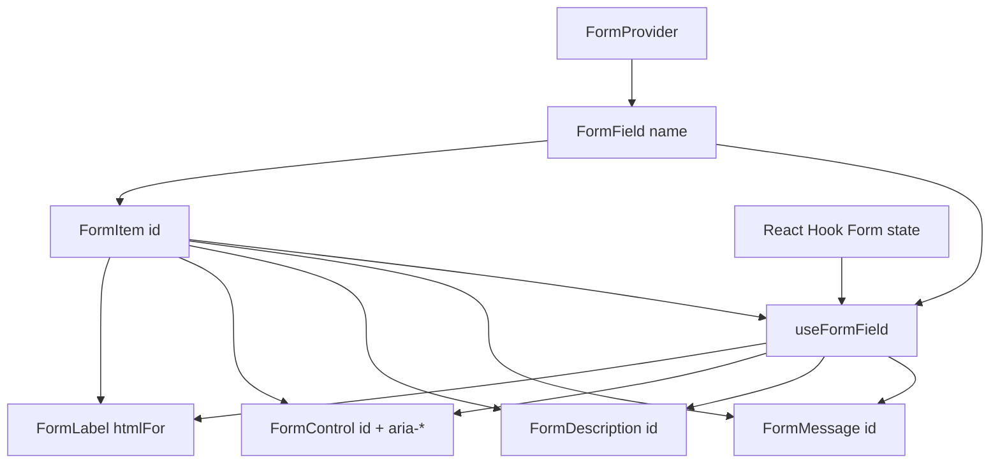

<Callout type="idea" title="文件定位">

该文件不是表单状态库的替代品，而是 React Hook Form 的呈现适配层。它通过两个 Context 把字段名和 FormItem ID 传给后代，使每个输入控件自动获得 label、说明和错误关联。

</Callout>

## 这个文件负责什么

- 透传 FormProvider。
- 用泛型 Controller 包装 FormField。
- 读取单字段状态而非整个表单。
- 生成稳定 ID。
- 自动设置 htmlFor、aria-describedby 与 aria-invalid。
- 渲染描述和错误消息。

## 执行思路

1. `<Form {...form}>` 提供 RHF 上下文。
2. FormField 把 name 放入 FieldContext。
3. FormItem 创建唯一 id。
4. useFormField 合并字段状态和派生 ID。
5. Label/Control/Message 自动共享这些信息。

## 与其他模块的关系

| 模块 | 关系 |
| --- | --- |
| `react-hook-form` | 表单状态、Controller 与字段错误。 |
| `Radix Slot` | 把控制属性合并到真实输入组件。 |
| `Label` | 可访问标签。 |
| `UserSettings/Admin/Items forms` | 主要使用方。 |

## 导出 API

| 导出 | 类型 | 用途 |
| --- | --- | --- |
| `Form` | `component alias` | React Hook Form FormProvider。 |
| `FormField` | `generic component` | Controller + 字段名 Context。 |
| `useFormField` | `hook` | 读取字段状态和派生 ID。 |
| `FormItem` | `component` | 字段布局与 ID Provider。 |
| `FormLabel` | `component` | 自动 htmlFor 和错误样式。 |
| `FormControl` | `component` | 给真实控件注入 ARIA。 |
| `FormDescription` | `component` | 辅助说明。 |
| `FormMessage` | `component` | 字段错误。 |

## 组合结构



<Callout type="success" title="自动无障碍关联">

业务表单只需按固定结构组合组件，不必手工生成 ID 或拼接 `aria-describedby`。

</Callout>

## 带注释源码

> 原始路径：`frontend/src/components/ui/form.tsx`。以下仅增加学习性注释，不改变程序行为。

```tsx title="form.tsx" lineNumbers
import * as React from "react"
import * as LabelPrimitive from "@radix-ui/react-label"
import { Slot } from "@radix-ui/react-slot"
import {
  Controller,
  FormProvider,
  useFormContext,
  useFormState,
  type ControllerProps,
  type FieldPath,
  type FieldValues,
} from "react-hook-form"

import { cn } from "@/lib/utils"
import { Label } from "@/components/ui/label"

// FormProvider 把 react-hook-form 实例注入整棵字段子树。
const Form = FormProvider

type FormFieldContextValue<
  TFieldValues extends FieldValues = FieldValues,
  TName extends FieldPath<TFieldValues> = FieldPath<TFieldValues>,
> = {
  name: TName
}

// FieldContext 只保存当前字段名，具体状态仍来自 RHF。
const FormFieldContext = React.createContext<FormFieldContextValue>(
  {} as FormFieldContextValue
)

// 泛型确保 name 必须是 TFieldValues 的合法 FieldPath。
const FormField = <
  TFieldValues extends FieldValues = FieldValues,
  TName extends FieldPath<TFieldValues> = FieldPath<TFieldValues>,
>({
  ...props
}: ControllerProps<TFieldValues, TName>) => {
  return (
    <FormFieldContext.Provider value={{ name: props.name }}>
      <Controller {...props} />
    </FormFieldContext.Provider>
  )
}

// 聚合字段名、唯一 ID、错误和 ARIA 关联，是所有子组件的核心桥梁。
const useFormField = () => {
  const fieldContext = React.useContext(FormFieldContext)
  const itemContext = React.useContext(FormItemContext)
  const { getFieldState } = useFormContext()
  const formState = useFormState({ name: fieldContext.name })
  const fieldState = getFieldState(fieldContext.name, formState)

  if (!fieldContext) {
    throw new Error("useFormField should be used within <FormField>")
  }

  const { id } = itemContext

  return {
    id,
    name: fieldContext.name,
    formItemId: `${id}-form-item`,
    formDescriptionId: `${id}-form-item-description`,
    formMessageId: `${id}-form-item-message`,
    ...fieldState,
  }
}

type FormItemContextValue = {
  id: string
}

const FormItemContext = React.createContext<FormItemContextValue>(
  {} as FormItemContextValue
)

// 每个 FormItem 生成稳定 id，供 Label、Control、Description、Message 共享。
function FormItem({ className, ...props }: React.ComponentProps<"div">) {
  const id = React.useId()

  return (
    <FormItemContext.Provider value={{ id }}>
      <div
        data-slot="form-item"
        className={cn("grid gap-2", className)}
        {...props}
      />
    </FormItemContext.Provider>
  )
}

function FormLabel({
  className,
  ...props
}: React.ComponentProps<typeof LabelPrimitive.Root>) {
  const { error, formItemId } = useFormField()

  return (
    <Label
      data-slot="form-label"
      data-error={!!error}
      className={cn("data-[error=true]:text-destructive", className)}
      htmlFor={formItemId}
      {...props}
    />
  )
}

// Slot 把 id、aria-describedby、aria-invalid 合并到真正输入控件。
function FormControl({ ...props }: React.ComponentProps<typeof Slot>) {
  const { error, formItemId, formDescriptionId, formMessageId } = useFormField()

  return (
    <Slot
      data-slot="form-control"
      id={formItemId}
      aria-describedby={
        !error
          ? `${formDescriptionId}`
          : `${formDescriptionId} ${formMessageId}`
      }
      aria-invalid={!!error}
      {...props}
    />
  )
}

function FormDescription({ className, ...props }: React.ComponentProps<"p">) {
  const { formDescriptionId } = useFormField()

  return (
    <p
      data-slot="form-description"
      id={formDescriptionId}
      className={cn("text-muted-foreground text-sm", className)}
      {...props}
    />
  )
}

// 优先显示 RHF error.message；无错误时也可显示调用方 children。
function FormMessage({ className, ...props }: React.ComponentProps<"p">) {
  const { error, formMessageId } = useFormField()
  const body = error ? String(error?.message ?? "") : props.children

  if (!body) {
    return null
  }

  return (
    <p
      data-slot="form-message"
      id={formMessageId}
      className={cn("text-destructive text-sm", className)}
      {...props}
    >
      {body}
    </p>
  )
}

export {
  useFormField,
  Form,
  FormItem,
  FormLabel,
  FormControl,
  FormDescription,
  FormMessage,
  FormField,
}
```

## 阅读重点

- 当前 Context 默认值使用类型断言，`if (!fieldContext)` 很难捕获缺少 Provider；可用 `undefined` 默认值改进。
- `useFormState({ name })` 只订阅当前字段，减少无关重渲染。
- FormControl 必须只有一个可接收 props 的子元素。
- aria-describedby 在有错误时同时关联描述与消息。
- 错误文字仍应具体说明修复方式，而不只写 Invalid。

## Twoslash：FieldPath 的核心价值

```ts twoslash
type Fields = {
  email: string
  profile: {
    fullName: string
  }
}

type FieldPath = 'email' | 'profile.fullName'

function field<Name extends FieldPath>(name: Name) {
  return name
}

const name = field('profile.fullName')
//    ^?
```
