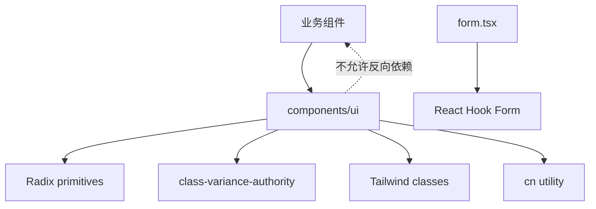

<Callout type="idea" title="目录定位">

`components/ui/` 是最底层的视觉与交互组件库。它应保持业务无关：不知道 User、Item 或 API，只接收 props、children 和状态。上层业务组件通过组合这些原语完成表单、菜单、表格和布局。

</Callout>

## 目录结构

<Files>
  <Folder name="ui" defaultOpen>
    <Folder name="actions">
      <File name="button.tsx" />
      <File name="loading-button.tsx" />
      <File name="button-group.tsx" />
      <File name="pagination.tsx" />
    </Folder>
    <Folder name="forms">
      <File name="form.tsx" />
      <File name="input.tsx" />
      <File name="password-input.tsx" />
      <File name="checkbox.tsx" />
      <File name="select.tsx" />
      <File name="label.tsx" />
    </Folder>
    <Folder name="overlays">
      <File name="dialog.tsx" />
      <File name="sheet.tsx" />
      <File name="dropdown-menu.tsx" />
      <File name="tooltip.tsx" />
    </Folder>
    <Folder name="display">
      <File name="alert.tsx" />
      <File name="avatar.tsx" />
      <File name="badge.tsx" />
      <File name="card.tsx" />
      <File name="separator.tsx" />
      <File name="table.tsx" />
      <File name="tabs.tsx" />
      <File name="skeleton.tsx" />
      <File name="sonner.tsx" />
    </Folder>
    <File name="sidebar.tsx — 复合响应式布局系统" />
  </Folder>
</Files>

## 依赖层级

## 原语的三种类型

<Cards>
  <Card title="样式原语">Input、Card、Alert 等主要包装原生元素。</Card>
  <Card title="行为原语">Dialog、Select、DropdownMenu 借助 Radix 状态机。</Card>
  <Card title="组合系统">Form、Sidebar 通过 Context 协调多个子组件。</Card>
</Cards>

<Callout type="info" title="为什么保留 data-slot">

`data-slot` 为主题覆盖、父子选择器和测试提供稳定名称，比依赖内部 class 更不容易随样式调整失效。

</Callout>

## 组织原则

- UI 原语不导入生成 API 客户端或业务模型。
- 优先包装成熟的无障碍原语，而不是重新实现焦点和键盘状态机。
- CVA 负责有限变体，`className` 负责局部覆盖。
- asChild 解决 DOM 语义组合，但要求调用方理解最终元素。
- 业务校验和网络状态留在上层组件，原语保持可复用。
