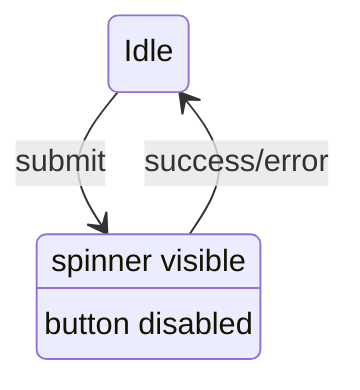

<Callout type="idea" title="文件定位">

LoadingButton 将最常见的异步按钮模式标准化：请求期间显示 Spinner、保留原文字、阻止再次点击。它不自行启动请求，只消费上层传入的 loading 布尔值。

</Callout>

## 这个文件负责什么

- 提供 Button 风格变体与尺寸。
- 接受 loading 状态。
- loading 时显示 Spinner。
- 合并 loading 与 disabled。
- 保留 asChild/Slottable 组合。

## 执行思路

1. 上层 Mutation 暴露 isPending。
2. isPending 传给 loading。
3. 组件显示 Loader2 并设置 disabled。
4. Mutation 结束后恢复普通按钮。

## 与其他模块的关系

| 模块 | 关系 |
| --- | --- |
| `TanStack Query mutations` | 常见 loading 来源。 |
| `Radix Slot/Slottable` | 多态子元素组合。 |
| `CVA` | 变体和尺寸。 |
| `lucide-react` | Spinner 图标。 |

## 导出 API

| 导出 | 类型 | 用途 |
| --- | --- | --- |
| `LoadingButton` | `component` | 带 loading 的按钮。 |
| `buttonVariants` | `style factory` | 变体类生成器。 |

## 组合结构

```tsx title="usage.tsx"
<LoadingButton
  type="submit"
  loading={mutation.isPending}
>
  Save changes
</LoadingButton>
```



## 带注释源码

> 原始路径：`frontend/src/components/ui/loading-button.tsx`。以下仅增加学习性注释，不改变程序行为。

```tsx title="loading-button.tsx" lineNumbers
import { Slot, Slottable } from "@radix-ui/react-slot"
import { cva, type VariantProps } from "class-variance-authority"
import { Loader2 } from "lucide-react"
import { cn } from "@/lib/utils"

// 与普通 Button 类似的变体集合，额外为 loading 状态预留 Spinner。
const buttonVariants = cva(
  "inline-flex items-center justify-center gap-2 whitespace-nowrap rounded-md text-sm font-medium transition-all disabled:pointer-events-none disabled:opacity-50 [&_svg]:pointer-events-none [&_svg:not([class*='size-'])]:size-4 shrink-0 [&_svg]:shrink-0 outline-none focus-visible:border-ring focus-visible:ring-ring/50 focus-visible:ring-[3px] aria-invalid:ring-destructive/20 dark:aria-invalid:ring-destructive/40 aria-invalid:border-destructive",
  {
    variants: {
      variant: {
        default:
          "bg-primary text-primary-foreground shadow-xs hover:bg-primary/90",
        destructive:
          "bg-destructive text-white shadow-xs hover:bg-destructive/90 focus-visible:ring-destructive/20 dark:focus-visible:ring-destructive/40 dark:bg-destructive/60",
        outline:
          "border bg-background shadow-xs hover:bg-accent hover:text-accent-foreground dark:bg-input/30 dark:border-input dark:hover:bg-input/50",
        secondary:
          "bg-secondary text-secondary-foreground shadow-xs hover:bg-secondary/80",
        ghost:
          "hover:bg-accent hover:text-accent-foreground dark:hover:bg-accent/50",
        link: "text-primary underline-offset-4 hover:underline",
      },
      size: {
        default: "h-9 px-4 py-2 has-[>svg]:px-3",
        sm: "h-8 rounded-md gap-1.5 px-3 has-[>svg]:px-2.5",
        lg: "h-10 rounded-md px-6 has-[>svg]:px-4",
        icon: "size-9",
      },
    },
    defaultVariants: {
      variant: "default",
      size: "default",
    },
  },
)

export interface ButtonProps
  extends React.ButtonHTMLAttributes<HTMLButtonElement>,
  VariantProps<typeof buttonVariants> {
  asChild?: boolean
  loading?: boolean
}

// loading 同时控制视觉反馈和 disabled，阻止重复提交。
function LoadingButton({
  className,
  loading = false,
  children,
  disabled,
  variant,
  size,
  asChild = false,
  ...props
}: ButtonProps) {
  // Slottable 保证 asChild 时 children 与前置 Spinner 正确合并。
  const Comp = asChild ? Slot : "button"
  return (
    <Comp
      className={cn(buttonVariants({ variant, size, className }))}
      disabled={loading || disabled}
      {...props}
    >
      {/* Spinner 仅在 pending 时挂载；按钮文本保留，避免宽度和上下文变化。 */}
      {loading && <Loader2 className="mr-2 h-5 w-5 animate-spin" />}
      <Slottable>{children}</Slottable>
    </Comp>
  )
}

export { buttonVariants, LoadingButton }
```

## 阅读重点

- 保留按钮文字比替换成“Loading...”更稳定，也能说明正在执行什么。
- 视觉 Spinner 之外可增加 `aria-busy={loading}` 提升语义。
- 请求取消或失败后必须恢复 loading。
- 该文件复制了 Button variants，长期可考虑共享以避免样式漂移。
