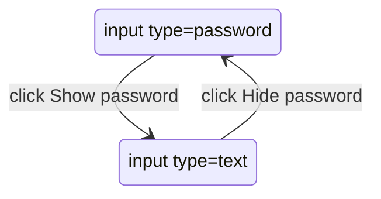

<Callout type="idea" title="文件定位">

PasswordInput 把密码可见性作为本地 UI 状态处理。它仍然表现为标准 input，能够被 React Hook Form 注册，并通过 ref 接受聚焦。

</Callout>

## 这个文件负责什么

- 继承原生 input 属性。
- forwardRef 到真实 input。
- 在 password/text 间切换 type。
- 提供显示/隐藏图标按钮。
- 为图标按钮提供动态 aria-label。
- 保留错误样式。

## 执行思路

1. 初始 showPassword=false。
2. 输入字段以 password 类型渲染。
3. 点击图标按钮翻转本地状态。
4. type 改为 text 或恢复 password。
5. 字段值和表单注册保持不变。

## 与其他模块的关系

| 模块 | 关系 |
| --- | --- |
| `Button` | 可见性切换按钮。 |
| `React Hook Form` | 通过 ref/name/onChange 接入。 |
| `ChangePassword` | 三个密码字段。 |
| `lucide-react` | Eye/EyeOff。 |

## 导出 API

| 导出 | 类型 | 用途 |
| --- | --- | --- |
| `PasswordInput` | `forwardRef component` | 带可见性切换的 input。 |

## 组合结构



```tsx title="usage.tsx"
<PasswordInput
  autoComplete="current-password"
  placeholder="••••••••"
/>
```

## 带注释源码

> 原始路径：`frontend/src/components/ui/password-input.tsx`。以下仅增加学习性注释，不改变程序行为。

```tsx title="password-input.tsx" lineNumbers
import * as React from "react"
import { Eye, EyeOff } from "lucide-react"

import { cn } from "@/lib/utils"
import { Button } from "./button"

interface PasswordInputProps extends React.ComponentProps<"input"> {
  error?: string
}

// forwardRef 保持与 React Hook Form 和外部聚焦逻辑兼容。
const PasswordInput = React.forwardRef<HTMLInputElement, PasswordInputProps>(
  ({ className, error, ...props }, ref) => {
    // 可见性是纯本地 UI 状态，不改变实际 value。
    const [showPassword, setShowPassword] = React.useState(false)

    return (
      <div className="relative">
        <input
          // 只切换 input type；字段值、name、ref 和校验状态保持不变。
          type={showPassword ? "text" : "password"}
          data-slot="input"
          className={cn(
            "file:text-foreground placeholder:text-muted-foreground selection:bg-primary selection:text-primary-foreground dark:bg-input/30 border-input h-9 w-full min-w-0 rounded-md border bg-transparent px-3 py-1 pr-10 text-base shadow-xs transition-[color,box-shadow] outline-none file:inline-flex file:h-7 file:border-0 file:bg-transparent file:text-sm file:font-medium disabled:pointer-events-none disabled:cursor-not-allowed disabled:opacity-50 md:text-sm",
            "focus-visible:border-ring focus-visible:ring-ring/50 focus-visible:ring-[3px]",
            "aria-invalid:ring-destructive/20 dark:aria-invalid:ring-destructive/40 aria-invalid:border-destructive",
            className
          )}
          ref={ref}
          aria-invalid={!!error}
          {...props}
        />
        {/* type=button 防止可见性按钮误提交外层表单。 */}
        <Button
          type="button"
          variant="ghost"
          size="icon-sm"
          className="absolute right-0 top-0 h-full px-3 py-2 hover:bg-transparent"
          onClick={() => setShowPassword(!showPassword)}
          aria-label={showPassword ? "Hide password" : "Show password"}
        >
          {showPassword ? (
            <EyeOff className="h-4 w-4 text-muted-foreground" />
          ) : (
            <Eye className="h-4 w-4 text-muted-foreground" />
          )}
        </Button>
      </div>
    )
  }
)

PasswordInput.displayName = "PasswordInput"

export { PasswordInput }
```

## 阅读重点

- 切换按钮必须是 `type="button"`。
- 动态 aria-label 应描述按钮将执行的动作，而不是当前图标名称。
- 浏览器密码管理器依赖 name、autocomplete 和 type，业务层应设置正确属性。
- `error` 与 FormControl 的 aria-invalid 机制存在重叠，可统一来源。
