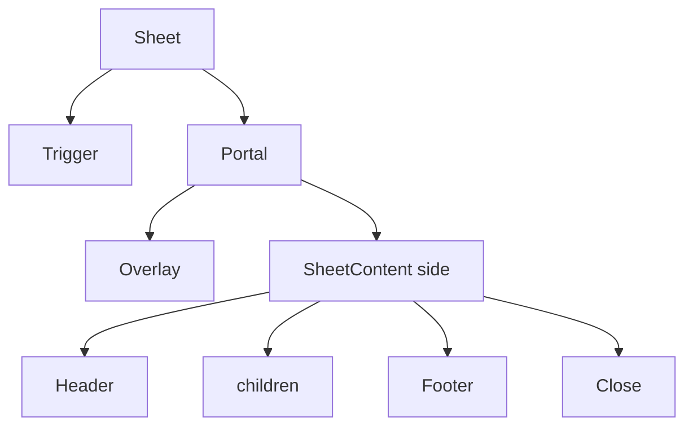

<Callout type="idea" title="文件定位">

Sheet 与 Dialog 的行为基础相同，但空间模型不同：它从视口边缘进入，更适合移动端侧边栏、筛选器和详情面板。

</Callout>

## 这个文件负责什么

- 管理打开状态和 Trigger。
- 通过 Portal/Overlay 模态显示。
- 支持四个 side。
- 按方向应用滑入滑出动画。
- 提供 Header/Footer/Title/Description。
- 附带默认关闭按钮。

## 执行思路

1. Trigger 打开 Root。
2. Portal 挂载 Overlay。
3. Content 按 side 定位并动画进入。
4. 焦点进入面板。
5. Close/Escape 关闭并恢复焦点。

## 与其他模块的关系

| 模块 | 关系 |
| --- | --- |
| `@radix-ui/react-dialog` | 状态与无障碍基础。 |
| `ui/sidebar` | 移动端侧边栏容器。 |
| `cn` | 方向类和动画。 |

## 导出 API

| 导出 | 类型 | 用途 |
| --- | --- | --- |
| `Sheet/Trigger/Close` | `components` | 状态与控制。 |
| `SheetContent` | `component` | 按 side 定位的面板。 |
| `SheetHeader/Footer` | `components` | 内部布局。 |
| `SheetTitle/Description` | `components` | 可访问名称与说明。 |

## 组合结构

<Tabs items={['left', 'right', 'top', 'bottom']}>
  <Tab>适合主导航或目录。</Tab>
  <Tab>适合详情、设置、筛选。</Tab>
  <Tab>适合全局通知或短工具条。</Tab>
  <Tab>适合移动端操作面板。</Tab>
</Tabs>



## 带注释源码

> 原始路径：`frontend/src/components/ui/sheet.tsx`。以下仅增加学习性注释，不改变程序行为。

```tsx title="sheet.tsx" lineNumbers
"use client"

import * as React from "react"
import * as SheetPrimitive from "@radix-ui/react-dialog"
import { XIcon } from "lucide-react"

import { cn } from "@/lib/utils"

// Sheet 复用 Dialog 的状态和焦点模型，但把 Content 定位为屏幕边缘面板。
function Sheet({ ...props }: React.ComponentProps<typeof SheetPrimitive.Root>) {
  return <SheetPrimitive.Root data-slot="sheet" {...props} />
}

function SheetTrigger({
  ...props
}: React.ComponentProps<typeof SheetPrimitive.Trigger>) {
  return <SheetPrimitive.Trigger data-slot="sheet-trigger" {...props} />
}

function SheetClose({
  ...props
}: React.ComponentProps<typeof SheetPrimitive.Close>) {
  return <SheetPrimitive.Close data-slot="sheet-close" {...props} />
}

function SheetPortal({
  ...props
}: React.ComponentProps<typeof SheetPrimitive.Portal>) {
  return <SheetPrimitive.Portal data-slot="sheet-portal" {...props} />
}

// Overlay 阻止用户与背景交互，并突出当前面板。
function SheetOverlay({
  className,
  ...props
}: React.ComponentProps<typeof SheetPrimitive.Overlay>) {
  return (
    <SheetPrimitive.Overlay
      data-slot="sheet-overlay"
      className={cn(
        "data-[state=open]:animate-in data-[state=closed]:animate-out data-[state=closed]:fade-out-0 data-[state=open]:fade-in-0 fixed inset-0 z-50 bg-black/50",
        className
      )}
      {...props}
    />
  )
}

// side 选择四个方向，并映射为不同定位、边框和滑入动画。
function SheetContent({
  className,
  children,
  side = "right",
  ...props
}: React.ComponentProps<typeof SheetPrimitive.Content> & {
  side?: "top" | "right" | "bottom" | "left"
}) {
  return (
    <SheetPortal>
      <SheetOverlay />
      <SheetPrimitive.Content
        data-slot="sheet-content"
        className={cn(
          "bg-background data-[state=open]:animate-in data-[state=closed]:animate-out fixed z-50 flex flex-col gap-4 shadow-lg transition ease-in-out data-[state=closed]:duration-300 data-[state=open]:duration-500",
          side === "right" &&
            "data-[state=closed]:slide-out-to-right data-[state=open]:slide-in-from-right inset-y-0 right-0 h-full w-3/4 border-l sm:max-w-sm",
          side === "left" &&
            "data-[state=closed]:slide-out-to-left data-[state=open]:slide-in-from-left inset-y-0 left-0 h-full w-3/4 border-r sm:max-w-sm",
          side === "top" &&
            "data-[state=closed]:slide-out-to-top data-[state=open]:slide-in-from-top inset-x-0 top-0 h-auto border-b",
          side === "bottom" &&
            "data-[state=closed]:slide-out-to-bottom data-[state=open]:slide-in-from-bottom inset-x-0 bottom-0 h-auto border-t",
          className
        )}
        {...props}
      >
        {/* 业务内容之后追加统一关闭按钮，确保每个 Sheet 都可显式关闭。 */}
        {children}
        <SheetPrimitive.Close className="ring-offset-background focus:ring-ring data-[state=open]:bg-secondary absolute top-4 right-4 rounded-xs opacity-70 transition-opacity hover:opacity-100 focus:ring-2 focus:ring-offset-2 focus:outline-hidden disabled:pointer-events-none">
          <XIcon className="size-4" />
          <span className="sr-only">Close</span>
        </SheetPrimitive.Close>
      </SheetPrimitive.Content>
    </SheetPortal>
  )
}

function SheetHeader({ className, ...props }: React.ComponentProps<"div">) {
  return (
    <div
      data-slot="sheet-header"
      className={cn("flex flex-col gap-1.5 p-4", className)}
      {...props}
    />
  )
}

function SheetFooter({ className, ...props }: React.ComponentProps<"div">) {
  return (
    <div
      data-slot="sheet-footer"
      className={cn("mt-auto flex flex-col gap-2 p-4", className)}
      {...props}
    />
  )
}

function SheetTitle({
  className,
  ...props
}: React.ComponentProps<typeof SheetPrimitive.Title>) {
  return (
    <SheetPrimitive.Title
      data-slot="sheet-title"
      className={cn("text-foreground font-semibold", className)}
      {...props}
    />
  )
}

function SheetDescription({
  className,
  ...props
}: React.ComponentProps<typeof SheetPrimitive.Description>) {
  return (
    <SheetPrimitive.Description
      data-slot="sheet-description"
      className={cn("text-muted-foreground text-sm", className)}
      {...props}
    />
  )
}

export {
  Sheet,
  SheetTrigger,
  SheetClose,
  SheetContent,
  SheetHeader,
  SheetFooter,
  SheetTitle,
  SheetDescription,
}
```

## 阅读重点

- 每个 SheetContent 应有 Title/Description，必要时使用 sr-only。
- 移动导航通常从 left/right 进入，底部 Sheet 更适合短操作。
- 默认宽度为 75% 且 sm:max-w-sm，业务可通过 className 覆盖。
- 模态 Sheet 不适合作为永久桌面侧栏；该项目桌面侧栏使用固定布局。
