<Callout type="idea" title="文件定位">

这是前端 UI 层最复杂的复合组件。它不是单个 Sidebar，而是一套布局协议：Provider 保存状态，Root 选择响应式实现，Header/Content/Footer 组织区域，Menu 系列负责导航项，Tooltip 解决 icon 折叠态可读性。

</Callout>

## 这个文件负责什么

- 同时管理桌面 open 与移动端 openMobile。
- 支持受控/非受控桌面状态。
- 用 Cookie 持久化折叠偏好。
- 提供 Ctrl/Cmd+B 快捷键。
- 移动端自动切换为 Sheet。
- 支持 sidebar/floating/inset 三种布局。
- 支持 offcanvas/icon/none 三种折叠策略。
- 提供完整菜单、子菜单、徽标、操作和 Skeleton 原语。

## 执行思路

1. SidebarProvider 读取 Cookie 和设备类型。
2. Context 暴露 state/open/openMobile/toggleSidebar。
3. Sidebar 根据 collapsible 与 isMobile 选择渲染分支。
4. 桌面端用 data-state 驱动宽度和位置样式。
5. 移动端用 Sheet 管理遮罩与焦点。
6. 业务层通过 Header/Content/Footer 与 Menu 组件组合内容。

## 与其他模块的关系

| 模块 | 关系 |
| --- | --- |
| `useIsMobile` | 决定桌面或移动实现。 |
| `Sheet` | 移动端抽屉。 |
| `Tooltip` | icon 折叠态菜单说明。 |
| `Button/Input/Separator/Skeleton` | 内部基础原语。 |
| `CVA` | SidebarMenuButton 变体。 |
| `AppSidebar/Main/User` | 业务侧边栏组合层。 |

## 导出 API

| 导出 | 类型 | 用途 |
| --- | --- | --- |
| `SidebarProvider/useSidebar` | `context` | 全局侧栏状态。 |
| `Sidebar` | `layout root` | 响应式根布局。 |
| `SidebarTrigger/Rail` | `controls` | 折叠控制。 |
| `SidebarInset` | `layout` | 与侧栏并列的主内容。 |
| `SidebarHeader/Content/Footer` | `slots` | 区域布局。 |
| `SidebarGroup*` | `components` | 导航分组。 |
| `SidebarMenu*` | `components` | 菜单项、按钮、操作、徽标和 Skeleton。 |
| `SidebarMenuSub*` | `components` | 子导航层级。 |

## 组合结构

## 状态模型

| 状态 | 设备 | 作用 |
| --- | --- | --- |
| `open` | desktop | 控制 expanded/collapsed。 |
| `state` | desktop | 从 open 派生的字符串，供 data-state 样式使用。 |
| `openMobile` | mobile | 控制 Sheet 是否打开。 |
| `isMobile` | both | 选择实现分支。 |
| `toggleSidebar` | both | 根据设备切换正确状态。 |

## 组件分层

<Files>
  <Folder name="SidebarProvider" defaultOpen>
    <File name="Context + Cookie + keyboard shortcut" />
    <Folder name="Sidebar" defaultOpen>
      <File name="mobile: Sheet" />
      <File name="desktop: fixed container + gap" />
      <File name="SidebarTrigger / SidebarRail" />
      <File name="SidebarInset" />
      <Folder name="structural slots">
        <File name="SidebarHeader" />
        <File name="SidebarContent" />
        <File name="SidebarFooter" />
      </Folder>
      <Folder name="menu system">
        <File name="SidebarGroup*" />
        <File name="SidebarMenu*" />
        <File name="SidebarMenuSub*" />
      </Folder>
    </Folder>
  </Folder>
</Files>

## 响应式分支

```mermaid
flowchart TD
  Provider --> Mobile{isMobile?}
  Mobile -->|是| Sheet[Sheet + openMobile]
  Mobile -->|否| Desktop[Fixed sidebar + layout gap]
  Desktop --> Collapse{collapsible}
  Collapse --> None[none: always visible]
  Collapse --> Off[offcanvas: leave viewport]
  Collapse --> Icon[icon: shrink to 3rem]
  Trigger[SidebarTrigger] --> Toggle[toggleSidebar]
  Toggle --> Sheet
  Toggle --> Desktop
```



<Callout type="idea" title="数据属性驱动样式">

组件把 `state`、`collapsible`、`variant`、`side` 写到 data 属性。后代使用 Tailwind 的 `group-data-*` 选择器响应，而不需要每个子组件重复读取 Context。

</Callout>

## 带注释源码

> 原始路径：`frontend/src/components/ui/sidebar.tsx`。以下仅增加学习性注释，不改变程序行为。

```tsx title="sidebar.tsx" lineNumbers
import { Slot } from "@radix-ui/react-slot"
import { cva, type VariantProps } from "class-variance-authority"
import { PanelLeftIcon } from "lucide-react"
import * as React from "react"

import { Button } from "@/components/ui/button"
import { Input } from "@/components/ui/input"
import { Separator } from "@/components/ui/separator"
import {
  Sheet,
  SheetContent,
  SheetDescription,
  SheetHeader,
  SheetTitle,
} from "@/components/ui/sheet"
import { Skeleton } from "@/components/ui/skeleton"
import {
  Tooltip,
  TooltipContent,
  TooltipProvider,
  TooltipTrigger,
} from "@/components/ui/tooltip"
import { cn } from "@/lib/utils"
import { useIsMobile } from "@/hooks/useMobile"

// 集中保存尺寸、持久化和快捷键配置，避免散落魔法值。
const SIDEBAR_COOKIE_NAME = "sidebar_state"
const SIDEBAR_COOKIE_MAX_AGE = 60 * 60 * 24 * 7
const SIDEBAR_WIDTH = "16rem"
const SIDEBAR_WIDTH_MOBILE = "18rem"
const SIDEBAR_WIDTH_ICON = "3rem"
const SIDEBAR_KEYBOARD_SHORTCUT = "b"

// Context 同时描述桌面折叠状态与移动端 Sheet 状态。
type SidebarContextProps = {
  state: "expanded" | "collapsed"
  open: boolean
  setOpen: (open: boolean) => void
  openMobile: boolean
  setOpenMobile: (open: boolean) => void
  isMobile: boolean
  toggleSidebar: () => void
}

const SidebarContext = React.createContext<SidebarContextProps | null>(null)

// 所有 Sidebar 子组件通过统一 Hook 访问状态，并阻止脱离 Provider 使用。
function useSidebar() {
  const context = React.useContext(SidebarContext)
  if (!context) {
    throw new Error("useSidebar must be used within a SidebarProvider.")
  }

  return context
}

// Provider 协调受控/非受控桌面状态、Cookie、移动端状态和快捷键。
function SidebarProvider({
  defaultOpen = true,
  open: openProp,
  onOpenChange: setOpenProp,
  className,
  style,
  children,
  ...props
}: React.ComponentProps<"div"> & {
  defaultOpen?: boolean
  open?: boolean
  onOpenChange?: (open: boolean) => void
}) {
  const isMobile = useIsMobile()
  const [openMobile, setOpenMobile] = React.useState(false)

  // 首次渲染优先从 Cookie 恢复桌面展开状态。
  const getInitialOpen = () => {
    if (typeof document === "undefined") return defaultOpen

    const cookie = document.cookie
      .split("; ")
      .find((c) => c.startsWith(`${SIDEBAR_COOKIE_NAME}=`))

    if (!cookie) return defaultOpen

    return cookie.split("=")[1] === "true"
  }

  // This is the internal state of the sidebar.
  // We use openProp and setOpenProp for control from outside the component.
  const [_open, _setOpen] = React.useState(getInitialOpen)
  const open = openProp ?? _open
  const setOpen = React.useCallback(
    (value: boolean | ((value: boolean) => boolean)) => {
      const openState = typeof value === "function" ? value(open) : value
      if (setOpenProp) {
        setOpenProp(openState)
      } else {
        _setOpen(openState)
      }

      // This sets the cookie to keep the sidebar state.
      document.cookie = `${SIDEBAR_COOKIE_NAME}=${openState}; path=/; max-age=${SIDEBAR_COOKIE_MAX_AGE}`
    },
    [setOpenProp, open],
  )

  // Helper to toggle the sidebar.
  // 同一个动作在移动端切换 Sheet，在桌面端切换折叠。
  const toggleSidebar = React.useCallback(() => {
    return isMobile ? setOpenMobile((open) => !open) : setOpen((open) => !open)
  }, [isMobile, setOpen])

  // Adds a keyboard shortcut to toggle the sidebar.
  // Ctrl/Cmd+B 提供全局快捷键，并在卸载时清理监听器。
  React.useEffect(() => {
    const handleKeyDown = (event: KeyboardEvent) => {
      if (
        event.key === SIDEBAR_KEYBOARD_SHORTCUT &&
        (event.metaKey || event.ctrlKey)
      ) {
        event.preventDefault()
        toggleSidebar()
      }
    }

    window.addEventListener("keydown", handleKeyDown)
    return () => window.removeEventListener("keydown", handleKeyDown)
  }, [toggleSidebar])

  // We add a state so that we can do data-state="expanded" or "collapsed".
  // This makes it easier to style the sidebar with Tailwind classes.
  const state = open ? "expanded" : "collapsed"

  const contextValue = React.useMemo<SidebarContextProps>(
    () => ({
      state,
      open,
      setOpen,
      isMobile,
      openMobile,
      setOpenMobile,
      toggleSidebar,
    }),
    [state, open, setOpen, isMobile, openMobile, toggleSidebar],
  )

  return (
    <SidebarContext.Provider value={contextValue}>
      <TooltipProvider delayDuration={0}>
        <div
          data-slot="sidebar-wrapper"
          style={
            {
              "--sidebar-width": SIDEBAR_WIDTH,
              "--sidebar-width-icon": SIDEBAR_WIDTH_ICON,
              ...style,
            } as React.CSSProperties
          }
          className={cn(
            "group/sidebar-wrapper has-data-[variant=inset]:bg-sidebar flex min-h-svh w-full",
            className,
          )}
          {...props}
        >
          {children}
        </div>
      </TooltipProvider>
    </SidebarContext.Provider>
  )
}

// 根组件根据设备和 collapsible 策略选择普通容器、移动 Sheet 或桌面固定布局。
function Sidebar({
  side = "left",
  variant = "sidebar",
  collapsible = "offcanvas",
  className,
  children,
  ...props
}: React.ComponentProps<"div"> & {
  side?: "left" | "right"
  variant?: "sidebar" | "floating" | "inset"
  collapsible?: "offcanvas" | "icon" | "none"
}) {
  const { isMobile, state, openMobile, setOpenMobile } = useSidebar()

  if (collapsible === "none") {
    return (
      <div
        data-slot="sidebar"
        className={cn(
          "bg-sidebar text-sidebar-foreground flex h-full w-(--sidebar-width) flex-col",
          className,
        )}
        {...props}
      >
        {children}
      </div>
    )
  }

  // 移动端不复用桌面 fixed 布局，而是渲染为可关闭 Sheet。
  if (isMobile) {
    return (
      <Sheet open={openMobile} onOpenChange={setOpenMobile} {...props}>
        <SheetContent
          data-sidebar="sidebar"
          data-slot="sidebar"
          data-mobile="true"
          className="bg-sidebar text-sidebar-foreground w-(--sidebar-width) p-0 [&>button]:hidden"
          style={
            {
              "--sidebar-width": SIDEBAR_WIDTH_MOBILE,
            } as React.CSSProperties
          }
          side={side}
        >
          <SheetHeader className="sr-only">
            <SheetTitle>Sidebar</SheetTitle>
            <SheetDescription>Displays the mobile sidebar.</SheetDescription>
          </SheetHeader>
          <div className="flex h-full w-full flex-col">{children}</div>
        </SheetContent>
      </Sheet>
    )
  }

  return (
    <div
      className="group peer text-sidebar-foreground hidden md:block"
      data-state={state}
      data-collapsible={state === "collapsed" ? collapsible : ""}
      data-variant={variant}
      data-side={side}
      data-slot="sidebar"
    >
      {/* This is what handles the sidebar gap on desktop */}
      <div
        data-slot="sidebar-gap"
        className={cn(
          "relative w-(--sidebar-width) bg-transparent transition-[width] duration-200 ease-linear",
          "group-data-[collapsible=offcanvas]:w-0",
          "group-data-[side=right]:rotate-180",
          variant === "floating" || variant === "inset"
            ? "group-data-[collapsible=icon]:w-[calc(var(--sidebar-width-icon)+(--spacing(4)))]"
            : "group-data-[collapsible=icon]:w-(--sidebar-width-icon)",
        )}
      />
      <div
        data-slot="sidebar-container"
        className={cn(
          "fixed inset-y-0 z-10 hidden h-svh w-(--sidebar-width) transition-[left,right,width] duration-200 ease-linear md:flex",
          side === "left"
            ? "left-0 group-data-[collapsible=offcanvas]:left-[calc(var(--sidebar-width)*-1)]"
            : "right-0 group-data-[collapsible=offcanvas]:right-[calc(var(--sidebar-width)*-1)]",
          // Adjust the padding for floating and inset variants.
          variant === "floating" || variant === "inset"
            ? "p-2 group-data-[collapsible=icon]:w-[calc(var(--sidebar-width-icon)+(--spacing(4))+2px)]"
            : "group-data-[collapsible=icon]:w-(--sidebar-width-icon) group-data-[side=left]:border-r group-data-[side=right]:border-l",
          className,
        )}
        {...props}
      >
        <div
          data-sidebar="sidebar"
          data-slot="sidebar-inner"
          className="bg-sidebar group-data-[variant=floating]:border-sidebar-border flex h-full w-full flex-col group-data-[variant=floating]:rounded-lg group-data-[variant=floating]:border group-data-[variant=floating]:shadow-sm"
        >
          {children}
        </div>
      </div>
    </div>
  )
}

// Trigger 调用 Context.toggleSidebar，不关心当前设备类型。
function SidebarTrigger({
  className,
  onClick,
  ...props
}: React.ComponentProps<typeof Button>) {
  const { toggleSidebar, open } = useSidebar()
  const sidebarCopy = open ? "Collapse Sidebar" : "Open Sidebar"

  return (
    <Button
      data-sidebar="trigger"
      data-slot="sidebar-trigger"
      variant="ghost"
      size="icon"
      className={cn("size-7", className)}
      onClick={(event) => {
        onClick?.(event)
        toggleSidebar()
      }}
      {...props}
    >
      <PanelLeftIcon />
      <span className="sr-only">{sidebarCopy}</span>
    </Button>
  )
}

// Rail 扩大侧栏边缘的可点击区域，支持快速折叠/展开。
function SidebarRail({ className, ...props }: React.ComponentProps<"button">) {
  const { toggleSidebar } = useSidebar()

  return (
    <button
      data-sidebar="rail"
      data-slot="sidebar-rail"
      aria-label="Toggle Sidebar"
      tabIndex={-1}
      onClick={toggleSidebar}
      title="Toggle Sidebar"
      className={cn(
        "hover:after:bg-sidebar-border absolute inset-y-0 z-20 hidden w-4 -translate-x-1/2 transition-all ease-linear group-data-[side=left]:-right-4 group-data-[side=right]:left-0 after:absolute after:inset-y-0 after:left-1/2 after:w-[2px] sm:flex",
        "in-data-[side=left]:cursor-w-resize in-data-[side=right]:cursor-e-resize",
        "[[data-side=left][data-state=collapsed]_&]:cursor-e-resize [[data-side=right][data-state=collapsed]_&]:cursor-w-resize",
        "hover:group-data-[collapsible=offcanvas]:bg-sidebar group-data-[collapsible=offcanvas]:translate-x-0 group-data-[collapsible=offcanvas]:after:left-full",
        "[[data-side=left][data-collapsible=offcanvas]_&]:-right-2",
        "[[data-side=right][data-collapsible=offcanvas]_&]:-left-2",
        className,
      )}
      {...props}
    />
  )
}

function SidebarInset({ className, ...props }: React.ComponentProps<"main">) {
  return (
    <main
      data-slot="sidebar-inset"
      className={cn(
        "bg-transparent relative flex w-full flex-1 flex-col",
        "md:peer-data-[variant=inset]:m-2 md:peer-data-[variant=inset]:ml-0 md:peer-data-[variant=inset]:rounded-xl md:peer-data-[variant=inset]:shadow-sm md:peer-data-[variant=inset]:peer-data-[state=collapsed]:ml-2",
        className,
      )}
      {...props}
    />
  )
}

function SidebarInput({
  className,
  ...props
}: React.ComponentProps<typeof Input>) {
  return (
    <Input
      data-slot="sidebar-input"
      data-sidebar="input"
      className={cn("bg-background h-8 w-full shadow-none", className)}
      {...props}
    />
  )
}

function SidebarHeader({ className, ...props }: React.ComponentProps<"div">) {
  return (
    <div
      data-slot="sidebar-header"
      data-sidebar="header"
      className={cn("flex flex-col gap-2 p-2 pb-3", className)}
      {...props}
    />
  )
}

function SidebarFooter({ className, ...props }: React.ComponentProps<"div">) {
  return (
    <div
      data-slot="sidebar-footer"
      data-sidebar="footer"
      className={cn("flex flex-col gap-3 p-2", className)}
      {...props}
    />
  )
}

function SidebarSeparator({
  className,
  ...props
}: React.ComponentProps<typeof Separator>) {
  return (
    <Separator
      data-slot="sidebar-separator"
      data-sidebar="separator"
      className={cn("bg-sidebar-border mx-2 w-auto", className)}
      {...props}
    />
  )
}

// Content 是可滚动主体；Header/Footer 保持独立布局区域。
function SidebarContent({ className, ...props }: React.ComponentProps<"div">) {
  return (
    <div
      data-slot="sidebar-content"
      data-sidebar="content"
      className={cn(
        "flex min-h-0 flex-1 flex-col gap-2 overflow-auto group-data-[collapsible=icon]:overflow-hidden",
        className,
      )}
      {...props}
    />
  )
}

function SidebarGroup({ className, ...props }: React.ComponentProps<"div">) {
  return (
    <div
      data-slot="sidebar-group"
      data-sidebar="group"
      className={cn("relative flex w-full min-w-0 flex-col px-2", className)}
      {...props}
    />
  )
}

function SidebarGroupLabel({
  className,
  asChild = false,
  ...props
}: React.ComponentProps<"div"> & { asChild?: boolean }) {
  const Comp = asChild ? Slot : "div"

  return (
    <Comp
      data-slot="sidebar-group-label"
      data-sidebar="group-label"
      className={cn(
        "text-sidebar-foreground/70 ring-sidebar-ring flex h-8 shrink-0 items-center rounded-md px-2 text-xs font-medium outline-hidden transition-[margin,opacity] duration-200 ease-linear focus-visible:ring-2 [&>svg]:size-4 [&>svg]:shrink-0",
        "group-data-[collapsible=icon]:-mt-8 group-data-[collapsible=icon]:opacity-0",
        className,
      )}
      {...props}
    />
  )
}

function SidebarGroupAction({
  className,
  asChild = false,
  ...props
}: React.ComponentProps<"button"> & { asChild?: boolean }) {
  const Comp = asChild ? Slot : "button"

  return (
    <Comp
      data-slot="sidebar-group-action"
      data-sidebar="group-action"
      className={cn(
        "text-sidebar-foreground ring-sidebar-ring hover:bg-sidebar-accent hover:text-sidebar-accent-foreground absolute top-3.5 right-3 flex aspect-square w-5 items-center justify-center rounded-md p-0 outline-hidden transition-transform focus-visible:ring-2 [&>svg]:size-4 [&>svg]:shrink-0",
        // Increases the hit area of the button on mobile.
        "after:absolute after:-inset-2 md:after:hidden",
        "group-data-[collapsible=icon]:hidden",
        className,
      )}
      {...props}
    />
  )
}

function SidebarGroupContent({
  className,
  ...props
}: React.ComponentProps<"div">) {
  return (
    <div
      data-slot="sidebar-group-content"
      data-sidebar="group-content"
      className={cn("w-full text-sm", className)}
      {...props}
    />
  )
}

function SidebarMenu({ className, ...props }: React.ComponentProps<"ul">) {
  return (
    <ul
      data-slot="sidebar-menu"
      data-sidebar="menu"
      className={cn("flex w-full min-w-0 flex-col gap-1", className)}
      {...props}
    />
  )
}

function SidebarMenuItem({ className, ...props }: React.ComponentProps<"li">) {
  return (
    <li
      data-slot="sidebar-menu-item"
      data-sidebar="menu-item"
      className={cn("group/menu-item relative", className)}
      {...props}
    />
  )
}

// 菜单按钮变体统一普通、outline 与不同尺寸，并响应折叠态 data 属性。
const sidebarMenuButtonVariants = cva(
  "peer/menu-button flex w-full items-center gap-2 overflow-hidden p-2 text-left text-sm outline-hidden ring-sidebar-ring transition-[width,height,padding] hover:bg-sidebar-accent hover:text-sidebar-accent-foreground focus-visible:ring-2 active:bg-sidebar-accent active:text-sidebar-accent-foreground disabled:pointer-events-none disabled:opacity-50 group-has-data-[sidebar=menu-action]/menu-item:pr-8 aria-disabled:pointer-events-none aria-disabled:opacity-50 data-[active=true]:bg-sidebar-accent data-[active=true]:font-medium data-[active=true]:text-sidebar-accent-foreground data-[state=open]:hover:bg-sidebar-accent data-[state=open]:hover:text-sidebar-accent-foreground group-data-[collapsible=icon]:size-8! group-data-[collapsible=icon]:p-2! [&>span:last-child]:truncate [&>svg]:size-4 [&>svg]:shrink-0 data-[state=open]:bg-sidebar-accent",
  {
    variants: {
      variant: {
        default: "hover:bg-sidebar-accent hover:text-sidebar-accent-foreground",
        outline:
          "bg-background shadow-[0_0_0_1px_hsl(var(--sidebar-border))] hover:bg-sidebar-accent hover:text-sidebar-accent-foreground hover:shadow-[0_0_0_1px_hsl(var(--sidebar-accent))]",
      },
      size: {
        default: "h-8 text-sm rounded-lg",
        sm: "h-7 text-xs",
        lg: "h-12 text-sm group-data-[collapsible=icon]:p-0! rounded-xl data-[state=closed]:rounded-lg",
      },
    },
    defaultVariants: {
      variant: "default",
      size: "default",
    },
  },
)

// asChild、active、tooltip 和尺寸在这里汇合，是业务导航最常用的原语。
function SidebarMenuButton({
  asChild = false,
  isActive = false,
  variant = "default",
  size = "default",
  tooltip,
  className,
  ...props
}: React.ComponentProps<"button"> & {
  asChild?: boolean
  isActive?: boolean
  tooltip?: string | React.ComponentProps<typeof TooltipContent>
} & VariantProps<typeof sidebarMenuButtonVariants>) {
  const Comp = asChild ? Slot : "button"
  const { isMobile, state } = useSidebar()

  const button = (
    <Comp
      data-slot="sidebar-menu-button"
      data-sidebar="menu-button"
      data-size={size}
      data-active={isActive}
      className={cn(sidebarMenuButtonVariants({ variant, size }), className)}
      {...props}
    />
  )

  if (!tooltip) {
    return button
  }

  if (typeof tooltip === "string") {
    tooltip = {
      children: tooltip,
    }
  }

  return (
    <Tooltip>
      <TooltipTrigger asChild>{button}</TooltipTrigger>
      <TooltipContent
        side="right"
        align="center"
        hidden={state !== "collapsed" || isMobile}
        {...tooltip}
      />
    </Tooltip>
  )
}

function SidebarMenuAction({
  className,
  asChild = false,
  showOnHover = false,
  ...props
}: React.ComponentProps<"button"> & {
  asChild?: boolean
  showOnHover?: boolean
}) {
  const Comp = asChild ? Slot : "button"

  return (
    <Comp
      data-slot="sidebar-menu-action"
      data-sidebar="menu-action"
      className={cn(
        "text-sidebar-foreground ring-sidebar-ring hover:bg-sidebar-accent hover:text-sidebar-accent-foreground peer-hover/menu-button:text-sidebar-accent-foreground absolute top-1.5 right-1 flex aspect-square w-5 items-center justify-center rounded-md p-0 outline-hidden transition-transform focus-visible:ring-2 [&>svg]:size-4 [&>svg]:shrink-0",
        // Increases the hit area of the button on mobile.
        "after:absolute after:-inset-2 md:after:hidden",
        "peer-data-[size=sm]/menu-button:top-1",
        "peer-data-[size=default]/menu-button:top-1.5",
        "peer-data-[size=lg]/menu-button:top-2.5",
        "group-data-[collapsible=icon]:hidden",
        showOnHover &&
        "peer-data-[active=true]/menu-button:text-sidebar-accent-foreground group-focus-within/menu-item:opacity-100 group-hover/menu-item:opacity-100 data-[state=open]:opacity-100 md:opacity-0",
        className,
      )}
      {...props}
    />
  )
}

function SidebarMenuBadge({
  className,
  ...props
}: React.ComponentProps<"div">) {
  return (
    <div
      data-slot="sidebar-menu-badge"
      data-sidebar="menu-badge"
      className={cn(
        "text-sidebar-foreground pointer-events-none absolute right-1 flex h-5 min-w-5 items-center justify-center rounded-md px-1 text-xs font-medium tabular-nums select-none",
        "peer-hover/menu-button:text-sidebar-accent-foreground peer-data-[active=true]/menu-button:text-sidebar-accent-foreground",
        "peer-data-[size=sm]/menu-button:top-1",
        "peer-data-[size=default]/menu-button:top-1.5",
        "peer-data-[size=lg]/menu-button:top-2.5",
        "group-data-[collapsible=icon]:hidden",
        className,
      )}
      {...props}
    />
  )
}

// Skeleton 为异步导航保留菜单图标与随机文本宽度。
function SidebarMenuSkeleton({
  className,
  showIcon = false,
  ...props
}: React.ComponentProps<"div"> & {
  showIcon?: boolean
}) {
  // Random width between 50 to 90%.
  const width = React.useMemo(() => {
    return `${Math.floor(Math.random() * 40) + 50}%`
  }, [])

  return (
    <div
      data-slot="sidebar-menu-skeleton"
      data-sidebar="menu-skeleton"
      className={cn("flex h-8 items-center gap-2 rounded-md px-2", className)}
      {...props}
    >
      {showIcon && (
        <Skeleton
          className="size-4 rounded-md"
          data-sidebar="menu-skeleton-icon"
        />
      )}
      <Skeleton
        className="h-4 max-w-(--skeleton-width) flex-1"
        data-sidebar="menu-skeleton-text"
        style={
          {
            "--skeleton-width": width,
          } as React.CSSProperties
        }
      />
    </div>
  )
}

function SidebarMenuSub({ className, ...props }: React.ComponentProps<"ul">) {
  return (
    <ul
      data-slot="sidebar-menu-sub"
      data-sidebar="menu-sub"
      className={cn(
        "border-sidebar-border mx-3.5 flex min-w-0 translate-x-px flex-col gap-1 border-l px-2.5 py-0.5",
        "group-data-[collapsible=icon]:hidden",
        className,
      )}
      {...props}
    />
  )
}

function SidebarMenuSubItem({
  className,
  ...props
}: React.ComponentProps<"li">) {
  return (
    <li
      data-slot="sidebar-menu-sub-item"
      data-sidebar="menu-sub-item"
      className={cn("group/menu-sub-item relative", className)}
      {...props}
    />
  )
}

// 子菜单按钮保持更紧凑层级，并在 icon 折叠态隐藏。
function SidebarMenuSubButton({
  asChild = false,
  size = "md",
  isActive = false,
  className,
  ...props
}: React.ComponentProps<"a"> & {
  asChild?: boolean
  size?: "sm" | "md"
  isActive?: boolean
}) {
  const Comp = asChild ? Slot : "a"

  return (
    <Comp
      data-slot="sidebar-menu-sub-button"
      data-sidebar="menu-sub-button"
      data-size={size}
      data-active={isActive}
      className={cn(
        "text-sidebar-foreground ring-sidebar-ring hover:bg-sidebar-accent hover:text-sidebar-accent-foreground active:bg-sidebar-accent active:text-sidebar-accent-foreground [&>svg]:text-sidebar-accent-foreground flex h-7 min-w-0 -translate-x-px items-center gap-2 overflow-hidden rounded-md px-2 outline-hidden focus-visible:ring-2 disabled:pointer-events-none disabled:opacity-50 aria-disabled:pointer-events-none aria-disabled:opacity-50 [&>span:last-child]:truncate [&>svg]:size-4 [&>svg]:shrink-0",
        "data-[active=true]:bg-sidebar-accent data-[active=true]:text-sidebar-accent-foreground",
        size === "sm" && "text-xs",
        size === "md" && "text-sm",
        "group-data-[collapsible=icon]:hidden",
        className,
      )}
      {...props}
    />
  )
}

export {
  Sidebar,
  SidebarContent,
  SidebarFooter,
  SidebarGroup,
  SidebarGroupAction,
  SidebarGroupContent,
  SidebarGroupLabel,
  SidebarHeader,
  SidebarInput,
  SidebarInset,
  SidebarMenu,
  SidebarMenuAction,
  SidebarMenuBadge,
  SidebarMenuButton,
  SidebarMenuItem,
  SidebarMenuSkeleton,
  SidebarMenuSub,
  SidebarMenuSubButton,
  SidebarMenuSubItem,
  SidebarProvider,
  SidebarRail,
  SidebarSeparator,
  SidebarTrigger,
  useSidebar,
}
```

## 阅读重点

- Cookie 未设置 SameSite/Secure；这里只保存非敏感 UI 偏好，仍可按部署策略补充属性。
- `getInitialOpen` 访问 document 已做 SSR 保护，但 useIsMobile 和其他 window 逻辑也需整体评估。
- Provider 的 setOpen 类型声明为 boolean，而实现接受 updater function，类型可进一步统一。
- 菜单 Tooltip 只应在 icon 折叠态显示，避免桌面展开时产生冗余。
- 737 行反映它是一套组件系统；拆分时应按 Context、Layout、Menu 模块分，而不是随意切行数。
- 业务代码应优先使用导出原语，不要依赖内部 data 属性之外的实现细节。

## Twoslash：区分用户偏好与派生状态

```ts twoslash
type SidebarState = 'expanded' | 'collapsed'
type Collapsible = 'offcanvas' | 'icon' | 'none'

function getState(open: boolean): SidebarState {
  return open ? 'expanded' : 'collapsed'
}

function dataCollapsible(open: boolean, mode: Collapsible) {
  return getState(open) === 'collapsed' ? mode : ''
}

const state = getState(false)
//    ^?
const mode = dataCollapsible(false, 'icon')
//    ^?
```

## 推荐阅读顺序

<Steps>
  <Step>先读常量、Context 类型和 `useSidebar()`。</Step>
  <Step>再读 `SidebarProvider()`，理解状态、Cookie 与快捷键。</Step>
  <Step>继续读 `Sidebar()` 的 none、mobile、desktop 三个分支。</Step>
  <Step>最后按结构槽位、Group、Menu、SubMenu 分组阅读导出组件。</Step>
</Steps>
