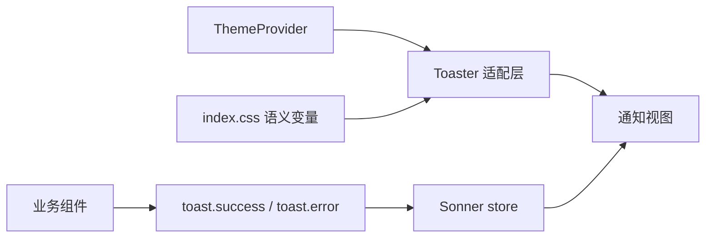

<Callout type="idea" title="文件定位">

这个文件不直接触发通知，而是定义通知应该如何显示。业务层调用 `toast.success()` 等函数，应用根节点只挂载一次 Toaster。

</Callout>

## 这个文件负责什么

- 同步 next-themes 的当前主题。
- 统一成功、信息、警告、错误和加载图标。
- 把通知背景、文字、边框和圆角绑定到主题变量。
- 透传 Sonner 的全部配置属性。

## 执行思路

<Steps>
  <Step>

### 1. ThemeProvider 解析当前主题。

  </Step>
  <Step>

### 2. main.tsx 挂载唯一 Toaster。

  </Step>
  <Step>

### 3. 业务 Hook 调用 toast API。

  </Step>
  <Step>

### 4. Sonner 将通知送入容器。

  </Step>
  <Step>

### 5. 容器根据类型、主题和传入 props 渲染。

  </Step>
</Steps>

## 与其他模块的关系

| 模块 | 关系 |
| --- | --- |
| `ThemeProvider / next-themes` | 提供 system/light/dark 当前值。 |
| `useCustomToast` | 封装业务层成功与错误通知。 |
| `main.tsx` | 应用根部挂载 Toaster。 |
| `index.css` | 提供 popover、border、radius 变量。 |

## 导出 API

| 导出 | 类型 | 用途 |
| --- | --- | --- |
| `Toaster` | `component` | 项目统一通知容器，兼容 Sonner ToasterProps。 |

## 组合结构



<Tabs items={['主题', '图标', '样式变量']}>
  <Tab>使用 `theme` prop 跟随页面主题。</Tab>
  <Tab>状态图标在一个位置集中配置。</Tab>
  <Tab>CSS 自定义属性复用项目的语义色和圆角。</Tab>
</Tabs>

## 带注释源码

> 原始路径：`frontend/src/components/ui/sonner.tsx`。以下仅增加学习性注释与代码高亮标记，不改变程序行为。

```tsx title="sonner.tsx" lineNumbers
"use client"

import {
  CircleCheckIcon,
  InfoIcon,
  Loader2Icon,
  OctagonXIcon,
  TriangleAlertIcon,
} from "lucide-react"
import { useTheme } from "next-themes"
import { Toaster as Sonner, type ToasterProps } from "sonner"

// 项目级适配层：统一主题、图标和 CSS 变量，同时保留 Sonner 原始 props。
const Toaster = ({ ...props }: ToasterProps) => {
  // next-themes 提供当前主题，使通知与页面明暗模式同步。
  const { theme = "system" } = useTheme()

  return (
    <Sonner
      theme={theme as ToasterProps["theme"]}
      className="toaster group"
      // 为每种通知状态提供一致的 Lucide 图标。
      icons={{
        success: <CircleCheckIcon className="size-4" />,
        info: <InfoIcon className="size-4" />,
        warning: <TriangleAlertIcon className="size-4" />,
        error: <OctagonXIcon className="size-4" />,
        loading: <Loader2Icon className="size-4 animate-spin" />,
      }}
      // 使用项目语义色变量覆盖 Sonner 默认视觉。
      style={
        {
          "--normal-bg": "var(--popover)",
          "--normal-text": "var(--popover-foreground)",
          "--normal-border": "var(--border)",
          "--border-radius": "var(--radius)",
        } as React.CSSProperties
      }
      {...props}
    />
  )
}

export { Toaster }
```

## 阅读重点

- Toaster 应只挂载一次，否则通知可能重复或位置冲突。
- `theme as ToasterProps["theme"]` 是库类型之间的桥接；升级依赖时应确认允许值一致。
- 业务组件应通过统一 Hook 或 toast API 触发消息，不要自行复制通知样式。
- 加载图标需要 `animate-spin`，其余图标保持静态以便快速识别。
