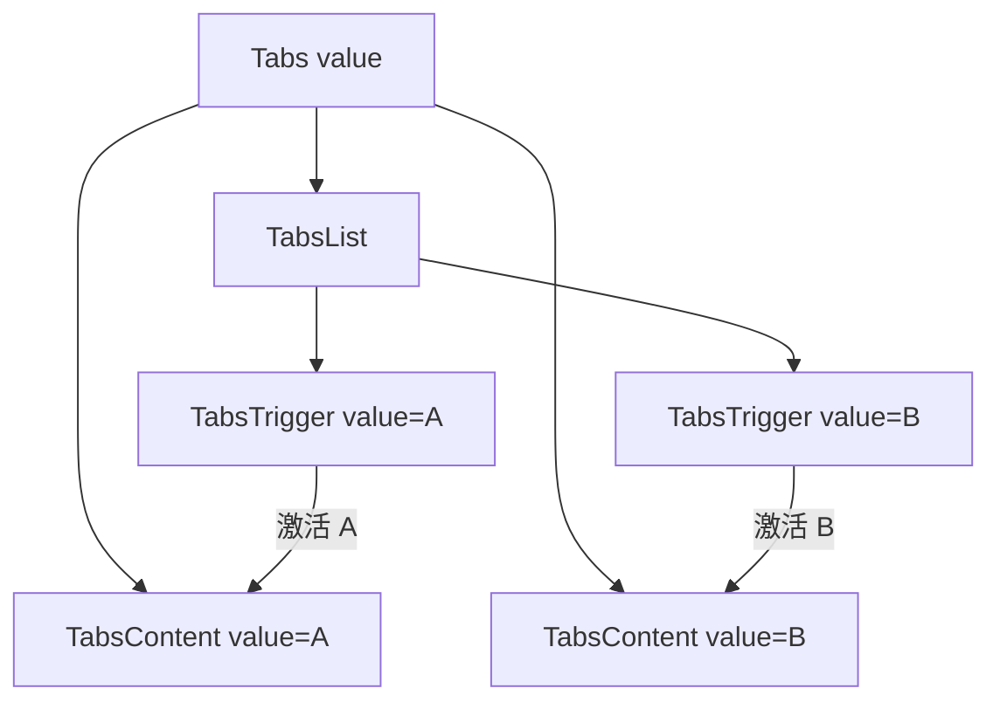

<Callout type="idea" title="文件定位">

Tabs 将多块同级内容放在同一页面区域中切换。Radix 负责状态和无障碍语义，本文件只增加 data-slot 与主题样式。

</Callout>

## 这个文件负责什么

- 提供 Tabs Root、List、Trigger、Content 组合组件。
- 继承 Radix 的受控与非受控状态能力。
- 支持键盘方向键与焦点管理。
- 用 data-state 驱动活动标签样式。
- 允许图标、禁用态和 className 扩展。

## 执行思路

<Steps>
  <Step>

### 1. Tabs 接收 defaultValue 或受控 value。

  </Step>
  <Step>

### 2. TabsList 渲染一组 Trigger。

  </Step>
  <Step>

### 3. 用户点击或键盘切换 Trigger。

  </Step>
  <Step>

### 4. Radix 更新活动 value。

  </Step>
  <Step>

### 5. 匹配 value 的 TabsContent 显示。

  </Step>
</Steps>

## 与其他模块的关系

| 模块 | 关系 |
| --- | --- |
| `@radix-ui/react-tabs` | 状态机与无障碍行为。 |
| `settings.tsx` | 用配置数组生成设置页标签。 |
| `cn` | 合并主题样式与调用方覆盖。 |
| `index.css` | 提供 background、muted、ring 等语义色。 |

## 导出 API

| 导出 | 类型 | 用途 |
| --- | --- | --- |
| `Tabs` | `root` | 保存当前活动值。 |
| `TabsList` | `list` | 承载一组触发器。 |
| `TabsTrigger` | `trigger` | 切换到对应 value。 |
| `TabsContent` | `panel` | 显示对应 value 的内容。 |

## 组合结构



```tsx title="组合约束"
<Tabs defaultValue="profile">
  <TabsList>
    <TabsTrigger value="profile">Profile</TabsTrigger>
  </TabsList>
  <TabsContent value="profile">...</TabsContent>
</Tabs>
```

## 带注释源码

> 原始路径：`frontend/src/components/ui/tabs.tsx`。以下仅增加学习性注释与代码高亮标记，不改变程序行为。

```tsx title="tabs.tsx" lineNumbers
import * as React from "react"
import * as TabsPrimitive from "@radix-ui/react-tabs"

import { cn } from "@/lib/utils"

// Root 保存当前 value，并为 List、Trigger、Content 建立共享上下文。
function Tabs({
  className,
  ...props
}: React.ComponentProps<typeof TabsPrimitive.Root>) {
  return (
    <TabsPrimitive.Root
      data-slot="tabs"
      className={cn("flex flex-col gap-2", className)}
      {...props}
    />
  )
}

// List 只负责触发器排列与背景容器。
function TabsList({
  className,
  ...props
}: React.ComponentProps<typeof TabsPrimitive.List>) {
  return (
    <TabsPrimitive.List
      data-slot="tabs-list"
      className={cn(
        "bg-muted text-muted-foreground inline-flex h-9 w-fit items-center justify-center rounded-lg p-[3px]",
        className
      )}
      {...props}
    />
  )
}

// Radix 写入 data-state=active，样式据此切换选中态。
function TabsTrigger({
  className,
  ...props
}: React.ComponentProps<typeof TabsPrimitive.Trigger>) {
  return (
    <TabsPrimitive.Trigger
      data-slot="tabs-trigger"
      className={cn(
        "data-[state=active]:bg-background dark:data-[state=active]:text-foreground focus-visible:border-ring focus-visible:ring-ring/50 focus-visible:outline-ring dark:data-[state=active]:border-input dark:data-[state=active]:bg-input/30 text-foreground dark:text-muted-foreground inline-flex h-[calc(100%-1px)] flex-1 items-center justify-center gap-1.5 rounded-md border border-transparent px-2 py-1 text-sm font-medium whitespace-nowrap transition-[color,box-shadow] focus-visible:ring-[3px] focus-visible:outline-1 disabled:pointer-events-none disabled:opacity-50 data-[state=active]:shadow-sm [&_svg]:pointer-events-none [&_svg]:shrink-0 [&_svg:not([class*='size-'])]:size-4",
        className
      )}
      {...props}
    />
  )
}

// 只有与当前 value 匹配的 Content 会进入活动状态。
function TabsContent({
  className,
  ...props
}: React.ComponentProps<typeof TabsPrimitive.Content>) {
  return (
    <TabsPrimitive.Content
      data-slot="tabs-content"
      className={cn("flex-1 outline-none", className)}
      {...props}
    />
  )
}

export { Tabs, TabsList, TabsTrigger, TabsContent }
```

## 阅读重点

- Trigger 与 Content 的 value 必须一一对应。
- Tabs 适合并列视图，不适合表达严格先后步骤。
- 内容很长或需要独立 URL 时，应考虑子路由而不是标签页。
- 活动态依赖 Radix 的 `data-state`，业务层无需重复维护 selected state。
