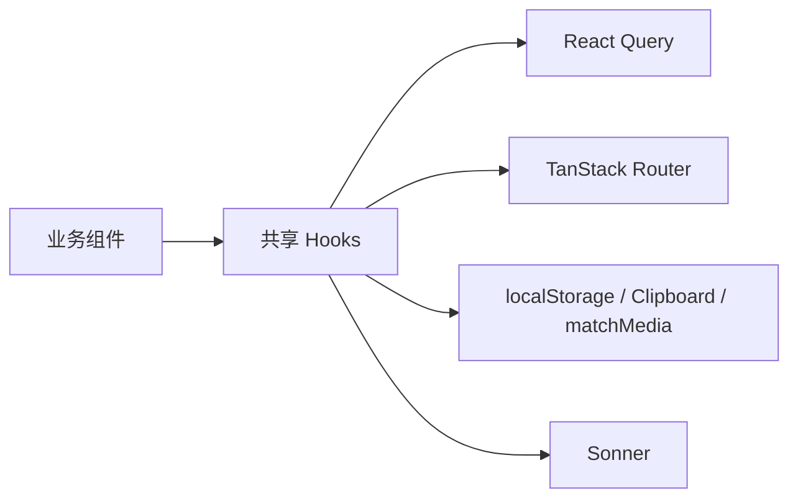

<Callout type="idea" title="目录定位">

`frontend/src/hooks` 位于 UI 与基础设施之间：它把 React Query、Router、浏览器 API 和通知系统包装成业务组件可直接调用的接口。

</Callout>

## 目录结构

<Files>
  <Folder name="frontend/src/hooks" defaultOpen>
    <File name="useAuth.ts" />
    <File name="useCopyToClipboard.ts" />
    <File name="useCustomToast.ts" />
    <File name="useMobile.ts" />
  </Folder>
</Files>

## 如何组织

| 文件 | 状态来源 | 对外能力 |
| --- | --- | --- |
| `useAuth.ts` | React Query + localStorage | 当前用户、登录、注册、退出 |
| `useCopyToClipboard.ts` | React state + Clipboard API | 复制文本和短暂成功状态 |
| `useCustomToast.ts` | Sonner store | 统一成功、错误消息 |
| `useMobile.ts` | matchMedia + viewport | 是否进入移动断点 |

## 组织原则

- Hook 名称以 `use` 开头，副作用由 React 生命周期管理。
- 业务组件消费稳定接口，不直接重复访问 localStorage 或 navigator。
- 服务端状态交给 React Query，本地瞬时状态交给 useState。
- 浏览器事件监听必须在 cleanup 中解除。
- 错误展示由统一通知 Hook 处理，避免文案和样式分裂。

## 推荐阅读顺序

<Steps>
  <Step>

### 1. 先读 `useCustomToast.ts`，理解最小封装。

  </Step>
  <Step>

### 2. 再读 `useCopyToClipboard.ts` 与 `useMobile.ts`，观察浏览器 API 生命周期。

  </Step>
  <Step>

### 3. 最后读 `useAuth.ts`，串联服务端状态、路由和本地令牌。

  </Step>
</Steps>
