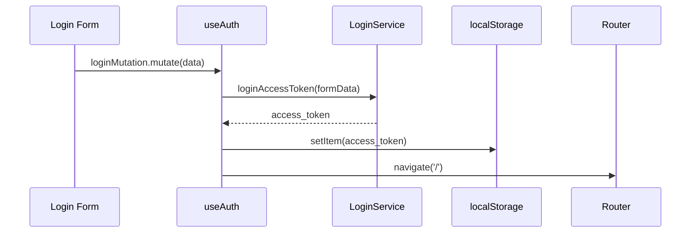

<Callout type="idea" title="文件定位">

这是前端认证流程的核心协调器。它不实现密码校验或 JWT 验证，而是连接生成的 API Client、React Query 缓存、Router 导航和 localStorage 令牌。

</Callout>

## 这个文件负责什么

- 判断浏览器中是否存在访问令牌。
- 查询并缓存当前用户。
- 封装注册与登录 Mutation。
- 登录成功后保存 access_token。
- 统一处理 API 错误通知。
- 退出时清理令牌并跳转登录页。

## 执行思路

<Steps>
  <Step>

### 1. 路由或组件调用 `isLoggedIn()` 做快速入口判断。

  </Step>
  <Step>

### 2. Hook 根据令牌决定是否启用 currentUser Query。

  </Step>
  <Step>

### 3. 表单触发登录或注册 Mutation。

  </Step>
  <Step>

### 4. 成功回调保存令牌或执行导航。

  </Step>
  <Step>

### 5. 失败回调经 handleError 转换为 toast。

  </Step>
  <Step>

### 6. 退出操作删除令牌并返回登录页。

  </Step>
</Steps>

## 与其他模块的关系

| 模块 | 关系 |
| --- | --- |
| `LoginService / UsersService` | 生成的 API 客户端服务。 |
| `React Query` | 管理 currentUser、Mutation 状态和缓存失效。 |
| `TanStack Router` | 登录、注册和退出后的导航。 |
| `main.tsx OpenAPI.TOKEN` | 每次请求从 localStorage 读取令牌。 |
| `useCustomToast / handleError` | 统一错误消息。 |

## 状态与缓存模型

| 键/状态 | 来源 | 生命周期 |
| --- | --- | --- |
| `access_token` | localStorage | 登录成功写入，退出或 401/403 删除 |
| `['currentUser']` | React Query | 登录态下请求并缓存 |
| `['users']` | React Query | 注册完成后标记过期 |
| `loginMutation.isPending` | Mutation | 单次登录请求期间 |



## 带注释源码

> 原始路径：`frontend/src/hooks/useAuth.ts`。以下仅增加学习性注释与代码高亮标记，不改变程序行为。

```ts title="useAuth.ts" lineNumbers
import { useMutation, useQuery, useQueryClient } from "@tanstack/react-query"
import { useNavigate } from "@tanstack/react-router"

import {
  type Body_login_login_access_token as AccessToken,
  LoginService,
  type UserPublic,
  type UserRegister,
  UsersService,
} from "@/client"
import { handleError } from "@/utils"
import useCustomToast from "./useCustomToast"

// 路由守卫只做快速令牌存在性判断，不代表令牌一定有效。
const isLoggedIn = () => {
  return localStorage.getItem("access_token") !== null
}

// 聚合认证相关 Query、Mutation、导航与错误通知。
const useAuth = () => {
  const navigate = useNavigate()
  const queryClient = useQueryClient()
  const { showErrorToast } = useCustomToast()

  // 只有本地存在令牌时才请求当前用户，避免匿名页面无效请求。
  const { data: user } = useQuery<UserPublic | null, Error>({
    queryKey: ["currentUser"],
    queryFn: UsersService.readUserMe,
    enabled: isLoggedIn(),
  })

  // 注册成功后回到登录页；结束时刷新管理员用户列表缓存。
  const signUpMutation = useMutation({
    mutationFn: (data: UserRegister) =>
      UsersService.registerUser({ requestBody: data }),
    onSuccess: () => {
      navigate({ to: "/login" })
    },
    onError: handleError.bind(showErrorToast),
    onSettled: () => {
      queryClient.invalidateQueries({ queryKey: ["users"] })
    },
  })

  // 登录接口返回访问令牌，保存后后续 OpenAPI 请求会自动读取。
  const login = async (data: AccessToken) => {
    const response = await LoginService.loginAccessToken({
      formData: data,
    })
    localStorage.setItem("access_token", response.access_token)
  }

  // Mutation 负责 pending/error/success 状态，组件只调用 mutate。
  const loginMutation = useMutation({
    mutationFn: login,
    onSuccess: () => {
      navigate({ to: "/" })
    },
    onError: handleError.bind(showErrorToast),
  })

  // 退出时删除令牌并立即离开受保护区域。
  const logout = () => {
    localStorage.removeItem("access_token")
    navigate({ to: "/login" })
  }

  return {
    signUpMutation,
    loginMutation,
    logout,
    user,
  }
}

export { isLoggedIn }
export default useAuth
```

## 阅读重点

- `isLoggedIn()` 只检查令牌是否存在；令牌过期由 main.tsx 的 401/403 全局处理兜底。
- currentUser 查询没有显式清除；退出时可考虑 `queryClient.clear()` 或移除敏感缓存。
- 令牌放在 localStorage 容易受 XSS 影响，生产系统需根据威胁模型评估 HttpOnly Cookie。
- 注册成功后失效 `users` 适合管理员列表，但普通注册页也会执行，影响很小。
- 认证 Hook 同时承担状态与导航，便于模板使用；大型项目可拆分 session store 与 mutation hooks。

## Twoslash：查询键的字面量类型

```ts twoslash
const currentUserKey = ['currentUser'] as const
//    ^?

const usersKey = ['users'] as const
//    ^?
```

`as const` 会保留元组和字符串字面量信息。当前源码直接写数组也能工作，但提取共享 Query Options 时，稳定的字面量类型更便于复用。
