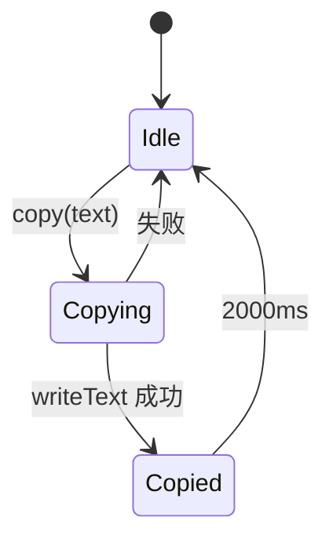

<Callout type="idea" title="文件定位">

该 Hook 把浏览器剪贴板副作用封装成可测试的组件接口。调用方不需要处理 API 是否存在、Promise 异常或“已复制”提示的定时恢复。

</Callout>

## 这个文件负责什么

- 检测 Clipboard API 是否可用。
- 异步写入文本。
- 记录最近一次成功复制的内容。
- 两秒后清空成功状态。
- 失败时返回 false 并恢复状态。

## 执行思路

<Steps>
  <Step>

### 1. 组件调用 `copy(text)`。

  </Step>
  <Step>

### 2. Hook 检查 navigator.clipboard。

  </Step>
  <Step>

### 3. writeText 写入系统剪贴板。

  </Step>
  <Step>

### 4. 成功后更新 copiedText 并启动定时器。

  </Step>
  <Step>

### 5. 两秒后状态恢复为 null；失败立即返回 false。

  </Step>
</Steps>

## 与其他模块的关系

| 模块 | 关系 |
| --- | --- |
| `Clipboard API` | 真正执行系统剪贴板写入。 |
| `React useState` | 保存短暂反馈状态。 |
| `React useCallback` | 保持 copy 函数引用稳定。 |
| `复制按钮组件` | 根据 copiedText 或 boolean 结果切换图标。 |

## 返回值契约

| 元素 | 类型 | 含义 |
| --- | --- | --- |
| `copiedText` | `string | null` | 最近成功复制的文本；两秒后恢复 null |
| `copy` | `(text: string) => Promise<boolean>` | 写入剪贴板并报告是否成功 |



## 带注释源码

> 原始路径：`frontend/src/hooks/useCopyToClipboard.ts`。以下仅增加学习性注释与代码高亮标记，不改变程序行为。

```ts title="useCopyToClipboard.ts" lineNumbers
// source: https://usehooks-ts.com/react-hook/use-copy-to-clipboard
import { useCallback, useState } from "react"

// null 表示当前没有需要展示的“已复制”反馈。
type CopiedValue = string | null

type CopyFn = (text: string) => Promise<boolean>

// 返回 [最近复制内容, 异步复制函数]，保持与常见 React Hook 习惯一致。
export function useCopyToClipboard(): [CopiedValue, CopyFn] {
  const [copiedText, setCopiedText] = useState<CopiedValue>(null)

  // useCallback 保证函数引用稳定，便于作为子组件 prop。
  const copy: CopyFn = useCallback(async (text) => {
    // 非安全上下文或旧浏览器可能不提供 Clipboard API。
    if (!navigator?.clipboard) {
      console.warn("Clipboard not supported")
      return false
    }

    try {
      // writeText 成功后记录文本，用于按钮短暂切换为成功态。
      await navigator.clipboard.writeText(text)
      setCopiedText(text)

      // 两秒后自动清空反馈，不影响剪贴板中的真实内容。
      setTimeout(() => setCopiedText(null), 2000)

      return true
    } catch (error) {
      console.warn("Copy failed", error)
      setCopiedText(null)
      return false
    }
  }, [])

  return [copiedText, copy]
}
```

## 阅读重点

- Clipboard API 通常要求 HTTPS 或 localhost 安全上下文。
- 组件卸载后定时器仍可能触发；频繁挂载场景可用 ref 保存并清理 timer。
- 连续复制会创建多个 timer，较早的 timer 可能提前清空较新的反馈。
- 函数返回 boolean，调用方可以在失败时显示 toast 或备用复制方案。

## Twoslash：元组解构后的类型

```ts twoslash
// ---cut-start---
type CopyResult = [string | null, (text: string) => Promise<boolean>]
declare const result: CopyResult
// ---cut-end---
const [copiedText, copy] = result
//     ^?
//                 ^?
```

元组类型让两个返回位置保持固定含义；如果改成普通数组，解构后的类型会变得更宽泛。
