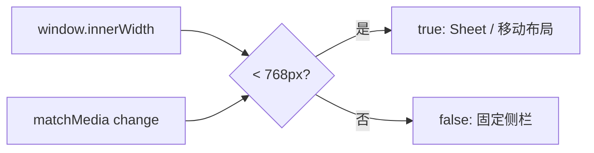

<Callout type="idea" title="文件定位">

该 Hook 将 CSS 断点映射为 JavaScript 布尔值。仅当组件的行为结构确实不同（例如固定侧栏与模态 Sheet）时才需要它；纯视觉变化应优先交给 CSS。

</Callout>

## 这个文件负责什么

- 定义移动端断点。
- 在客户端计算初始视口状态。
- 监听断点跨越事件。
- 卸载时清理监听器。
- 向组件返回稳定 boolean。

## 执行思路

<Steps>
  <Step>

### 1. 首次渲染返回 false（undefined 被转换）。

  </Step>
  <Step>

### 2. effect 创建 MediaQueryList。

  </Step>
  <Step>

### 3. 立即同步当前 innerWidth。

  </Step>
  <Step>

### 4. 跨越 768px 时更新状态。

  </Step>
  <Step>

### 5. 卸载时移除 change 监听。

  </Step>
</Steps>

## 与其他模块的关系

| 模块 | 关系 |
| --- | --- |
| `SidebarProvider` | 选择桌面固定侧栏或移动 Sheet。 |
| `window.matchMedia` | 高效监听媒体查询变化。 |
| `Tailwind md breakpoint` | 应与 768px 视觉断点保持一致。 |
| `React effect` | 管理浏览器事件生命周期。 |

## 行为断点



## 带注释源码

> 原始路径：`frontend/src/hooks/useMobile.ts`。以下仅增加学习性注释与代码高亮标记，不改变程序行为。

```ts title="useMobile.ts" lineNumbers
import * as React from "react"

// 与 Tailwind md 断点一致：小于 768px 视为移动布局。
const MOBILE_BREAKPOINT = 768

// 首次客户端 effect 后开始监听断点变化。
export function useIsMobile() {
  const [isMobile, setIsMobile] = React.useState<boolean | undefined>(undefined)

  React.useEffect(() => {
    // matchMedia 只在跨越断点时触发，比持续 resize 更高效。
    const mql = window.matchMedia(`(max-width: ${MOBILE_BREAKPOINT - 1}px)`)
    // 重新读取 innerWidth，确保返回值与实际视口一致。
    const onChange = () => {
      setIsMobile(window.innerWidth < MOBILE_BREAKPOINT)
    }
    mql.addEventListener("change", onChange)
    setIsMobile(window.innerWidth < MOBILE_BREAKPOINT)
    // 组件卸载时解除监听，避免残留回调。
    return () => mql.removeEventListener("change", onChange)
  }, [])

  return !!isMobile
}
```

## 阅读重点

- 服务端渲染阶段没有 window；当前 window 访问只发生在 effect 中，因此安全。
- 首次客户端渲染返回 false，可能在极短时间内先走桌面分支再切移动分支。
- 断点值应与 CSS 配置保持单一事实来源，否则会出现行为和样式不一致。
- 仅改变类名时无需 JavaScript Hook，使用响应式 CSS 更简单。
