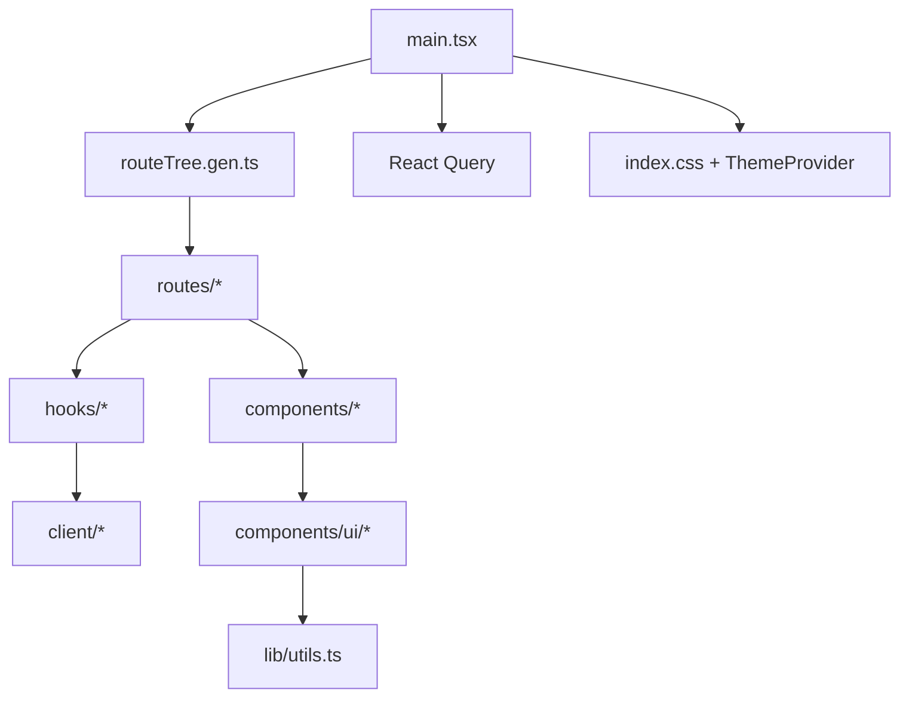

<Callout type="idea" title="目录定位">

`frontend/src` 是浏览器应用的运行时代码根目录。它采用“生成客户端 + 可复用组件 + 业务 Hook + 文件路由 + 单一启动入口”的分层结构。

</Callout>

## 目录结构

<Files>
  <Folder name="frontend/src" defaultOpen>
    <Folder name="client"><File name="OpenAPI 生成代码" /></Folder>
    <Folder name="components"><File name="业务组件与 UI 原语" /></Folder>
    <Folder name="hooks"><File name="认证和浏览器能力" /></Folder>
    <Folder name="lib"><File name="低层通用工具" /></Folder>
    <Folder name="routes"><File name="TanStack 文件路由" /></Folder>
    <File name="index.css" />
    <File name="main.tsx" />
    <File name="routeTree.gen.ts" />
    <File name="utils.ts" />
    <File name="vite-env.d.ts" />
  </Folder>
</Files>

## 如何组织

| 层 | 主要职责 | 是否应包含业务规则 |
| --- | --- | --- |
| `client` | 与后端通信和类型生成 | 否，通常自动生成 |
| `components/ui` | 无业务倾向的视觉原语 | 否 |
| `components/*` | 用户、物品、布局等业务 UI | 可以 |
| `hooks` | 状态、副作用和服务协调 | 可以 |
| `routes` | 页面边界、守卫和组合 | 可以，但避免重复服务逻辑 |
| `main.tsx` | 全局 Provider 和启动 | 仅全局策略 |

## 组织原则

- 自动生成的 client 与 routeTree 不手工维护。
- 业务页面通过 Hook 和服务访问数据，不在 UI 原语中请求 API。
- 全局 Provider 只在 main.tsx 组装一次。
- 主题值集中在 index.css，组件使用语义类。
- 目录 index 文档解释架构，具体文件文档解释实现。

## 推荐阅读顺序

<Steps>
  <Step>

### 1. 从 `main.tsx` 理解应用如何启动。

  </Step>
  <Step>

### 2. 阅读 `routes` 了解页面边界和认证守卫。

  </Step>
  <Step>

### 3. 阅读 `hooks/useAuth.ts` 理解数据与会话。

  </Step>
  <Step>

### 4. 阅读业务 components，再下钻 UI 原语。

  </Step>
  <Step>

### 5. 最后阅读生成的 client 与 routeTree，理解类型连接。

  </Step>
</Steps>
