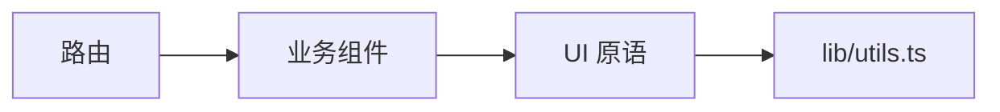

<Callout type="idea" title="目录定位">

当前 `lib` 目录非常克制，只包含 Tailwind 类名合并函数。它是 UI 原语的最低依赖层，不应反向依赖路由、API 或业务组件。

</Callout>

## 目录结构

<Files>
  <Folder name="frontend/src/lib" defaultOpen>
    <File name="utils.ts：cn() 类名合并" />
  </Folder>
</Files>

## 如何组织

依赖箭头应保持单向。`lib` 可以被上层使用，但不应导入上层模块。

## 组织原则

- 只放跨业务通用的纯函数或基础适配。
- 避免读取全局状态、路由或浏览器存储。
- 保持依赖少、体积小、易测试。
- 函数命名应表达机制，而不是某个页面用途。

## 推荐阅读顺序

<Steps>
  <Step>

### 1. 阅读 `utils.ts` 的 clsx 阶段。

  </Step>
  <Step>

### 2. 再观察 tailwind-merge 如何解决冲突。

  </Step>
  <Step>

### 3. 回到任意 UI 组件查看 cn 的调用方式。

  </Step>
</Steps>
