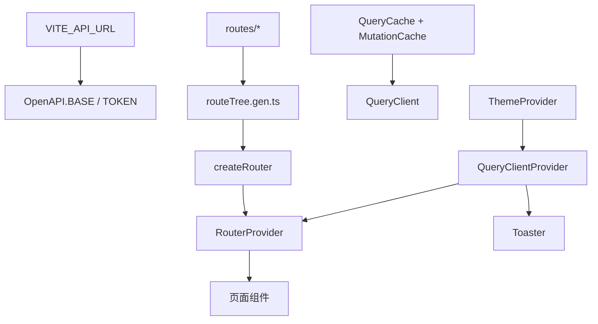

<Callout type="idea" title="文件定位">

这是浏览器应用的 composition root。所有需要“全局唯一”的对象都在这里创建和连接，页面组件不应重复实例化 QueryClient、Router 或 Toaster。

</Callout>

## 这个文件负责什么

- 设置 API 根地址与令牌读取器。
- 统一处理 401/403 会话失效。
- 创建 QueryClient 与全局缓存策略。
- 用生成路由树创建 Router。
- 注册 Router 类型扩展。
- 组装主题、Query、Router 和通知 Provider。
- 挂载 React 根节点。

## 执行思路

<Steps>
  <Step>

### 1. 读取 VITE_API_URL 配置 OpenAPI。

  </Step>
  <Step>

### 2. 注册动态 TOKEN 函数。

  </Step>
  <Step>

### 3. 创建带全局错误回调的 QueryClient。

  </Step>
  <Step>

### 4. 根据 routeTree 创建 Router。

  </Step>
  <Step>

### 5. ReactDOM 找到 #root。

  </Step>
  <Step>

### 6. 按 Provider 层级渲染应用。

  </Step>
</Steps>

## 与其他模块的关系

| 模块 | 关系 |
| --- | --- |
| `client/OpenAPI` | 生成客户端的全局配置。 |
| `useAuth` | 写入和删除同一 access_token。 |
| `routeTree.gen.ts` | 提供类型化路由结构。 |
| `ThemeProvider / index.css` | 控制明暗主题。 |
| `QueryClientProvider` | 向所有 Hook 提供缓存实例。 |
| `Toaster` | 渲染全局通知。 |

## 启动拓扑



## Provider 层级

<Files>
  <Folder name="StrictMode" defaultOpen>
    <Folder name="ThemeProvider" defaultOpen>
      <Folder name="QueryClientProvider" defaultOpen>
        <File name="RouterProvider" />
        <File name="Toaster" />
      </Folder>
    </Folder>
  </Folder>
</Files>

## 带注释源码

> 原始路径：`frontend/src/main.tsx`。以下仅增加学习性注释与代码高亮标记，不改变程序行为。

```tsx title="main.tsx" lineNumbers
import {
  MutationCache,
  QueryCache,
  QueryClient,
  QueryClientProvider,
} from "@tanstack/react-query"
import { createRouter, RouterProvider } from "@tanstack/react-router"
import { StrictMode } from "react"
import ReactDOM from "react-dom/client"
import { ApiError, OpenAPI } from "./client"
import { ThemeProvider } from "./components/theme-provider"
import { Toaster } from "./components/ui/sonner"
import "./index.css"
import { routeTree } from "./routeTree.gen"

// 在应用启动时配置生成客户端的 API 根地址。
OpenAPI.BASE = import.meta.env.VITE_API_URL ?? ""
// 每次请求动态读取最新令牌，避免捕获过期值。
OpenAPI.TOKEN = async () => {
  return localStorage.getItem("access_token") || ""
}

// Query 与 Mutation 共享的全局未授权处理。
const handleApiError = (error: Error) => {
  if (error instanceof ApiError && [401, 403].includes(error.status)) {
    localStorage.removeItem("access_token")
    window.location.href = "/login"
  }
}
// QueryClient 是服务端状态缓存的唯一实例。
const queryClient = new QueryClient({
  queryCache: new QueryCache({
    onError: handleApiError,
  }),
  mutationCache: new MutationCache({
    onError: handleApiError,
  }),
})

// 生成的 routeTree 在这里实例化为运行时 Router。
const router = createRouter({ routeTree })
// 模块扩展让 Link、navigate 和 Route 获得本项目路由类型。
declare module "@tanstack/react-router" {
  interface Register {
    router: typeof router
  }
}

// 根 Provider 顺序：主题 → 服务端状态 → 路由页面 → 全局通知。
ReactDOM.createRoot(document.getElementById("root")!).render(
  <StrictMode>
    <ThemeProvider defaultTheme="dark" storageKey="vite-ui-theme">
      <QueryClientProvider client={queryClient}>
        <RouterProvider router={router} />
        <Toaster richColors closeButton />
      </QueryClientProvider>
    </ThemeProvider>
  </StrictMode>,
)
```

## 阅读重点

- QueryClient 和 Router 必须在组件外创建，避免每次渲染重置缓存与路由状态。
- TOKEN 使用函数而不是固定字符串，可在登录后无需重建客户端。
- 401/403 统一跳转简洁，但 403 也可能表示权限不足而非会话失效；真实系统可区分处理。
- 使用 `window.location.href` 会整页刷新，优点是彻底清空运行时状态。
- Provider 顺序决定下层可访问的上下文；Toaster 位于 Query Provider 内但不依赖 Query。
