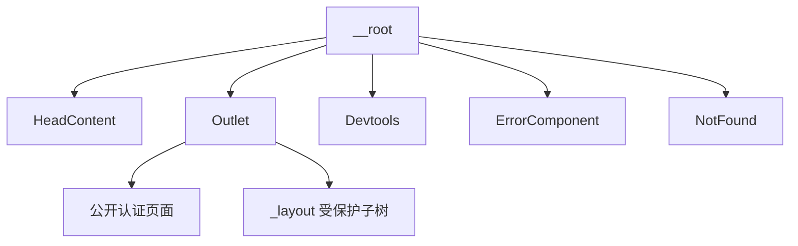

<Callout type="idea" title="文件定位">

所有 URL 最终都经过根路由。它不提供业务布局，而是定义全应用共享的文档头、匹配出口和异常边界。

</Callout>

## 这个文件负责什么

- 渲染子路由 head 元数据。
- 提供顶层 Outlet。
- 挂载路由和查询开发工具。
- 定义全局 notFoundComponent。
- 定义全局 errorComponent。

## 执行思路

<Steps>
  <Step>

### 1. Router 匹配当前 URL。

  </Step>
  <Step>

### 2. 根路由先渲染 HeadContent。

  </Step>
  <Step>

### 3. Outlet 渲染公开页面或受保护布局。

  </Step>
  <Step>

### 4. 子路由抛错时进入 ErrorComponent。

  </Step>
  <Step>

### 5. 无匹配页面进入 NotFound。

  </Step>
</Steps>

## 与其他模块的关系

| 模块 | 关系 |
| --- | --- |
| `routeTree.gen.ts` | 把根路由作为整棵树的父节点。 |
| `ErrorComponent / NotFound` | 全局异常与 404 UI。 |
| `各 route head()` | 向 HeadContent 提供标题与 meta。 |
| `Devtools` | 开发阶段检查路由和 Query 状态。 |

## 路由契约

| 配置 | 作用 |
| --- | --- |
| `component` | 所有页面共同的最外层渲染边界。 |
| `notFoundComponent` | URL 无匹配时显示。 |
| `errorComponent` | 路由加载或渲染抛错时显示。 |



## 带注释源码

> 原始路径：`frontend/src/routes/__root.tsx`。以下仅增加学习性注释与代码高亮标记，不改变程序行为。

```tsx title="__root.tsx" lineNumbers
import { ReactQueryDevtools } from "@tanstack/react-query-devtools"
import { createRootRoute, HeadContent, Outlet } from "@tanstack/react-router"
import { TanStackRouterDevtools } from "@tanstack/react-router-devtools"
import ErrorComponent from "@/components/Common/ErrorComponent"
import NotFound from "@/components/Common/NotFound"

// 根路由包住所有页面，并定义全局错误与 404 边界。
export const Route = createRootRoute({
  component: () => (
    <>
      {/* 渲染各子路由 head() 返回的标题和 meta。 */}
      <HeadContent />
      {/* 当前匹配的顶层子路由在这里渲染。 */}
      <Outlet />
      {/* 开发工具仅用于调试路由和服务端状态。 */}
      <TanStackRouterDevtools position="bottom-right" />
      <ReactQueryDevtools initialIsOpen={false} />
    </>
  ),
  notFoundComponent: () => <NotFound />,
  errorComponent: () => <ErrorComponent />,
})
```

## 阅读重点

- 根路由应保持轻量，业务导航和认证布局放在 `_layout.tsx`。
- Devtools 生产构建是否保留取决于打包配置，正式项目可按环境条件渲染。
- HeadContent 必须位于 Outlet 之外，才能集中处理匹配路由的 head。
- 错误组件应避免再次依赖容易失败的数据请求。
