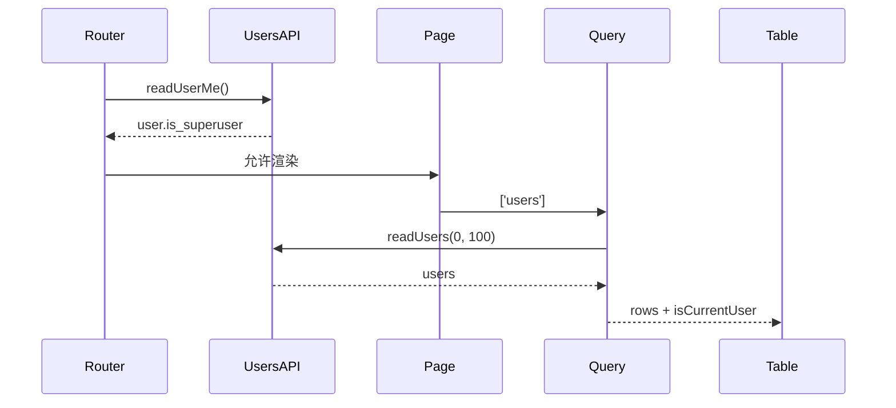

<Callout type="idea" title="文件定位">

管理员页面同时包含授权边界和数据展示。路由层先验证超级用户身份，页面层再请求用户列表并标记当前账号。

</Callout>

## 这个文件负责什么

- 验证当前用户是否为 superuser。
- 查询最多 100 个用户。
- 复用 `users` Query Key。
- 为当前登录用户添加行级标记。
- 用 Suspense 显示 PendingUsers。
- 渲染 DataTable 与新增用户入口。

## 执行思路

<Steps>
  <Step>

### 1. 进入 /admin。

  </Step>
  <Step>

### 2. beforeLoad 请求当前用户。

  </Step>
  <Step>

### 3. 非超级用户重定向首页。

  </Step>
  <Step>

### 4. UsersTable 先显示 PendingUsers。

  </Step>
  <Step>

### 5. useSuspenseQuery 获取用户列表。

  </Step>
  <Step>

### 6. 映射 isCurrentUser 后交给 DataTable。

  </Step>
</Steps>

## 与其他模块的关系

| 模块 | 关系 |
| --- | --- |
| `UsersService` | 读取当前用户和用户列表。 |
| `useAuth` | 读取缓存中的当前用户。 |
| `Admin columns` | 定义列和行操作。 |
| `DataTable` | 渲染通用数据表。 |
| `PendingUsers` | Suspense fallback。 |
| `AddUser` | 创建用户入口。 |

## 路由契约

| 配置 | 作用 |
| --- | --- |
| `path` | `/admin`，位于受保护 `_layout` 下。 |
| `beforeLoad` | 验证 `is_superuser`，失败跳转 `/`。 |
| `queryKey` | `["users"]`。 |
| `head` | 设置 Admin 页面标题。 |



## 带注释源码

> 原始路径：`frontend/src/routes/_layout/admin.tsx`。以下仅增加学习性注释与代码高亮标记，不改变程序行为。

```tsx title="admin.tsx" lineNumbers
import { useSuspenseQuery } from "@tanstack/react-query"
import { createFileRoute, redirect } from "@tanstack/react-router"
import { Suspense } from "react"

import { type UserPublic, UsersService } from "@/client"
import AddUser from "@/components/Admin/AddUser"
import { columns, type UserTableData } from "@/components/Admin/columns"
import { DataTable } from "@/components/Common/DataTable"
import PendingUsers from "@/components/Pending/PendingUsers"
import useAuth from "@/hooks/useAuth"

// 将 queryKey 与 queryFn 放在一起，便于预取、Suspense 和缓存复用。
function getUsersQueryOptions() {
  return {
    queryFn: () => UsersService.readUsers({ skip: 0, limit: 100 }),
    queryKey: ["users"],
  }
}

// 路由级守卫直接读取当前用户，非超级用户在页面渲染前离开。
export const Route = createFileRoute("/_layout/admin")({
  component: Admin,
  beforeLoad: async () => {
    const user = await UsersService.readUserMe()
    if (!user.is_superuser) {
      throw redirect({
        to: "/",
      })
    }
  },
  head: () => ({
    meta: [
      {
        title: "Admin - FastAPI Template",
      },
    ],
  }),
})

// Suspense 内部组件可以安全使用 useSuspenseQuery 并假定 data 已就绪。
function UsersTableContent() {
  const { user: currentUser } = useAuth()
  const { data: users } = useSuspenseQuery(getUsersQueryOptions())

  // 为每行补充 isCurrentUser，供操作列禁用“删除自己”等危险动作。
  const tableData: UserTableData[] = users.data.map((user: UserPublic) => ({
    ...user,
    isCurrentUser: currentUser?.id === user.id,
  }))

  return <DataTable columns={columns} data={tableData} />
}

// Suspense 边界把加载占位与成功内容分离。
function UsersTable() {
  return (
    <Suspense fallback={<PendingUsers />}>
      <UsersTableContent />
    </Suspense>
  )
}

function Admin() {
  return (
    <div className="flex flex-col gap-6">
      <div className="flex items-center justify-between">
        <div>
          <h1 className="text-2xl font-bold tracking-tight">Users</h1>
          <p className="text-muted-foreground">
            Manage user accounts and permissions
          </p>
        </div>
        <AddUser />
      </div>
      <UsersTable />
    </div>
  )
}
```

## 阅读重点

- 前端守卫只改善体验，后端每个管理员 API 仍必须校验权限。
- beforeLoad 与 useAuth 都可能请求当前用户；React Query 预取可进一步减少重复。
- 固定 limit=100 没有分页，大规模用户系统需要服务端分页。
- Suspense 让成功组件不必写 data undefined 分支，但必须有附近的 fallback。
- isCurrentUser 是展示层派生字段，不应写回后端模型。
