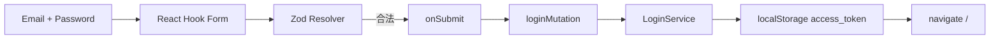

<Callout type="idea" title="文件定位">

登录页负责收集凭据和展示校验，不直接操作令牌。真正的 API 调用、令牌保存和成功导航封装在 useAuth 中。

</Callout>

## 这个文件负责什么

- 校验邮箱与密码长度。
- 让 schema 满足生成的 AccessToken 请求类型。
- 阻止已登录用户进入登录页。
- 配置页面标题。
- 管理表单字段和错误消息。
- 防止 pending 状态重复提交。
- 触发 loginMutation。
- 提供找回密码和注册链接。

## 执行思路

<Steps>
  <Step>

### 1. beforeLoad 检查本地令牌。

  </Step>
  <Step>

### 2. 匿名用户看到登录表单。

  </Step>
  <Step>

### 3. 输入在 blur 时经 Zod 校验。

  </Step>
  <Step>

### 4. handleSubmit 只把合法 FormData 交给 onSubmit。

  </Step>
  <Step>

### 5. loginMutation 请求后端并保存令牌。

  </Step>
  <Step>

### 6. 成功跳转 `/`，失败显示统一 toast。

  </Step>
</Steps>

## 与其他模块的关系

| 模块 | 关系 |
| --- | --- |
| `useAuth.loginMutation` | 执行 API、保存 token、导航和错误处理。 |
| `AuthLayout` | 提供认证页面共同外壳。 |
| `Form primitives` | 连接 React Hook Form 与可访问字段结构。 |
| `PasswordInput / LoadingButton` | 密码可见性与 pending 反馈。 |
| `recover-password / signup routes` | 认证流程其他入口。 |

## 路由契约

| 配置 | 作用 |
| --- | --- |
| `path` | `/login`。 |
| `beforeLoad` | 已登录时重定向 `/`。 |
| `schema` | username 必须是 email；password 至少 8 位。 |
| `head` | Log In 页面标题。 |

## 表单数据链路



<Tabs items={['运行时校验', '静态类型', '服务端校验']}>
  <Tab>Zod 在浏览器中生成字段错误。</Tab>
  <Tab>`satisfies` 与 `z.infer` 连接 schema 和 TypeScript。</Tab>
  <Tab>后端仍是安全边界，不能信任客户端结果。</Tab>
</Tabs>

## 带注释源码

> 原始路径：`frontend/src/routes/login.tsx`。以下仅增加学习性注释与代码高亮标记，不改变程序行为。

```tsx title="login.tsx" lineNumbers
import { zodResolver } from "@hookform/resolvers/zod"
import {
  createFileRoute,
  Link as RouterLink,
  redirect,
} from "@tanstack/react-router"
import { useForm } from "react-hook-form"
import { z } from "zod"

import type { Body_login_login_access_token as AccessToken } from "@/client"
import { AuthLayout } from "@/components/Common/AuthLayout"
import {
  Form,
  FormControl,
  FormField,
  FormItem,
  FormLabel,
  FormMessage,
} from "@/components/ui/form"
import { Input } from "@/components/ui/input"
import { LoadingButton } from "@/components/ui/loading-button"
import { PasswordInput } from "@/components/ui/password-input"
import useAuth, { isLoggedIn } from "@/hooks/useAuth"

// Zod 同时提供运行时校验和 FormData 静态类型来源。
const formSchema = z.object({
  username: z.email({ message: "Invalid email address" }),
  password: z
    .string()
    .min(1, { message: "Password is required" })
    .min(8, { message: "Password must be at least 8 characters" }),
}) satisfies z.ZodType<AccessToken>

type FormData = z.infer<typeof formSchema>

// 已登录用户不应停留在登录页，beforeLoad 直接送回首页。
export const Route = createFileRoute("/login")({
  component: Login,
  beforeLoad: async () => {
    if (isLoggedIn()) {
      throw redirect({
        to: "/",
      })
    }
  },
  head: () => ({
    meta: [
      {
        title: "Log In - FastAPI Template",
      },
    ],
  }),
})

function Login() {
  const { loginMutation } = useAuth()
  // React Hook Form 使用 Zod resolver，并在失焦时校验全部规则。
  const form = useForm<FormData>({
    resolver: zodResolver(formSchema),
    mode: "onBlur",
    criteriaMode: "all",
    defaultValues: {
      username: "",
      password: "",
    },
  })

  // pending 守卫避免用户快速重复提交同一凭据。
  const onSubmit = (data: FormData) => {
    if (loginMutation.isPending) return
    loginMutation.mutate(data)
  }

  return (
    <AuthLayout>
      <Form {...form}>
        <form
          onSubmit={form.handleSubmit(onSubmit)}
          className="flex flex-col gap-6"
        >
          <div className="flex flex-col items-center gap-2 text-center">
            <h1 className="text-2xl font-bold">Login to your account</h1>
          </div>

          <div className="grid gap-4">
            {/* username 字段实际承载邮箱，以匹配 OAuth2 password form。 */}
            <FormField
              control={form.control}
              name="username"
              render={({ field }) => (
                <FormItem>
                  <FormLabel>Email</FormLabel>
                  <FormControl>
                    <Input
                      data-testid="email-input"
                      placeholder="user@example.com"
                      type="email"
                      {...field}
                    />
                  </FormControl>
                  <FormMessage className="text-xs" />
                </FormItem>
              )}
            />

            <FormField
              control={form.control}
              name="password"
              render={({ field }) => (
                <FormItem>
                  <div className="flex items-center">
                    <FormLabel>Password</FormLabel>
                    <RouterLink
                      to="/recover-password"
                      className="ml-auto text-sm underline-offset-4 hover:underline"
                    >
                      Forgot your password?
                    </RouterLink>
                  </div>
                  <FormControl>
                    <PasswordInput
                      data-testid="password-input"
                      placeholder="Password"
                      {...field}
                    />
                  </FormControl>
                  <FormMessage className="text-xs" />
                </FormItem>
              )}
            />

            {/* Mutation pending 状态直接驱动按钮禁用与加载反馈。 */}
            <LoadingButton type="submit" loading={loginMutation.isPending}>
              Log In
            </LoadingButton>
          </div>

          <div className="text-center text-sm">
            Don't have an account yet?{" "}
            <RouterLink to="/signup" className="underline underline-offset-4">
              Sign up
            </RouterLink>
          </div>
        </form>
      </Form>
    </AuthLayout>
  )
}
```

## 阅读重点

- 字段名是 `username`，值却是邮箱，这是 OAuth2 Password Flow 的常见接口形状。
- `satisfies z.ZodType<AccessToken>` 会在编译期检查 schema 输出是否兼容生成请求类型。
- 客户端长度校验改善体验，后端仍必须独立验证。
- pending 守卫与 LoadingButton 双重防止重复提交。
- data-testid 为 Playwright 测试提供稳定选择器。

## Twoslash：从字面量联合约束字段名

```ts twoslash
// ---cut-start---
type LoginField = 'username' | 'password'
function registerField(name: LoginField) {
  return name
}
// ---cut-end---
const field = registerField('username')
//    ^?
```

表单库通过类似的键联合把 `name` 与 `FormData` 对齐，拼写错误会在编译期暴露。
