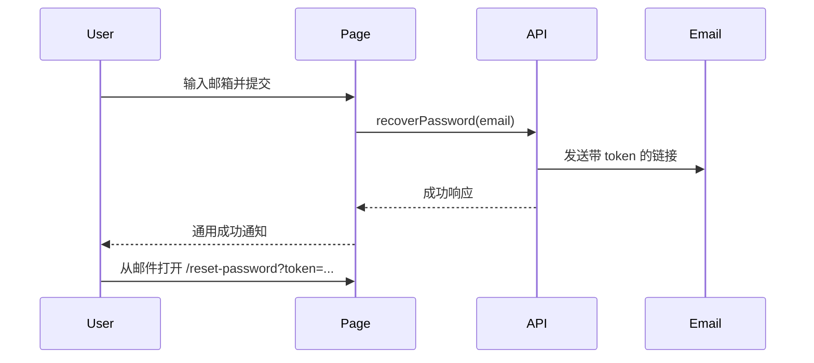

<Callout type="idea" title="文件定位">

该页面只负责“申请恢复链接”这一阶段，不修改密码。后端生成一次性 token 并发送邮件，用户随后进入 reset-password 页面。

</Callout>

## 这个文件负责什么

- 校验恢复邮箱。
- 阻止已登录用户访问。
- 调用 LoginService.recoverPassword。
- 成功后显示通知并重置表单。
- 失败时解析 API 错误。
- 提供返回登录页链接。

## 执行思路

<Steps>
  <Step>

### 1. 用户输入邮箱。

  </Step>
  <Step>

### 2. Zod 验证邮箱格式。

  </Step>
  <Step>

### 3. Mutation 调用恢复接口。

  </Step>
  <Step>

### 4. 后端发送包含 token 的邮件。

  </Step>
  <Step>

### 5. 前端显示通用成功提示并清空表单。

  </Step>
  <Step>

### 6. 用户从邮件进入 reset-password。

  </Step>
</Steps>

## 与其他模块的关系

| 模块 | 关系 |
| --- | --- |
| `LoginService.recoverPassword` | 向后端提交邮箱。 |
| `useCustomToast` | 展示成功与错误。 |
| `handleError` | 解析 API 错误。 |
| `reset-password route` | 消费邮件中的 token。 |
| `Mailcatcher tests` | 端到端测试中读取恢复邮件。 |

## 路由契约

| 配置 | 作用 |
| --- | --- |
| `path` | `/recover-password`。 |
| `beforeLoad` | 已登录时重定向 `/`。 |
| `schema` | 单个 email 字段。 |
| `success` | toast + form.reset。 |



## 带注释源码

> 原始路径：`frontend/src/routes/recover-password.tsx`。以下仅增加学习性注释与代码高亮标记，不改变程序行为。

```tsx title="recover-password.tsx" lineNumbers
import { zodResolver } from "@hookform/resolvers/zod"
import { useMutation } from "@tanstack/react-query"
import {
  createFileRoute,
  Link as RouterLink,
  redirect,
} from "@tanstack/react-router"
import { useForm } from "react-hook-form"
import { z } from "zod"

import { LoginService } from "@/client"
import { AuthLayout } from "@/components/Common/AuthLayout"
import {
  Form,
  FormControl,
  FormField,
  FormItem,
  FormLabel,
  FormMessage,
} from "@/components/ui/form"
import { Input } from "@/components/ui/input"
import { LoadingButton } from "@/components/ui/loading-button"
import { isLoggedIn } from "@/hooks/useAuth"
import useCustomToast from "@/hooks/useCustomToast"
import { handleError } from "@/utils"

// 恢复流程只需要一个合法邮箱地址。
const formSchema = z.object({
  email: z.email({ message: "Invalid email address" }),
})

type FormData = z.infer<typeof formSchema>

// 已登录用户无需恢复密码，直接返回首页。
export const Route = createFileRoute("/recover-password")({
  component: RecoverPassword,
  beforeLoad: async () => {
    if (isLoggedIn()) {
      throw redirect({
        to: "/",
      })
    }
  },
  head: () => ({
    meta: [
      {
        title: "Recover Password - FastAPI Template",
      },
    ],
  }),
})

function RecoverPassword() {
  const form = useForm<FormData>({
    resolver: zodResolver(formSchema),
    defaultValues: {
      email: "",
    },
  })
  const { showSuccessToast, showErrorToast } = useCustomToast()

  // 将表单形状转换为生成客户端需要的命名参数。
  const recoverPassword = async (data: FormData) => {
    await LoginService.recoverPassword({
      email: data.email,
    })
  }

  // Mutation 统一管理 loading、success、error 生命周期。
  const mutation = useMutation({
    mutationFn: recoverPassword,
    onSuccess: () => {
      showSuccessToast("Password recovery email sent successfully")
      // 成功后清空邮箱，防止误以为仍需再次提交。
      form.reset()
    },
    onError: handleError.bind(showErrorToast),
  })

  // 请求进行中忽略重复提交。
  const onSubmit = async (data: FormData) => {
    if (mutation.isPending) return
    mutation.mutate(data)
  }

  return (
    <AuthLayout>
      <Form {...form}>
        <form
          onSubmit={form.handleSubmit(onSubmit)}
          className="flex flex-col gap-6"
        >
          <div className="flex flex-col items-center gap-2 text-center">
            <h1 className="text-2xl font-bold">Password Recovery</h1>
          </div>

          <div className="grid gap-4">
            <FormField
              control={form.control}
              name="email"
              render={({ field }) => (
                <FormItem>
                  <FormLabel>Email</FormLabel>
                  <FormControl>
                    <Input
                      data-testid="email-input"
                      placeholder="user@example.com"
                      type="email"
                      {...field}
                    />
                  </FormControl>
                  <FormMessage />
                </FormItem>
              )}
            />

            <LoadingButton
              type="submit"
              className="w-full"
              loading={mutation.isPending}
            >
              Continue
            </LoadingButton>
          </div>

          <div className="text-center text-sm">
            Remember your password?{" "}
            <RouterLink to="/login" className="underline underline-offset-4">
              Log in
            </RouterLink>
          </div>
        </form>
      </Form>
    </AuthLayout>
  )
}
```

## 阅读重点

- 安全系统通常无论邮箱是否存在都返回相似成功文案，避免账号枚举。
- 按钮 loading 直接绑定 mutation.isPending。
- 恢复邮件发送可能较慢，后端应异步处理并设置速率限制。
- 页面不保存 token；token 只从邮件链接进入重置页。
- 错误文案不应泄露账户存在性或内部邮件系统细节。
