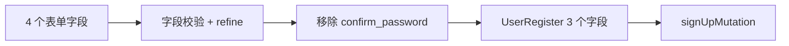

<Callout type="idea" title="文件定位">

注册页展示了“表单模型比 API 模型多一个字段”的常见场景：confirm_password 改善输入可靠性，但提交前必须被明确移除。

</Callout>

## 这个文件负责什么

- 校验姓名、邮箱和密码。
- 跨字段验证两次密码一致。
- 阻止已登录用户访问。
- 管理四个表单字段。
- 移除 confirm_password。
- 触发 useAuth.signUpMutation。
- 提供返回登录页链接。

## 执行思路

<Steps>
  <Step>

### 1. 用户填写四个字段。

  </Step>
  <Step>

### 2. Zod 做单字段和跨字段校验。

  </Step>
  <Step>

### 3. pending 守卫阻止重复提交。

  </Step>
  <Step>

### 4. 解构移除 confirm_password。

  </Step>
  <Step>

### 5. Mutation 提交 UserRegister 数据。

  </Step>
  <Step>

### 6. 成功后跳转 /login。

  </Step>
</Steps>

## 与其他模块的关系

| 模块 | 关系 |
| --- | --- |
| `useAuth.signUpMutation` | 执行注册、错误处理和导航。 |
| `AuthLayout` | 统一认证页面框架。 |
| `Zod refine` | 验证两次密码一致。 |
| `generated UserRegister type` | 后端真正接受的请求形状。 |
| `login route` | 注册成功后的下一步。 |

## 路由契约

| 配置 | 作用 |
| --- | --- |
| `path` | `/signup`。 |
| `beforeLoad` | 已登录时重定向 `/`。 |
| `schema` | email、full_name、password、confirm_password。 |
| `submitted fields` | email、full_name、password。 |

<Tabs items={['表单模型', 'API 请求模型']}>
  <Tab>`email + full_name + password + confirm_password`，用于交互和一致性校验。</Tab>
  <Tab>`email + full_name + password`，与后端 `UserRegister` 对齐。</Tab>
</Tabs>



## 带注释源码

> 原始路径：`frontend/src/routes/signup.tsx`。以下仅增加学习性注释与代码高亮标记，不改变程序行为。

```tsx title="signup.tsx" lineNumbers
import { zodResolver } from "@hookform/resolvers/zod"
import {
  createFileRoute,
  Link as RouterLink,
  redirect,
} from "@tanstack/react-router"
import { useForm } from "react-hook-form"
import { z } from "zod"
import { AuthLayout } from "@/components/Common/AuthLayout"
import {
  Form,
  FormControl,
  FormField,
  FormItem,
  FormLabel,
  FormMessage,
} from "@/components/ui/form"
import { Input } from "@/components/ui/input"
import { LoadingButton } from "@/components/ui/loading-button"
import { PasswordInput } from "@/components/ui/password-input"
import useAuth, { isLoggedIn } from "@/hooks/useAuth"

// schema 同时描述邮箱、姓名、密码和确认密码规则。
const formSchema = z
  .object({
    email: z.email({ message: "Invalid email address" }),
    full_name: z.string().min(1, { message: "Full Name is required" }),
    password: z
      .string()
      .min(1, { message: "Password is required" })
      .min(8, { message: "Password must be at least 8 characters" }),
    confirm_password: z
      .string()
      .min(1, { message: "Password confirmation is required" }),
  })
  // refine 处理跨字段相等约束，并把错误定位到确认密码。
  .refine((data) => data.password === data.confirm_password, {
    message: "The passwords don't match",
    path: ["confirm_password"],
  })

type FormData = z.infer<typeof formSchema>

// 已登录用户不需要再次注册，进入页面前返回首页。
export const Route = createFileRoute("/signup")({
  component: SignUp,
  beforeLoad: async () => {
    if (isLoggedIn()) {
      throw redirect({
        to: "/",
      })
    }
  },
  head: () => ({
    meta: [
      {
        title: "Sign Up - FastAPI Template",
      },
    ],
  }),
})

function SignUp() {
  const { signUpMutation } = useAuth()
  const form = useForm<FormData>({
    resolver: zodResolver(formSchema),
    mode: "onBlur",
    criteriaMode: "all",
    defaultValues: {
      email: "",
      full_name: "",
      password: "",
      confirm_password: "",
    },
  })

  // pending 时忽略重复提交。
  const onSubmit = (data: FormData) => {
    if (signUpMutation.isPending) return

    // exclude confirm_password from submission data
    // confirm_password 只用于前端校验，不属于 UserRegister 请求模型。
    const { confirm_password: _confirm_password, ...submitData } = data
    // submitData 保留 email、full_name、password。
    signUpMutation.mutate(submitData)
  }

  return (
    <AuthLayout>
      <Form {...form}>
        <form
          onSubmit={form.handleSubmit(onSubmit)}
          className="flex flex-col gap-6"
        >
          <div className="flex flex-col items-center gap-2 text-center">
            <h1 className="text-2xl font-bold">Create an account</h1>
          </div>

          <div className="grid gap-4">
            <FormField
              control={form.control}
              name="full_name"
              render={({ field }) => (
                <FormItem>
                  <FormLabel>Full Name</FormLabel>
                  <FormControl>
                    <Input
                      data-testid="full-name-input"
                      placeholder="User"
                      type="text"
                      {...field}
                    />
                  </FormControl>
                  <FormMessage />
                </FormItem>
              )}
            />

            <FormField
              control={form.control}
              name="email"
              render={({ field }) => (
                <FormItem>
                  <FormLabel>Email</FormLabel>
                  <FormControl>
                    <Input
                      data-testid="email-input"
                      placeholder="user@example.com"
                      type="email"
                      {...field}
                    />
                  </FormControl>
                  <FormMessage />
                </FormItem>
              )}
            />

            <FormField
              control={form.control}
              name="password"
              render={({ field }) => (
                <FormItem>
                  <FormLabel>Password</FormLabel>
                  <FormControl>
                    <PasswordInput
                      data-testid="password-input"
                      placeholder="Password"
                      {...field}
                    />
                  </FormControl>
                  <FormMessage />
                </FormItem>
              )}
            />

            <FormField
              control={form.control}
              name="confirm_password"
              render={({ field }) => (
                <FormItem>
                  <FormLabel>Confirm Password</FormLabel>
                  <FormControl>
                    <PasswordInput
                      data-testid="confirm-password-input"
                      placeholder="Confirm Password"
                      {...field}
                    />
                  </FormControl>
                  <FormMessage />
                </FormItem>
              )}
            />

            <LoadingButton
              type="submit"
              className="w-full"
              loading={signUpMutation.isPending}
            >
              Sign Up
            </LoadingButton>
          </div>

          <div className="text-center text-sm">
            Already have an account?{" "}
            <RouterLink to="/login" className="underline underline-offset-4">
              Log in
            </RouterLink>
          </div>
        </form>
      </Form>
    </AuthLayout>
  )
}
```

## 阅读重点

- 确认密码是 UI 字段，不应成为数据库或 API 模型字段。
- 解构重命名为 `_confirm_password` 明确表示有意丢弃，避免 lint 未使用告警。
- 前后端都应校验密码策略；客户端规则只是即时反馈。
- 注册完成跳登录页而不是自动登录，流程简单且便于邮箱验证扩展。
- 姓名仅检查非空，真实产品可进一步处理首尾空格和最大长度。
