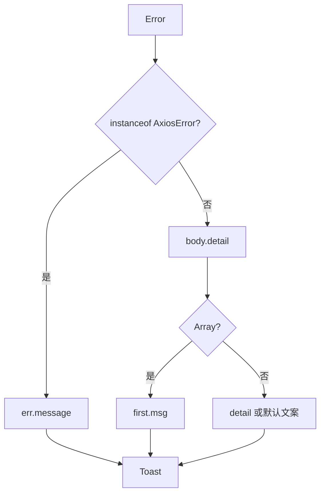

<Callout type="idea" title="文件定位">

该文件包含两个跨业务辅助函数：一个把不同错误协议折叠成字符串，一个把姓名转换为头像占位缩写。它位于应用工具层，而非最低层 lib。

</Callout>

## 这个文件负责什么

- 识别 AxiosError。
- 读取 OpenAPI ApiError.body.detail。
- 处理 FastAPI validation detail 数组。
- 提供默认错误文案。
- 把错误文本交给绑定的通知函数。
- 生成最多两个大写姓名首字母。

## 执行思路

<Steps>
  <Step>

### 1. Mutation 把 ApiError 交给 handleError。

  </Step>
  <Step>

### 2. extractErrorMessage 判断错误形状。

  </Step>
  <Step>

### 3. 数组 detail 取第一条 msg。

  </Step>
  <Step>

### 4. 字符串 detail 直接返回。

  </Step>
  <Step>

### 5. handleError 调用绑定的 toast 函数。

  </Step>
  <Step>

### 6. 头像组件独立调用 getInitials。

  </Step>
</Steps>

## 与其他模块的关系

| 模块 | 关系 |
| --- | --- |
| `AxiosError` | 网络/客户端错误分支。 |
| `generated ApiError` | OpenAPI 客户端错误类型。 |
| `FastAPI validation errors` | detail 数组结构。 |
| `useCustomToast` | 通常通过 bind 注入 showErrorToast。 |
| `Avatar / Sidebar User` | 显示姓名缩写。 |

## 支持的错误形状

| 来源 | 典型结构 | 当前提取结果 |
| --- | --- | --- |
| Axios | `AxiosError.message` | message |
| FastAPI 校验 | `body.detail: [{ msg }]` | 第一条 msg |
| HTTPException | `body.detail: string` | detail |
| 未知 | 无可用 detail | `Something went wrong.` |



## 带注释源码

> 原始路径：`frontend/src/utils.ts`。以下仅增加学习性注释与代码高亮标记，不改变程序行为。

```ts title="utils.ts" lineNumbers
import { AxiosError } from "axios"
import type { ApiError } from "./client"

// 把 Axios 网络错误和 OpenAPI 后端错误统一转换为用户可读字符串。
function extractErrorMessage(err: ApiError): string {
  // AxiosError 通常代表传输层或 Axios 自身产生的错误。
  if (err instanceof AxiosError) {
    return err.message
  }

  // FastAPI 校验错误 detail 可能是数组，普通 HTTPException detail 常为字符串。
  const errDetail = (err.body as any)?.detail
  if (Array.isArray(errDetail) && errDetail.length > 0) {
    return errDetail[0].msg
  }
  return errDetail || "Something went wrong."
}

// 通过 Function.bind 把 toast 函数作为 this 注入，便于直接交给 Mutation.onError。
export const handleError = function (
  this: (msg: string) => void,
  err: ApiError,
) {
  const errorMessage = extractErrorMessage(err)
  this(errorMessage)
}

// 头像缩写最多取前两个单词的首字母。
export const getInitials = (name: string): string => {
  return name
    .split(" ")
    .slice(0, 2)
    .map((word) => word[0])
    .join("")
    .toUpperCase()
}
```

## 阅读重点

- `err.body as any` 牺牲类型安全；可为后端错误体建立判别联合和类型守卫。
- 校验错误数组只显示第一条，适合 toast；表单字段错误应尽量定位到具体字段。
- 使用 this + bind 很紧凑，但对不熟悉 JavaScript this 的读者不直观；也可改为高阶函数。
- getInitials 对连续空格或空字符串不够健壮，可先 trim/filter。
- 后端内部错误不应无筛选地暴露给最终用户。
