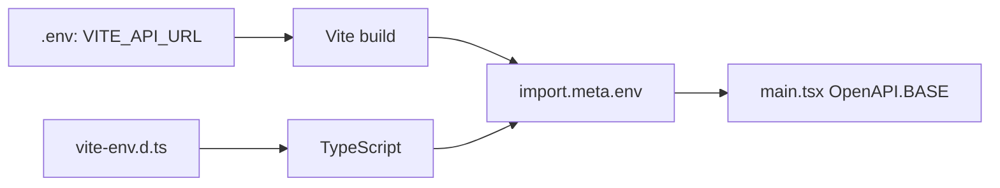

<Callout type="idea" title="文件定位">

这是环境类型边界，不会生成运行时代码。它让 main.tsx 读取 `import.meta.env.VITE_API_URL` 时获得补全和类型检查。

</Callout>

## 这个文件负责什么

- 引入 Vite client 类型。
- 声明 VITE_API_URL。
- 把环境变量标记为 readonly。
- 把 ImportMetaEnv 连接到 ImportMeta.env。

## 执行思路

<Steps>
  <Step>

### 1. TypeScript 加载 .d.ts。

  </Step>
  <Step>

### 2. 三斜线引用引入 Vite 基础声明。

  </Step>
  <Step>

### 3. 接口合并扩展 ImportMetaEnv。

  </Step>
  <Step>

### 4. main.tsx 读取 VITE_API_URL 时获得 string | undefined。

  </Step>
  <Step>

### 5. 空值合并运算符提供默认空字符串。

  </Step>
</Steps>

## 与其他模块的关系

| 模块 | 关系 |
| --- | --- |
| `Vite` | 在构建时注入 `VITE_` 前缀变量。 |
| `main.tsx` | 读取 API 根地址。 |
| `.env files` | 提供实际运行值。 |
| `TypeScript declaration merging` | 把项目字段加入已有接口。 |

<Callout type="warn" title="客户端环境变量不是秘密">

任何进入前端 bundle 的变量都可能被浏览器用户读取。`VITE_API_URL` 适合公开 API 地址，但数据库密码、私钥和服务端令牌绝不能放入 `VITE_` 变量。

</Callout>

## 编译期连接



## 带注释源码

> 原始路径：`frontend/src/vite-env.d.ts`。以下仅增加学习性注释与代码高亮标记，不改变程序行为。

```ts title="vite-env.d.ts" lineNumbers
/// <reference types="vite/client" />
// 引入 Vite 内置的 import.meta、资源模块和 HMR 类型。

// 扩展本项目允许读取的环境变量，并使用 readonly 防止运行时误赋值。
interface ImportMetaEnv {
  readonly VITE_API_URL?: string
}

// 把自定义 ImportMetaEnv 挂到 import.meta.env。
interface ImportMeta {
  readonly env: ImportMetaEnv
}
```

## 阅读重点

- 只有 `VITE_` 前缀变量默认暴露给客户端，不能存放秘密。
- 类型声明不会验证部署环境一定设置了变量，运行时仍需默认值或启动校验。
- 可选 `?` 表示本地和相对 API 场景允许缺失。
- 环境变量值始终以字符串注入，布尔和数字需要显式解析。
- `.d.ts` 应只放声明，不写运行时副作用。

## Twoslash：可选环境变量的推导

```ts twoslash
interface Env {
  readonly VITE_API_URL?: string
}
declare const env: Env

const configured = env.VITE_API_URL
//    ^?
const apiBase = env.VITE_API_URL ?? ''
//    ^?
```

空值合并后，`apiBase` 从 `string | undefined` 收窄为稳定的 `string`。
