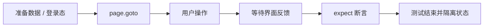

<Callout type="idea" title="文件定位">

这组测试把 `/admin` 当作一个完整管理系统验证：既检查页面能否使用，也检查普通用户不能越权进入。

</Callout>

## 这个文件负责什么

- 通过 Playwright 浏览器测试覆盖 12 个独立用例。
- 从用户可见行为出发验证页面，而不是直接读取 React 内部状态。
- 用角色、标签、文本和稳定 test id 定位交互元素。
- 同时覆盖成功路径、失败路径及该业务域的关键边界。
- 让每个测试拥有可解释的前置状态与最终断言。

## 执行思路

<Steps>
  <Step>

### 1. 准备环境变量、认证快照或随机测试数据。

  </Step>
  <Step>

### 2. 导航到真实路由，等待页面进入可交互状态。

  </Step>
  <Step>

### 3. 使用接近用户行为的定位器完成输入、点击和切换。

  </Step>
  <Step>

### 4. 等待网络结果通过 UI 反馈呈现。

  </Step>
  <Step>

### 5. 对可见内容、URL、ARIA 状态或持久化结果做断言。

  </Step>
</Steps>

## 与其他模块的关系

| 模块 | 关系 |
| --- | --- |
| `Playwright test runner` | 提供 page、request、expect、生命周期钩子和并发隔离。 |
| `auth.setup.ts` | 为默认受保护页面用例生成可复用登录状态。 |
| `utils/privateApi.ts` | 在不依赖 UI 的情况下快速准备后端数据。 |
| `utils/random.ts` | 生成低冲突邮箱、密码和业务字段。 |
| `utils/user.ts` | 复用注册、登录和退出的用户级操作。 |

## 覆盖矩阵

| 场景 | 验证目标 |
| --- | --- |
| 页面可达性 | 标题、说明和 Add User 主操作可见。 |
| 创建用户 | 普通用户与超级用户均能创建，并出现在表格中。 |
| 编辑与删除 | 菜单动作、成功提示和表格结果一致。 |
| 表单校验 | 邮箱、密码长度和确认密码规则生效。 |
| 取消操作 | 关闭对话框且不产生脏数据。 |
| 权限控制 | 普通用户被拒绝，超级用户可以访问。 |

## 前置状态

- 默认用例复用超级用户登录快照。
- 权限组显式清空 storageState，从匿名会话开始。
- 随机邮箱避免并发运行时撞到唯一约束。
- 普通用户通过 PrivateService 直接创建。

## 定位器策略

<Tabs items={['优先', '谨慎使用', '断言']}>
  <Tab>优先 `getByRole`、`getByLabel`、`getByPlaceholder`，定位方式与无障碍树一致。</Tab>
  <Tab>表格中先用唯一邮箱过滤行，避免依赖行号或脆弱 CSS 结构。</Tab>
  <Tab>成功不仅断言 toast，还断言对话框关闭、行出现/消失和 URL 权限结果。</Tab>
</Tabs>



## 带注释源码

> 原始路径：`frontend/tests/admin.spec.ts`。以下仅增加学习性注释与代码高亮标记，不改变程序行为。

```ts title="admin.spec.ts" lineNumbers
import { expect, test } from "@playwright/test"
import { firstSuperuser, firstSuperuserPassword } from "./config.ts"
import { createUser } from "./utils/privateApi"
import { randomEmail, randomPassword } from "./utils/random"
import { logInUser } from "./utils/user"

// 用例目标：Admin page is accessible and shows correct title。
test("Admin page is accessible and shows correct title", async ({ page }) => {
  await page.goto("/admin")
  await expect(page.getByRole("heading", { name: "Users" })).toBeVisible()
  await expect(
    page.getByText("Manage user accounts and permissions"),
  ).toBeVisible()
})

// 用例目标：Add User button is visible。
test("Add User button is visible", async ({ page }) => {
  await page.goto("/admin")
  await expect(page.getByRole("button", { name: "Add User" })).toBeVisible()
})

// 场景组：Admin user management。把共享前置条件与相关断言放在同一作用域。
test.describe("Admin user management", () => {
  // 用例目标：Create a new user successfully。
  test("Create a new user successfully", async ({ page }) => {
    await page.goto("/admin")

    const email = randomEmail()
    const password = randomPassword()
    const fullName = "Test User Admin"

    await page.getByRole("button", { name: "Add User" }).click()

    await page.getByPlaceholder("Email").fill(email)
    await page.getByPlaceholder("Full name").fill(fullName)
    await page.getByPlaceholder("Password").first().fill(password)
    await page.getByPlaceholder("Password").last().fill(password)

    await page.getByRole("button", { name: "Save" }).click()

    await expect(page.getByText("User created successfully")).toBeVisible()

    await expect(page.getByRole("dialog")).not.toBeVisible()

    // 先缩小到包含唯一随机邮箱的行，再在行内查找操作按钮。
    const userRow = page.getByRole("row").filter({ hasText: email })
    await expect(userRow).toBeVisible()
  })

  // 用例目标：Create a superuser。
  test("Create a superuser", async ({ page }) => {
    await page.goto("/admin")

    const email = randomEmail()
    const password = randomPassword()

    await page.getByRole("button", { name: "Add User" }).click()

    await page.getByPlaceholder("Email").fill(email)
    await page.getByPlaceholder("Password").first().fill(password)
    await page.getByPlaceholder("Password").last().fill(password)
    await page.getByLabel("Is superuser?").check()
    await page.getByLabel("Is active?").check()

    await page.getByRole("button", { name: "Save" }).click()

    await expect(page.getByText("User created successfully")).toBeVisible()

    await expect(page.getByRole("dialog")).not.toBeVisible()

    const userRow = page.getByRole("row").filter({ hasText: email })
    await expect(userRow.getByText("Superuser")).toBeVisible()
  })

  // 用例目标：Edit a user successfully。
  test("Edit a user successfully", async ({ page }) => {
    await page.goto("/admin")

    const email = randomEmail()
    const password = randomPassword()
    const originalName = "Original Name"
    const updatedName = "Updated Name"

    await page.getByRole("button", { name: "Add User" }).click()
    await page.getByPlaceholder("Email").fill(email)
    await page.getByPlaceholder("Full name").fill(originalName)
    await page.getByPlaceholder("Password").first().fill(password)
    await page.getByPlaceholder("Password").last().fill(password)
    await page.getByRole("button", { name: "Save" }).click()

    await expect(page.getByText("User created successfully")).toBeVisible()
    await expect(page.getByRole("dialog")).not.toBeVisible()

    const userRow = page.getByRole("row").filter({ hasText: email })
    await userRow.getByRole("button").click()

    await page.getByRole("menuitem", { name: "Edit User" }).click()

    await page.getByPlaceholder("Full name").fill(updatedName)
    await page.getByRole("button", { name: "Save" }).click()

    await expect(page.getByText("User updated successfully")).toBeVisible()
    await expect(page.getByText(updatedName)).toBeVisible()
  })

  // 用例目标：Delete a user successfully。
  test("Delete a user successfully", async ({ page }) => {
    await page.goto("/admin")

    const email = randomEmail()
    const password = randomPassword()

    await page.getByRole("button", { name: "Add User" }).click()
    await page.getByPlaceholder("Email").fill(email)
    await page.getByPlaceholder("Password").first().fill(password)
    await page.getByPlaceholder("Password").last().fill(password)
    await page.getByRole("button", { name: "Save" }).click()

    await expect(page.getByText("User created successfully")).toBeVisible()

    await expect(page.getByRole("dialog")).not.toBeVisible()

    const userRow = page.getByRole("row").filter({ hasText: email })
    await userRow.getByRole("button").click()

    await page.getByRole("menuitem", { name: "Delete User" }).click()

    await page.getByRole("button", { name: "Delete" }).click()

    await expect(
      page.getByText("The user was deleted successfully"),
    ).toBeVisible()

    await expect(
      page.getByRole("row").filter({ hasText: email }),
    ).not.toBeVisible()
  })

  // 用例目标：Cancel user creation。
  test("Cancel user creation", async ({ page }) => {
    await page.goto("/admin")

    await page.getByRole("button", { name: "Add User" }).click()
    await page.getByPlaceholder("Email").fill("test@example.com")

    await page.getByRole("button", { name: "Cancel" }).click()

    await expect(page.getByRole("dialog")).not.toBeVisible()
  })

  // 用例目标：Email is required and must be valid。
  test("Email is required and must be valid", async ({ page }) => {
    await page.goto("/admin")

    await page.getByRole("button", { name: "Add User" }).click()

    await page.getByPlaceholder("Email").fill("invalid-email")
    await page.getByPlaceholder("Email").blur()

    await expect(page.getByText("Invalid email address")).toBeVisible()
  })

  // 用例目标：Password must be at least 8 characters。
  test("Password must be at least 8 characters", async ({ page }) => {
    await page.goto("/admin")

    await page.getByRole("button", { name: "Add User" }).click()

    await page.getByPlaceholder("Email").fill(randomEmail())
    await page.getByPlaceholder("Password").first().fill("short")
    await page.getByPlaceholder("Password").last().fill("short")
    await page.getByRole("button", { name: "Save" }).click()

    await expect(
      page.getByText("Password must be at least 8 characters"),
    ).toBeVisible()
  })

  // 用例目标：Passwords must match。
  test("Passwords must match", async ({ page }) => {
    await page.goto("/admin")

    await page.getByRole("button", { name: "Add User" }).click()

    await page.getByPlaceholder("Email").fill(randomEmail())
    await page.getByPlaceholder("Password").first().fill(randomPassword())
    await page.getByPlaceholder("Password").last().fill("different12345")
    await page.getByPlaceholder("Password").last().blur()

    await expect(page.getByText("The passwords don't match")).toBeVisible()
  })
})

// 场景组：Admin page access control。把共享前置条件与相关断言放在同一作用域。
// 权限测试必须覆盖普通用户与超级用户两侧，而不是只测允许路径。
test.describe("Admin page access control", () => {
  // 清空默认登录快照，确保这一组从匿名会话开始。
  test.use({ storageState: { cookies: [], origins: [] } })

  // 用例目标：Non-superuser cannot access admin page。
  test("Non-superuser cannot access admin page", async ({ page }) => {
    const email = randomEmail()
    const password = randomPassword()

    // 通过仅本地开放的私有 API 快速创建普通用户，避免重复走注册 UI。
    await createUser({ email, password })
    await logInUser(page, email, password)

    await page.goto("/admin")

    await expect(page.getByRole("heading", { name: "Users" })).not.toBeVisible()
    await expect(page).not.toHaveURL(/\/admin/)
  })

  // 用例目标：Superuser can access admin page。
  test("Superuser can access admin page", async ({ page }) => {
    await logInUser(page, firstSuperuser, firstSuperuserPassword)

    await page.goto("/admin")

    await expect(page.getByRole("heading", { name: "Users" })).toBeVisible()
  })
})
```

## 阅读重点

- 权限测试应验证“看不到标题”和“URL 不再是 /admin”，防止页面内容被隐藏但路由仍泄露。
- 随机数据能降低冲突，但失败后的测试用户可能残留；长期可增加 API 清理或独立数据库。
- 同一文件同时覆盖 CRUD 与表单校验，规模继续增长时可拆分为 admin-crud 和 admin-validation。
- 使用角色定位器会推动组件保持正确按钮、对话框和菜单语义。

## 为什么这是端到端测试

这里实际启动浏览器并穿过路由、表单、生成客户端、后端 API 与数据库。它比单元测试更慢，但能捕获“各层单独正确、组合后却失败”的问题。
