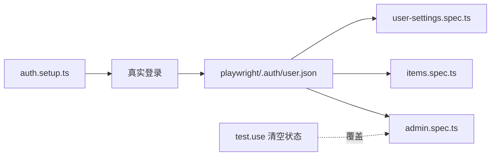

<Callout type="idea" title="文件定位">

这是 Playwright setup project 的入口。它把高频登录动作从每个受保护页面测试中抽出，显著减少重复请求和测试时间。

</Callout>

## 这个文件负责什么

- 使用真实登录页验证认证主路径。
- 读取统一的超级用户测试凭据。
- 等待登录后首页 URL。
- 保存 cookie、localStorage 等浏览器状态。
- 为依赖该 setup 的测试项目提供可复用快照。

## 执行思路

<Steps>
  <Step>

### 1. 打开 `/login`。

  </Step>
  <Step>

### 2. 填写邮箱与密码。

  </Step>
  <Step>

### 3. 点击 Log In 并等待 `/`。

  </Step>
  <Step>

### 4. 调用 `storageState()` 序列化上下文。

  </Step>
  <Step>

### 5. 后续测试直接加载 `playwright/.auth/user.json`。

  </Step>
</Steps>

## 与其他模块的关系

| 模块 | 关系 |
| --- | --- |
| `playwright.config` | 把 setup project 配为其他浏览器项目的 dependency。 |
| `config.ts` | 从根 `.env` 读取超级用户凭据。 |
| `受保护页面 spec` | 默认继承登录状态，减少重复 UI 登录。 |
| `匿名场景` | 通过 `test.use` 清空 storageState 覆盖默认快照。 |

## 状态复用模型



## 带注释源码

> 原始路径：`frontend/tests/auth.setup.ts`。以下仅增加学习性注释与代码高亮标记，不改变程序行为。

```ts title="auth.setup.ts" lineNumbers
import { test as setup } from "@playwright/test"
import { firstSuperuser, firstSuperuserPassword } from "./config.ts"

// Playwright project 会把该文件作为后续测试的 storageState。
const authFile = "playwright/.auth/user.json"

// setup project 只执行一次真实登录，再把 cookie/localStorage 快照写入磁盘。
setup("authenticate", async ({ page }) => {
  await page.goto("/login")
  await page.getByTestId("email-input").fill(firstSuperuser)
  await page.getByTestId("password-input").fill(firstSuperuserPassword)
  await page.getByRole("button", { name: "Log In" }).click()
  await page.waitForURL("/")
  // 等待首页确认登录成功后再持久化，避免保存半完成状态。
  await page.context().storageState({ path: authFile })
})
```

## 阅读重点

- 认证快照是测试加速手段，不应替代登录页自身的独立测试。
- 必须在确认 URL 跳转后保存状态，否则可能得到尚未写入 token 的快照。
- 快照文件可能含敏感会话数据，应加入 `.gitignore`，不要提交仓库。
- 当登录态结构变化时，删除旧快照并重新运行 setup。
