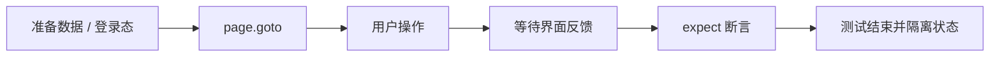

<Callout type="idea" title="文件定位">

这组测试覆盖一个典型受保护 CRUD 页面，从创建用户、登录到表格行操作和空状态均走真实链路。

</Callout>

## 这个文件负责什么

- 通过 Playwright 浏览器测试覆盖 9 个独立用例。
- 从用户可见行为出发验证页面，而不是直接读取 React 内部状态。
- 用角色、标签、文本和稳定 test id 定位交互元素。
- 同时覆盖成功路径、失败路径及该业务域的关键边界。
- 让每个测试拥有可解释的前置状态与最终断言。

## 执行思路

<Steps>
  <Step>

### 1. 准备环境变量、认证快照或随机测试数据。

  </Step>
  <Step>

### 2. 导航到真实路由，等待页面进入可交互状态。

  </Step>
  <Step>

### 3. 使用接近用户行为的定位器完成输入、点击和切换。

  </Step>
  <Step>

### 4. 等待网络结果通过 UI 反馈呈现。

  </Step>
  <Step>

### 5. 对可见内容、URL、ARIA 状态或持久化结果做断言。

  </Step>
</Steps>

## 与其他模块的关系

| 模块 | 关系 |
| --- | --- |
| `Playwright test runner` | 提供 page、request、expect、生命周期钩子和并发隔离。 |
| `auth.setup.ts` | 为默认受保护页面用例生成可复用登录状态。 |
| `utils/privateApi.ts` | 在不依赖 UI 的情况下快速准备后端数据。 |
| `utils/random.ts` | 生成低冲突邮箱、密码和业务字段。 |
| `utils/user.ts` | 复用注册、登录和退出的用户级操作。 |

## 覆盖矩阵

| 场景 | 验证目标 |
| --- | --- |
| 页面外壳 | 标题、说明和 Add Item 按钮可见。 |
| 创建 | 完整字段与仅必填字段两种路径。 |
| 校验与取消 | 标题必填，取消后对话框关闭。 |
| 编辑 | 目标行菜单可修改标题并显示成功反馈。 |
| 删除 | 确认删除后目标行消失。 |
| 空状态 | 新用户没有条目时显示引导文案。 |

## 前置状态

- CRUD 组清空 storageState，创建独立用户并在每个测试前重新登录。
- 编辑/删除子组在 beforeEach 中先创建目标条目。
- 随机标题和描述使行定位稳定。
- 空状态用例使用全新用户，保证数据库中没有历史条目。

## 定位器策略

<Tabs items={['优先', '谨慎使用', '断言']}>
  <Tab>按钮、对话框、行和标题使用 role；表单字段使用 label/placeholder。</Tab>
  <Tab>编辑删除先按唯一标题过滤行，再在行内打开菜单，不依赖表格顺序。</Tab>
  <Tab>成功路径同时检查 toast 与表格内容；删除检查行不可见，空状态检查引导文案。</Tab>
</Tabs>



## 带注释源码

> 原始路径：`frontend/tests/items.spec.ts`。以下仅增加学习性注释与代码高亮标记，不改变程序行为。

```ts title="items.spec.ts" lineNumbers
import { expect, test } from "@playwright/test"
import { createUser } from "./utils/privateApi"
import {
  randomEmail,
  randomItemDescription,
  randomItemTitle,
  randomPassword,
} from "./utils/random"
import { logInUser } from "./utils/user"

// 用例目标：Items page is accessible and shows correct title。
test("Items page is accessible and shows correct title", async ({ page }) => {
  await page.goto("/items")
  await expect(page.getByRole("heading", { name: "Items" })).toBeVisible()
  await expect(page.getByText("Create and manage your items")).toBeVisible()
})

// 用例目标：Add Item button is visible。
test("Add Item button is visible", async ({ page }) => {
  await page.goto("/items")
  await expect(page.getByRole("button", { name: "Add Item" })).toBeVisible()
})

// 场景组：Items management。把共享前置条件与相关断言放在同一作用域。
test.describe("Items management", () => {
  // 清空默认登录快照，确保这一组从匿名会话开始。
  test.use({ storageState: { cookies: [], origins: [] } })
  let email: string
  const password = randomPassword()

  // 组内只执行一次：准备可复用的服务端测试数据。
  // 一组 CRUD 用例共享同一用户，减少重复创建账户的成本。
  test.beforeAll(async () => {
    email = randomEmail()
    await createUser({ email, password })
  })

  // 每个用例重新建立页面状态，避免测试之间相互污染。
  // 每个用例重新登录并打开 Items 页面，但保留该用户已经创建的业务数据。
  test.beforeEach(async ({ page }) => {
    await logInUser(page, email, password)
    await page.goto("/items")
  })

  // 用例目标：Create a new item successfully。
  test("Create a new item successfully", async ({ page }) => {
    const title = randomItemTitle()
    const description = randomItemDescription()

    await page.getByRole("button", { name: "Add Item" }).click()
    await page.getByLabel("Title").fill(title)
    await page.getByLabel("Description").fill(description)
    await page.getByRole("button", { name: "Save" }).click()

    await expect(page.getByText("Item created successfully")).toBeVisible()
    await expect(page.getByText(title)).toBeVisible()
  })

  // 用例目标：Create item with only required fields。
  test("Create item with only required fields", async ({ page }) => {
    const title = randomItemTitle()

    await page.getByRole("button", { name: "Add Item" }).click()
    await page.getByLabel("Title").fill(title)
    await page.getByRole("button", { name: "Save" }).click()

    await expect(page.getByText("Item created successfully")).toBeVisible()
    await expect(page.getByText(title)).toBeVisible()
  })

  // 用例目标：Cancel item creation。
  test("Cancel item creation", async ({ page }) => {
    await page.getByRole("button", { name: "Add Item" }).click()
    await page.getByLabel("Title").fill("Test Item")
    await page.getByRole("button", { name: "Cancel" }).click()

    await expect(page.getByRole("dialog")).not.toBeVisible()
  })

  // 用例目标：Title is required。
  test("Title is required", async ({ page }) => {
    await page.getByRole("button", { name: "Add Item" }).click()
    await page.getByLabel("Title").fill("")
    await page.getByLabel("Title").blur()

    await expect(page.getByText("Title is required")).toBeVisible()
  })

  // 场景组：Edit and Delete。把共享前置条件与相关断言放在同一作用域。
  test.describe("Edit and Delete", () => {
    let itemTitle: string

    // 每个用例重新建立页面状态，避免测试之间相互污染。
    test.beforeEach(async ({ page }) => {
      itemTitle = randomItemTitle()

      await page.getByRole("button", { name: "Add Item" }).click()
      await page.getByLabel("Title").fill(itemTitle)
      await page.getByRole("button", { name: "Save" }).click()
      await expect(page.getByText("Item created successfully")).toBeVisible()
      await expect(page.getByRole("dialog")).not.toBeVisible()
    })

    // 用例目标：Edit an item successfully。
    test("Edit an item successfully", async ({ page }) => {
      // 用随机标题把动作菜单限定在目标行，避免误操作其他记录。
      const itemRow = page.getByRole("row").filter({ hasText: itemTitle })
      await itemRow.getByRole("button").last().click()
      await page.getByRole("menuitem", { name: "Edit Item" }).click()

      const updatedTitle = randomItemTitle()
      await page.getByLabel("Title").fill(updatedTitle)
      await page.getByRole("button", { name: "Save" }).click()

      await expect(page.getByText("Item updated successfully")).toBeVisible()
      await expect(page.getByText(updatedTitle)).toBeVisible()
    })

    // 用例目标：Delete an item successfully。
    test("Delete an item successfully", async ({ page }) => {
      const itemRow = page.getByRole("row").filter({ hasText: itemTitle })
      await itemRow.getByRole("button").last().click()
      await page.getByRole("menuitem", { name: "Delete Item" }).click()

      await page.getByRole("button", { name: "Delete" }).click()

      await expect(
        page.getByText("The item was deleted successfully"),
      ).toBeVisible()
      await expect(page.getByText(itemTitle)).not.toBeVisible()
    })
  })
})

// 场景组：Items empty state。把共享前置条件与相关断言放在同一作用域。
test.describe("Items empty state", () => {
  // 清空默认登录快照，确保这一组从匿名会话开始。
  test.use({ storageState: { cookies: [], origins: [] } })

  // 用例目标：Shows empty state message when no items exist。
  test("Shows empty state message when no items exist", async ({ page }) => {
    const email = randomEmail()
    const password = randomPassword()
    await createUser({ email, password })
    await logInUser(page, email, password)

    await page.goto("/items")

    await expect(page.getByText("You don't have any items yet")).toBeVisible()
    await expect(page.getByText("Add a new item to get started")).toBeVisible()
  })
})
```

## 阅读重点

- beforeAll 共享用户提高速度，但组内数据会累积；用唯一标题降低互相影响。
- 只验证 UI 提示不够，CRUD 用例还要验证列表中的真实结果。
- 空状态必须使用没有业务数据的新账号，否则测试会偶发失败。
- 当分页加入后，按行文本定位仍可能需要等待数据刷新或搜索。

## 为什么这是端到端测试

这里实际启动浏览器并穿过路由、表单、生成客户端、后端 API 与数据库。它比单元测试更慢，但能捕获“各层单独正确、组合后却失败”的问题。
