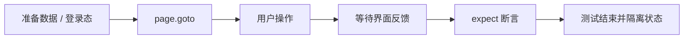

<Callout type="idea" title="文件定位">

这是跨越浏览器、后端令牌、邮件服务和再次登录的完整认证恢复测试，能发现单层测试难以覆盖的集成问题。

</Callout>

## 这个文件负责什么

- 通过 Playwright 浏览器测试覆盖 6 个独立用例。
- 从用户可见行为出发验证页面，而不是直接读取 React 内部状态。
- 用角色、标签、文本和稳定 test id 定位交互元素。
- 同时覆盖成功路径、失败路径及该业务域的关键边界。
- 让每个测试拥有可解释的前置状态与最终断言。

## 执行思路

<Steps>
  <Step>

### 1. 准备环境变量、认证快照或随机测试数据。

  </Step>
  <Step>

### 2. 导航到真实路由，等待页面进入可交互状态。

  </Step>
  <Step>

### 3. 使用接近用户行为的定位器完成输入、点击和切换。

  </Step>
  <Step>

### 4. 等待网络结果通过 UI 反馈呈现。

  </Step>
  <Step>

### 5. 对可见内容、URL、ARIA 状态或持久化结果做断言。

  </Step>
</Steps>

## 与其他模块的关系

| 模块 | 关系 |
| --- | --- |
| `Playwright test runner` | 提供 page、request、expect、生命周期钩子和并发隔离。 |
| `auth.setup.ts` | 为默认受保护页面用例生成可复用登录状态。 |
| `utils/privateApi.ts` | 在不依赖 UI 的情况下快速准备后端数据。 |
| `utils/random.ts` | 生成低冲突邮箱、密码和业务字段。 |
| `utils/user.ts` | 复用注册、登录和退出的用户级操作。 |

## 覆盖矩阵

| 场景 | 验证目标 |
| --- | --- |
| 页面基础 | 标题、邮箱输入和 Continue 按钮可用。 |
| 成功恢复 | 注册用户、请求邮件、打开链接、设置新密码并重新登录。 |
| 令牌错误 | 无效或过期链接得到安全提示。 |
| 密码强度 | 弱密码在重置表单中被拒绝。 |

## 前置状态

- 清空默认登录快照。
- 成功场景先创建随机用户。
- MailCatcher 提供隔离邮件收件箱 API。
- 邮件轮询按收件人或主题过滤，避免读到其他并发测试邮件。

## 定位器策略

<Tabs items={['优先', '谨慎使用', '断言']}>
  <Tab>页面输入与按钮使用 test id/role，邮件通过 API 而非 UI 读取。</Tab>
  <Tab>不要固定等待数秒；findLastEmail 以短间隔轮询并有总超时。</Tab>
  <Tab>最终断言必须用新密码真实登录，证明令牌消费和密码持久化都成功。</Tab>
</Tabs>



## 带注释源码

> 原始路径：`frontend/tests/reset-password.spec.ts`。以下仅增加学习性注释与代码高亮标记，不改变程序行为。

```ts title="reset-password.spec.ts" lineNumbers
import { expect, test } from "@playwright/test"
import { findLastEmail } from "./utils/mailcatcher"
import { randomEmail, randomPassword } from "./utils/random"
import { logInUser, signUpNewUser } from "./utils/user"

// 清空默认登录快照，确保这一组从匿名会话开始。
test.use({ storageState: { cookies: [], origins: [] } })

// 用例目标：Password Recovery title is visible。
test("Password Recovery title is visible", async ({ page }) => {
  await page.goto("/recover-password")

  await expect(
    page.getByRole("heading", { name: "Password Recovery" }),
  ).toBeVisible()
})

// 用例目标：Input is visible, empty and editable。
test("Input is visible, empty and editable", async ({ page }) => {
  await page.goto("/recover-password")

  await expect(page.getByTestId("email-input")).toBeVisible()
  await expect(page.getByTestId("email-input")).toHaveText("")
  await expect(page.getByTestId("email-input")).toBeEditable()
})

// 用例目标：Continue button is visible。
test("Continue button is visible", async ({ page }) => {
  await page.goto("/recover-password")

  await expect(page.getByRole("button", { name: "Continue" })).toBeVisible()
})

// 用例目标：User can reset password successfully using the link。
test("User can reset password successfully using the link", async ({
  page,
  request,
}) => {
  const fullName = "Test User"
  const email = randomEmail()
  const password = randomPassword()
  const newPassword = randomPassword()

  // Sign up a new user
  await signUpNewUser(page, fullName, email, password)

  await page.goto("/recover-password")
  await page.getByTestId("email-input").fill(email)

  await page.getByRole("button", { name: "Continue" }).click()

  // MailCatcher 轮询等待异步邮件，再从邮件正文中的链接继续浏览器流程。
  const emailData = await findLastEmail({
    request,
    filter: (e) => e.recipients.includes(`<${email}>`),
    timeout: 5000,
  })

  await page.goto(
    `${process.env.MAILCATCHER_HOST}/messages/${emailData.id}.html`,
  )

  const selector = 'a[href*="/reset-password?token="]'

  const url = await page.getAttribute(selector, "href")
  // 从捕获邮件中提取一次性重置链接，模拟真实用户点击。
  const resetUrl = new URL(url!)

  // Set the new password and confirm it
  await page.goto(`${resetUrl.pathname}${resetUrl.search}`)

  await page.getByTestId("new-password-input").fill(newPassword)
  await page.getByTestId("confirm-password-input").fill(newPassword)
  await page.getByRole("button", { name: "Reset Password" }).click()
  await expect(page.getByText("Password updated successfully")).toBeVisible()

  // Check if the user is able to login with the new password
  await logInUser(page, email, newPassword)
})

// 用例目标：Expired or invalid reset link。
test("Expired or invalid reset link", async ({ page }) => {
  const password = randomPassword()
  const invalidUrl = "/reset-password?token=invalidtoken"

  await page.goto(invalidUrl)

  await page.getByTestId("new-password-input").fill(password)
  await page.getByTestId("confirm-password-input").fill(password)
  await page.getByRole("button", { name: "Reset Password" }).click()

  await expect(page.getByText("Invalid token")).toBeVisible()
})

// 用例目标：Weak new password validation。
test("Weak new password validation", async ({ page, request }) => {
  const fullName = "Test User"
  const email = randomEmail()
  const password = randomPassword()
  const weakPassword = "123"

  // Sign up a new user
  await signUpNewUser(page, fullName, email, password)

  await page.goto("/recover-password")
  await page.getByTestId("email-input").fill(email)
  await page.getByRole("button", { name: "Continue" }).click()

  const emailData = await findLastEmail({
    request,
    filter: (e) => e.recipients.includes(`<${email}>`),
    timeout: 5000,
  })

  await page.goto(
    `${process.env.MAILCATCHER_HOST}/messages/${emailData.id}.html`,
  )

  const selector = 'a[href*="/reset-password?token="]'
  const url = await page.getAttribute(selector, "href")
  const resetUrl = new URL(url!)

  // Set a weak new password
  await page.goto(`${resetUrl.pathname}${resetUrl.search}`)
  await page.getByTestId("new-password-input").fill(weakPassword)
  await page.getByTestId("confirm-password-input").fill(weakPassword)
  await page.getByRole("button", { name: "Reset Password" }).click()

  await expect(
    page.getByText("Password must be at least 8 characters"),
  ).toBeVisible()
})
```

## 阅读重点

- 邮件测试的关键是过滤条件和超时，否则并发时容易拿到错误邮件。
- 重置链接是一次性安全凭据，测试日志不应长期保存完整 URL。
- 成功提示只是中间信号，使用新密码登录才是端到端最终证明。
- 无效令牌场景应避免暴露内部签名或解析细节。

## 为什么这是端到端测试

这里实际启动浏览器并穿过路由、表单、生成客户端、后端 API 与数据库。它比单元测试更慢，但能捕获“各层单独正确、组合后却失败”的问题。
