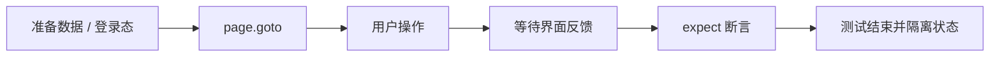

<Callout type="idea" title="文件定位">

注册测试把客户端 Zod 校验与后端唯一约束放在同一套件中验证，确保错误能准确回到用户界面。

</Callout>

## 这个文件负责什么

- 通过 Playwright 浏览器测试覆盖 11 个独立用例。
- 从用户可见行为出发验证页面，而不是直接读取 React 内部状态。
- 用角色、标签、文本和稳定 test id 定位交互元素。
- 同时覆盖成功路径、失败路径及该业务域的关键边界。
- 让每个测试拥有可解释的前置状态与最终断言。

## 执行思路

<Steps>
  <Step>

### 1. 准备环境变量、认证快照或随机测试数据。

  </Step>
  <Step>

### 2. 导航到真实路由，等待页面进入可交互状态。

  </Step>
  <Step>

### 3. 使用接近用户行为的定位器完成输入、点击和切换。

  </Step>
  <Step>

### 4. 等待网络结果通过 UI 反馈呈现。

  </Step>
  <Step>

### 5. 对可见内容、URL、ARIA 状态或持久化结果做断言。

  </Step>
</Steps>

## 与其他模块的关系

| 模块 | 关系 |
| --- | --- |
| `Playwright test runner` | 提供 page、request、expect、生命周期钩子和并发隔离。 |
| `auth.setup.ts` | 为默认受保护页面用例生成可复用登录状态。 |
| `utils/privateApi.ts` | 在不依赖 UI 的情况下快速准备后端数据。 |
| `utils/random.ts` | 生成低冲突邮箱、密码和业务字段。 |
| `utils/user.ts` | 复用注册、登录和退出的用户级操作。 |

## 覆盖矩阵

| 场景 | 验证目标 |
| --- | --- |
| 表单可用性 | 四个字段为空且可编辑，按钮和登录链接可见。 |
| 成功注册 | 合法姓名、邮箱和密码可创建账号。 |
| 邮箱规则 | 格式错误与已存在邮箱分别得到反馈。 |
| 密码规则 | 弱密码和两次密码不一致被拒绝。 |
| 必填规则 | 姓名、邮箱、密码缺失时显示字段错误。 |

## 前置状态

- 文件级清空登录状态。
- 每个成功/校验场景生成独立随机邮箱和密码。
- fillForm 允许对单个字段传入空值或非法值。
- 重复邮箱使用已存在测试账号触发后端唯一约束。

## 定位器策略

<Tabs items={['优先', '谨慎使用', '断言']}>
  <Tab>字段使用稳定 test id，主操作和导航链接使用 role。</Tab>
  <Tab>不要依赖 CSS 错误类；直接断言可读校验消息。</Tab>
  <Tab>成功路径应检查跳转或成功状态；失败路径确认仍留在注册流程且显示对应错误。</Tab>
</Tabs>



## 带注释源码

> 原始路径：`frontend/tests/sign-up.spec.ts`。以下仅增加学习性注释与代码高亮标记，不改变程序行为。

```ts title="sign-up.spec.ts" lineNumbers
import { expect, type Page, test } from "@playwright/test"

import { randomEmail, randomPassword } from "./utils/random"

// 清空默认登录快照，确保这一组从匿名会话开始。
test.use({ storageState: { cookies: [], origins: [] } })

// 参数化填写四个注册字段，让各用例只改变需要测试的输入。
const fillForm = async (
  page: Page,
  full_name: string,
  email: string,
  password: string,
  confirm_password: string,
) => {
  await page.getByTestId("full-name-input").fill(full_name)
  await page.getByTestId("email-input").fill(email)
  await page.getByTestId("password-input").fill(password)
  await page.getByTestId("confirm-password-input").fill(confirm_password)
}

// 可编辑性检查比“元素存在”更接近真实可用状态。
const verifyInput = async (page: Page, testId: string) => {
  const input = page.getByTestId(testId)
  await expect(input).toBeVisible()
  await expect(input).toHaveText("")
  await expect(input).toBeEditable()
}

// 用例目标：Inputs are visible, empty and editable。
test("Inputs are visible, empty and editable", async ({ page }) => {
  await page.goto("/signup")

  await verifyInput(page, "full-name-input")
  await verifyInput(page, "email-input")
  await verifyInput(page, "password-input")
  await verifyInput(page, "confirm-password-input")
})

// 用例目标：Sign Up button is visible。
test("Sign Up button is visible", async ({ page }) => {
  await page.goto("/signup")

  await expect(page.getByRole("button", { name: "Sign Up" })).toBeVisible()
})

// 用例目标：Log In link is visible。
test("Log In link is visible", async ({ page }) => {
  await page.goto("/signup")

  await expect(page.getByRole("link", { name: "Log In" })).toBeVisible()
})

// 用例目标：Sign up with valid name, email, and password。
test("Sign up with valid name, email, and password", async ({ page }) => {
  const full_name = "Test User"
  const email = randomEmail()
  const password = randomPassword()

  await page.goto("/signup")
  await fillForm(page, full_name, email, password, password)
  await page.getByRole("button", { name: "Sign Up" }).click()
})

// 用例目标：Sign up with invalid email。
test("Sign up with invalid email", async ({ page }) => {
  await page.goto("/signup")

  await fillForm(
    page,
    "Playwright Test",
    "invalid-email",
    "changethis",
    "changethis",
  )
  await page.getByRole("button", { name: "Sign Up" }).click()

  await expect(page.getByText("Invalid email address")).toBeVisible()
})

// 用例目标：Sign up with existing email。
test("Sign up with existing email", async ({ page }) => {
  const fullName = "Test User"
  const email = randomEmail()
  const password = randomPassword()

  await page.goto("/signup")

  await fillForm(page, fullName, email, password, password)
  await page.getByRole("button", { name: "Sign Up" }).click()

  await page.goto("/signup")

  await fillForm(page, fullName, email, password, password)
  await page.getByRole("button", { name: "Sign Up" }).click()

  await page
    .getByText("The user with this email already exists in the system")
    .click()
})

// 用例目标：Sign up with weak password。
test("Sign up with weak password", async ({ page }) => {
  const fullName = "Test User"
  const email = randomEmail()
  const password = "weak"

  await page.goto("/signup")

  await fillForm(page, fullName, email, password, password)
  await page.getByRole("button", { name: "Sign Up" }).click()

  await expect(
    page.getByText("Password must be at least 8 characters"),
  ).toBeVisible()
})

// 用例目标：Sign up with mismatched passwords。
test("Sign up with mismatched passwords", async ({ page }) => {
  const fullName = "Test User"
  const email = randomEmail()
  const password = randomPassword()
  const password2 = randomPassword()

  await page.goto("/signup")

  await fillForm(page, fullName, email, password, password2)
  await page.getByRole("button", { name: "Sign Up" }).click()

  await expect(page.getByText("The passwords don't match")).toBeVisible()
})

// 用例目标：Sign up with missing full name。
test("Sign up with missing full name", async ({ page }) => {
  const fullName = ""
  const email = randomEmail()
  const password = randomPassword()

  await page.goto("/signup")

  await fillForm(page, fullName, email, password, password)
  await page.getByRole("button", { name: "Sign Up" }).click()

  await expect(page.getByText("Full Name is required")).toBeVisible()
})

// 用例目标：Sign up with missing email。
test("Sign up with missing email", async ({ page }) => {
  const fullName = "Test User"
  const email = ""
  const password = randomPassword()

  await page.goto("/signup")

  await fillForm(page, fullName, email, password, password)
  await page.getByRole("button", { name: "Sign Up" }).click()

  await expect(page.getByText("Invalid email address")).toBeVisible()
})

// 用例目标：Sign up with missing password。
test("Sign up with missing password", async ({ page }) => {
  const fullName = ""
  const email = randomEmail()
  const password = ""

  await page.goto("/signup")

  await fillForm(page, fullName, email, password, password)
  await page.getByRole("button", { name: "Sign Up" }).click()

  await expect(page.getByText("Password is required")).toBeVisible()
})
```

## 阅读重点

- 客户端校验提升体验，但后端仍必须重复验证并保证邮箱唯一。
- 随机密码生成器应始终满足当前最小长度，否则“成功”用例会偶发失败。
- 每个必填字段独立测试有助于准确定位 schema 回归。
- 错误文案若支持国际化，可改为断言字段关联和错误代码。

## 为什么这是端到端测试

这里实际启动浏览器并穿过路由、表单、生成客户端、后端 API 与数据库。它比单元测试更慢，但能捕获“各层单独正确、组合后却失败”的问题。
