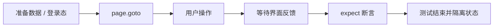

<Callout type="idea" title="文件定位">

设置页包含多个相互独立但共享身份的表单。这组测试验证标签导航、服务端更新、客户端撤销和浏览器主题持久化。

</Callout>

## 这个文件负责什么

- 通过 Playwright 浏览器测试覆盖 14 个独立用例。
- 从用户可见行为出发验证页面，而不是直接读取 React 内部状态。
- 用角色、标签、文本和稳定 test id 定位交互元素。
- 同时覆盖成功路径、失败路径及该业务域的关键边界。
- 让每个测试拥有可解释的前置状态与最终断言。

## 执行思路

<Steps>
  <Step>

### 1. 准备环境变量、认证快照或随机测试数据。

  </Step>
  <Step>

### 2. 导航到真实路由，等待页面进入可交互状态。

  </Step>
  <Step>

### 3. 使用接近用户行为的定位器完成输入、点击和切换。

  </Step>
  <Step>

### 4. 等待网络结果通过 UI 反馈呈现。

  </Step>
  <Step>

### 5. 对可见内容、URL、ARIA 状态或持久化结果做断言。

  </Step>
</Steps>

## 与其他模块的关系

| 模块 | 关系 |
| --- | --- |
| `Playwright test runner` | 提供 page、request、expect、生命周期钩子和并发隔离。 |
| `auth.setup.ts` | 为默认受保护页面用例生成可复用登录状态。 |
| `utils/privateApi.ts` | 在不依赖 UI 的情况下快速准备后端数据。 |
| `utils/random.ts` | 生成低冲突邮箱、密码和业务字段。 |
| `utils/user.ts` | 复用注册、登录和退出的用户级操作。 |

## 覆盖矩阵

| 场景 | 验证目标 |
| --- | --- |
| 标签导航 | 默认标签和全部标签可见。 |
| 资料编辑 | 姓名、邮箱更新及非法邮箱反馈。 |
| 取消编辑 | 取消后恢复服务端原值。 |
| 密码修改 | 成功后旧会话退出，新密码可以重新登录。 |
| 密码校验 | 弱密码、不匹配、与旧密码相同均被拒绝。 |
| 主题设置 | 明暗切换写入 html class，并跨退出登录保持。 |

## 前置状态

- 复杂场景使用 PrivateService 创建独立用户。
- beforeAll 创建共享账号，beforeEach 恢复登录和目标标签。
- 取消场景保留创建 API 返回的原始值用于断言。
- 默认超级用户用于验证主题跨会话保存。

## 定位器策略

<Tabs items={['优先', '谨慎使用', '断言']}>
  <Tab>标签使用 role=tab 和 aria-selected，能同时验证可访问状态。</Tab>
  <Tab>表单值显示范围先缩小到 form，避免侧边栏重复文本造成误匹配。</Tab>
  <Tab>密码成功以重新登录为最终断言；主题成功以根元素 class 和跨会话保持为最终断言。</Tab>
</Tabs>



## 带注释源码

> 原始路径：`frontend/tests/user-settings.spec.ts`。以下仅增加学习性注释与代码高亮标记，不改变程序行为。

```ts title="user-settings.spec.ts" lineNumbers
import { expect, test } from "@playwright/test"
import { firstSuperuser, firstSuperuserPassword } from "./config.ts"
import { createUser } from "./utils/privateApi.ts"
import { randomEmail, randomPassword } from "./utils/random"
import { logInUser, logOutUser } from "./utils/user"

// 标签名既用于可见性检查，也作为页面信息架构的回归清单。
const tabs = ["My profile", "Password", "Danger zone"]

// 用例目标：My profile tab is active by default。
test("My profile tab is active by default", async ({ page }) => {
  await page.goto("/settings")
  await expect(page.getByRole("tab", { name: "My profile" })).toHaveAttribute(
    "aria-selected",
    "true",
  )
})

// 用例目标：All tabs are visible。
test("All tabs are visible", async ({ page }) => {
  await page.goto("/settings")
  for (const tab of tabs) {
    await expect(page.getByRole("tab", { name: tab })).toBeVisible()
  }
})

// 场景组：Edit user profile。把共享前置条件与相关断言放在同一作用域。
test.describe("Edit user profile", () => {
  // 清空默认登录快照，确保这一组从匿名会话开始。
  test.use({ storageState: { cookies: [], origins: [] } })
  let email: string
  let password: string

  // 组内只执行一次：准备可复用的服务端测试数据。
  test.beforeAll(async () => {
    email = randomEmail()
    password = randomPassword()
    await createUser({ email, password })
  })

  // 每个用例重新建立页面状态，避免测试之间相互污染。
  test.beforeEach(async ({ page }) => {
    await logInUser(page, email, password)
    await page.goto("/settings")
    await page.getByRole("tab", { name: "My profile" }).click()
  })

  // 用例目标：Edit user name with a valid name。
  test("Edit user name with a valid name", async ({ page }) => {
    const updatedName = "Test User 2"

    await page.getByRole("button", { name: "Edit" }).click()
    await page.getByLabel("Full name").fill(updatedName)
    await page.getByRole("button", { name: "Save" }).click()

    await expect(page.getByText("User updated successfully")).toBeVisible()
    await expect(
      page.locator("form").getByText(updatedName, { exact: true }),
    ).toBeVisible()
  })

  // 用例目标：Edit user email with an invalid email shows error。
  test("Edit user email with an invalid email shows error", async ({
    page,
  }) => {
    await page.getByRole("button", { name: "Edit" }).click()
    await page.getByLabel("Email").fill("")
    await page.locator("body").click()

    await expect(page.getByText("Invalid email address")).toBeVisible()
  })
})

// 场景组：Edit user email。把共享前置条件与相关断言放在同一作用域。
test.describe("Edit user email", () => {
  // 清空默认登录快照，确保这一组从匿名会话开始。
  test.use({ storageState: { cookies: [], origins: [] } })

  // 用例目标：Edit user email with a valid email。
  test("Edit user email with a valid email", async ({ page }) => {
    const email = randomEmail()
    const password = randomPassword()
    const updatedEmail = randomEmail()

    await createUser({ email, password })
    await logInUser(page, email, password)
    await page.goto("/settings")
    await page.getByRole("tab", { name: "My profile" }).click()

    await page.getByRole("button", { name: "Edit" }).click()
    await page.getByLabel("Email").fill(updatedEmail)
    await page.getByRole("button", { name: "Save" }).click()

    await expect(page.getByText("User updated successfully")).toBeVisible()
    await expect(
      page.locator("form").getByText(updatedEmail, { exact: true }),
    ).toBeVisible()
  })
})

// 场景组：Cancel edit actions。把共享前置条件与相关断言放在同一作用域。
test.describe("Cancel edit actions", () => {
  // 清空默认登录快照，确保这一组从匿名会话开始。
  test.use({ storageState: { cookies: [], origins: [] } })

  // 用例目标：Cancel edit action restores original name。
  test("Cancel edit action restores original name", async ({ page }) => {
    const email = randomEmail()
    const password = randomPassword()
    const user = await createUser({ email, password })

    await logInUser(page, email, password)
    await page.goto("/settings")
    await page.getByRole("tab", { name: "My profile" }).click()
    await page.getByRole("button", { name: "Edit" }).click()
    await page.getByLabel("Full name").fill("Test User")
    await page.getByRole("button", { name: "Cancel" }).first().click()

    await expect(
      page.locator("form").getByText(user.full_name as string, { exact: true }),
    ).toBeVisible()
  })

  // 用例目标：Cancel edit action restores original email。
  test("Cancel edit action restores original email", async ({ page }) => {
    const email = randomEmail()
    const password = randomPassword()
    await createUser({ email, password })

    await logInUser(page, email, password)
    await page.goto("/settings")
    await page.getByRole("tab", { name: "My profile" }).click()
    await page.getByRole("button", { name: "Edit" }).click()
    await page.getByLabel("Email").fill(randomEmail())
    await page.getByRole("button", { name: "Cancel" }).first().click()

    await expect(
      page.locator("form").getByText(email, { exact: true }),
    ).toBeVisible()
  })
})

// 场景组：Change password。把共享前置条件与相关断言放在同一作用域。
test.describe("Change password", () => {
  // 清空默认登录快照，确保这一组从匿名会话开始。
  test.use({ storageState: { cookies: [], origins: [] } })

  // 用例目标：Update password successfully。
  test("Update password successfully", async ({ page }) => {
    const email = randomEmail()
    const password = randomPassword()
    const newPassword = randomPassword()

    await createUser({ email, password })
    await logInUser(page, email, password)

    await page.goto("/settings")
    await page.getByRole("tab", { name: "Password" }).click()
    await page.getByTestId("current-password-input").fill(password)
    await page.getByTestId("new-password-input").fill(newPassword)
    await page.getByTestId("confirm-password-input").fill(newPassword)
    await page.getByRole("button", { name: "Update Password" }).click()

    await expect(page.getByText("Password updated successfully")).toBeVisible()

    // 退出后使用新密码重新登录，证明密码已在服务端真正更新。
    await logOutUser(page)
    await logInUser(page, email, newPassword)
  })
})

// 场景组：Change password validation。把共享前置条件与相关断言放在同一作用域。
test.describe("Change password validation", () => {
  // 清空默认登录快照，确保这一组从匿名会话开始。
  test.use({ storageState: { cookies: [], origins: [] } })
  let email: string
  let password: string

  // 组内只执行一次：准备可复用的服务端测试数据。
  test.beforeAll(async () => {
    email = randomEmail()
    password = randomPassword()
    await createUser({ email, password })
  })

  // 每个用例重新建立页面状态，避免测试之间相互污染。
  test.beforeEach(async ({ page }) => {
    await logInUser(page, email, password)
    await page.goto("/settings")
    await page.getByRole("tab", { name: "Password" }).click()
  })

  // 用例目标：Update password with weak passwords。
  test("Update password with weak passwords", async ({ page }) => {
    const weakPassword = "weak"

    await page.getByTestId("current-password-input").fill(password)
    await page.getByTestId("new-password-input").fill(weakPassword)
    await page.getByTestId("confirm-password-input").fill(weakPassword)
    await page.getByRole("button", { name: "Update Password" }).click()

    await expect(
      page.getByText("Password must be at least 8 characters"),
    ).toBeVisible()
  })

  // 用例目标：New password and confirmation password do not match。
  test("New password and confirmation password do not match", async ({
    page,
  }) => {
    await page.getByTestId("current-password-input").fill(password)
    await page.getByTestId("new-password-input").fill(randomPassword())
    await page.getByTestId("confirm-password-input").fill(randomPassword())
    await page.getByRole("button", { name: "Update Password" }).click()

    await expect(page.getByText("The passwords don't match")).toBeVisible()
  })

  // 用例目标：Current password and new password are the same。
  test("Current password and new password are the same", async ({ page }) => {
    await page.getByTestId("current-password-input").fill(password)
    await page.getByTestId("new-password-input").fill(password)
    await page.getByTestId("confirm-password-input").fill(password)
    await page.getByRole("button", { name: "Update Password" }).click()

    await expect(
      page.getByText("New password cannot be the same as the current one"),
    ).toBeVisible()
  })
})

// 用例目标：Appearance button is visible in sidebar。
test("Appearance button is visible in sidebar", async ({ page }) => {
  await page.goto("/settings")
  await expect(page.getByTestId("theme-button")).toBeVisible()
})

// 用例目标：User can switch between theme modes。
test("User can switch between theme modes", async ({ page }) => {
  await page.goto("/settings")

  await page.getByTestId("theme-button").click()
  await page.getByTestId("dark-mode").click()
  await expect(page.locator("html")).toHaveClass(/dark/)

  await expect(page.getByTestId("dark-mode")).not.toBeVisible()

  await page.getByTestId("theme-button").click()
  await page.getByTestId("light-mode").click()
  await expect(page.locator("html")).toHaveClass(/light/)
})

// 用例目标：Selected mode is preserved across sessions。
test("Selected mode is preserved across sessions", async ({ page }) => {
  await page.goto("/settings")

  await page.getByTestId("theme-button").click()
  if (
    await page.evaluate(() =>
      document.documentElement.classList.contains("dark"),
    )
  ) {
    await page.getByTestId("light-mode").click()
    await page.getByTestId("theme-button").click()
  }

  // 直接读取 html class 验证 ThemeProvider 最终写入的持久化结果。
  const isLightMode = await page.evaluate(() =>
    document.documentElement.classList.contains("light"),
  )
  expect(isLightMode).toBe(true)

  await page.getByTestId("theme-button").click()
  await page.getByTestId("dark-mode").click()
  let isDarkMode = await page.evaluate(() =>
    document.documentElement.classList.contains("dark"),
  )
  expect(isDarkMode).toBe(true)

  await logOutUser(page)
  await logInUser(page, firstSuperuser, firstSuperuserPassword)

  isDarkMode = await page.evaluate(() =>
    document.documentElement.classList.contains("dark"),
  )
  expect(isDarkMode).toBe(true)
})
```

## 阅读重点

- 设置页用例多且状态丰富，分组的 beforeAll/beforeEach 能兼顾可读性和速度。
- 取消编辑需要验证原值恢复，而不是只验证按钮点击或表单关闭。
- 主题偏好究竟按浏览器还是按用户存储，应由产品契约决定；测试揭示当前行为。
- 密码修改后重新登录是比 toast 更强的验证。
- 此文件较大，未来可按 profile/password/appearance 拆分以缩短失败定位。

## 为什么这是端到端测试

这里实际启动浏览器并穿过路由、表单、生成客户端、后端 API 与数据库。它比单元测试更慢，但能捕获“各层单独正确、组合后却失败”的问题。
