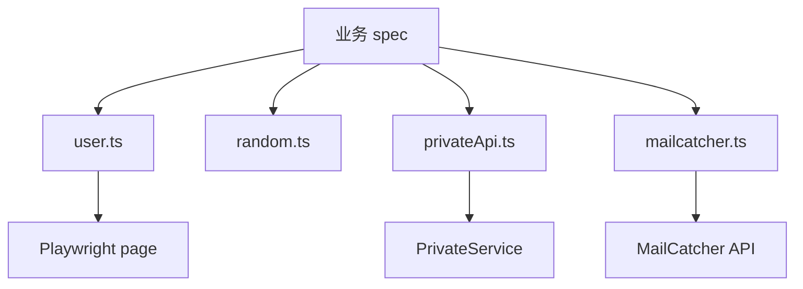

<Callout type="idea" title="目录定位">

工具层减少 spec 中的重复技术细节，让测试正文更接近“用户做了什么、系统应该怎样”。它不应隐藏关键业务断言。

</Callout>

## 目录结构

<Files>
  <Folder name="utils" defaultOpen>
    <File name="mailcatcher.ts" />
    <File name="privateApi.ts" />
    <File name="random.ts" />
    <File name="user.ts" />
  </Folder>
</Files>

## 如何组织

| 文件 | 抽象层级 | 典型用途 |
| --- | --- | --- |
| `mailcatcher.ts` | 外部测试服务 | 等待密码重置邮件 |
| `privateApi.ts` | 后端数据工厂 | 快速创建已验证用户 |
| `random.ts` | 纯数据工厂 | 生成低冲突字段 |
| `user.ts` | 浏览器用户动作 | 注册、登录、退出 |

## 组织原则

- 工具函数只封装可复用步骤，不吞掉关键 expect。
- 浏览器动作接收 Page，便于测试上下文隔离。
- 数据准备优先使用本地专用 API，避免生产暴露。
- 随机值满足业务 schema，并尽量降低并发冲突。
- 轮询必须有超时，避免测试无限挂起。

## 推荐阅读顺序

<Steps>
  <Step>

### 1. 先读 random.ts，理解测试数据来源。

  </Step>
  <Step>

### 2. 阅读 privateApi.ts，理解如何快速准备服务端状态。

  </Step>
  <Step>

### 3. 阅读 user.ts，理解浏览器级复用动作。

  </Step>
  <Step>

### 4. 最后读 mailcatcher.ts，掌握异步外部事件轮询。

  </Step>
</Steps>
