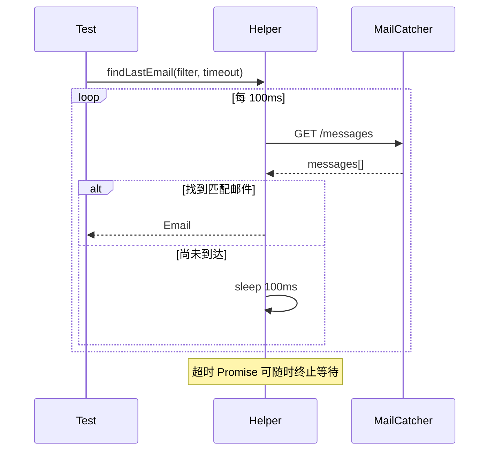

<Callout type="idea" title="文件定位">

密码重置邮件是异步副作用。该工具用“短轮询 + 总超时”代替脆弱的固定 sleep，并允许并发测试按收件人筛选。

</Callout>

## 这个文件负责什么

- 描述测试所需的最小 Email 结构。
- 请求 MailCatcher `/messages`。
- 按可选函数过滤邮件。
- 选择匹配列表中的最新邮件。
- 每 100ms 重试，默认 5 秒超时。
- 通过 Promise.race 在成功与超时之间竞争。

## 执行思路

<Steps>
  <Step>

### 1. 发起业务操作触发邮件。

  </Step>
  <Step>

### 2. findLastEmail 同时启动轮询与超时计时器。

  </Step>
  <Step>

### 3. findEmail 获取消息并应用 filter。

  </Step>
  <Step>

### 4. 未找到则等待 100ms 再查。

  </Step>
  <Step>

### 5. 找到返回 Email；超时则拒绝 Promise。

  </Step>
</Steps>

## 与其他模块的关系

| 模块 | 关系 |
| --- | --- |
| `reset-password.spec.ts` | 等待目标用户的重置邮件。 |
| `APIRequestContext` | 无需打开 MailCatcher UI 即可调用 HTTP API。 |
| `MAILCATCHER_HOST` | 由测试环境提供邮件服务地址。 |
| `Promise.race` | 建立异步操作的硬超时。 |

## 轮询时间线



## 带注释源码

> 原始路径：`frontend/tests/utils/mailcatcher.ts`。以下仅增加学习性注释与代码高亮标记，不改变程序行为。

```ts title="mailcatcher.ts" lineNumbers
import type { APIRequestContext } from "@playwright/test"

type Email = {
  id: number
  recipients: string[]
  subject: string
}

// 单次查询：读取 MailCatcher 消息列表，应用可选过滤器并取最新一封。
async function findEmail({
  request,
  filter,
}: {
  request: APIRequestContext
  filter?: (email: Email) => boolean
}) {
  const response = await request.get(`${process.env.MAILCATCHER_HOST}/messages`)

  let emails = await response.json()

  if (filter) {
    emails = emails.filter(filter)
  }

  const email = emails[emails.length - 1]

  if (email) {
    return email as Email
  }

  return null
}

export function findLastEmail({
  request,
  filter,
  timeout = 5000,
}: {
  request: APIRequestContext
  filter?: (email: Email) => boolean
  timeout?: number
}) {
  // 超时 Promise 为无限轮询设置硬停止边界。
  const timeoutPromise = new Promise<never>((_, reject) =>
    setTimeout(
      () => reject(new Error("Timeout while trying to get latest email")),
      timeout,
    ),
  )

  // 轮询间隔 100ms，适合本地测试邮件服务，不使用固定长等待。
  const checkEmails = async () => {
    while (true) {
      const emailData = await findEmail({ request, filter })

      if (emailData) {
        return emailData
      }
      // Wait for 100ms before checking again
      await new Promise((resolve) => setTimeout(resolve, 100))
    }
  }

  // 邮件先出现则返回；超时先发生则以明确错误结束测试。
  return Promise.race([timeoutPromise, checkEmails()])
}
```

## 阅读重点

- 过滤器应至少包含收件人或唯一主题，避免并发测试串信。
- 固定 `waitForTimeout(5000)` 总是等满；轮询通常更快且更稳定。
- 响应状态目前未显式检查，可在解析 JSON 前调用或断言 `response.ok()`。
- while(true) 只有在 Promise.race 外部超时存在时才安全。
- 生产邮件提供商不应被 E2E 测试直接消费，使用隔离 MailCatcher 更可控。

## Twoslash：`Promise.race` 的结果类型

```ts twoslash
const timeout = new Promise<never>((_, reject) => reject(new Error()))
const lookup = Promise.resolve({ id: 1, subject: 'Reset' })
const result = Promise.race([timeout, lookup])
//    ^?
```

`never` 不会污染成功值，因此结果仍保持邮件对象类型。
