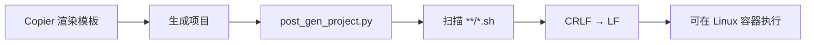

<Callout type="idea" title="目录定位">

Copier 把模板渲染成新项目后，会执行这里的钩子修正生成结果。当前仅统一 Shell 脚本换行符。

</Callout>

## 目录结构

<Files>
  <Folder name="hooks" defaultOpen>
    <File name="post_gen_project.py" />
  </Folder>
</Files>

## 如何组织

## 组织原则

- 钩子必须可重复执行，第二次运行不应继续改变文件。
- 只修改明确目标文件，避免重写用户内容。
- 跨平台问题在生成阶段解决，比运行时报错更早。
- 保持依赖最少，使用 Python 标准库即可。

## 推荐阅读顺序

<Steps>
  <Step>

### 1. 阅读 post_gen_project.py。

  </Step>
  <Step>

### 2. 结合 Copier 配置理解钩子的触发时机。

  </Step>
  <Step>

### 3. 在 Windows 生成项目后检查 Shell 文件仍为 LF。

  </Step>
</Steps>
