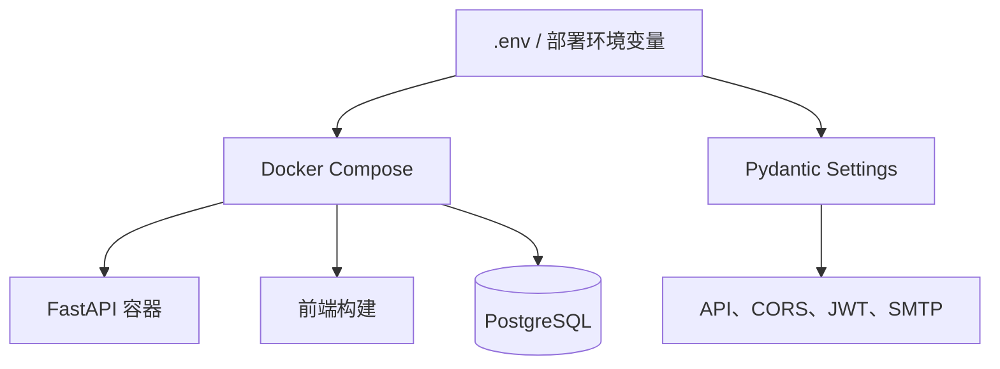

<Callout type="warn" title="先区分配置与密钥">

配置文件可以提交到仓库，但生产环境的 `SECRET_KEY`、数据库密码和超级管理员密码必须通过安全的环境变量或密钥系统注入，不能沿用示例值 `changethis`。

</Callout>

## 本页作用

本页汇总项目根目录中不属于某一个业务模块、但会影响整个工程行为的配置。阅读时不要逐行背诵，而要先按职责分类。

| 配置类别 | 代表文件 | 主要作用 |
| --- | --- | --- |
| 环境与密钥 | `.env` | 向前端、后端、数据库、邮件和部署流程提供运行参数 |
| 容器编排 | `compose.yml` 等 | 描述服务、网络、卷、健康检查和启动顺序 |
| 代码质量 | `.pre-commit-config.yaml` | 在提交前统一执行格式化、静态检查和代码生成 |
| 项目元数据 | `package.json`、`pyproject.toml` | 定义工作区脚本、工具版本和 Python 项目配置 |
| 模板生成 | `copier.yml` | 将仓库作为可交互项目模板使用 |

## 配置流向



## 阅读提示

- 先看变量名在哪里被消费，而不是只看变量值。
- `compose.override.yml` 偏向本地开发，`compose.traefik.yml` 偏向公网入口与 HTTPS。
- 自动生成文件和锁文件通常不手改；修改依赖声明后由包管理器重新生成。

---

The original files are consolidated here for easier reading. Their contents are preserved verbatim inside code blocks.

## `.dockerignore`

> Original file: `.dockerignore`

```text title=".dockerignore"
.git
**/__pycache__
**/.venv
backend/app/frontend
backend/htmlcov
frontend/blob-report
frontend/dist
frontend/node_modules
frontend/playwright-report
frontend/test-results
node_modules

```

## `.env`

> Original file: `.env`

```text title=".env"
# Domain
# This would be set to the production domain with an env var on deployment
# used by Traefik to transmit traffic and acquire TLS certificates
DOMAIN=localhost
# To test the local Traefik config
# DOMAIN=localhost.tiangolo.com

# Public frontend URL, used by the backend to generate links in emails.
# Keep the Vite URL for local development; deployments use the application URL.
FRONTEND_HOST=http://localhost:5173
# In staging and production, set this env var to the frontend host, e.g.
# FRONTEND_HOST=https://example.com

# Environment: local, staging, production
ENVIRONMENT=local

PROJECT_NAME="Full Stack FastAPI Project"
STACK_NAME=full-stack-fastapi-project

# Backend
BACKEND_CORS_ORIGINS="http://localhost,https://localhost,http://localhost.tiangolo.com"
SECRET_KEY=changethis
FIRST_SUPERUSER=admin@example.com
FIRST_SUPERUSER_PASSWORD=changethis

# Emails
SMTP_HOST=
SMTP_USER=
SMTP_PASSWORD=
EMAILS_FROM_EMAIL=info@example.com
SMTP_TLS=True
SMTP_SSL=False
SMTP_PORT=587

# Postgres
POSTGRES_SERVER=localhost
POSTGRES_PORT=5432
POSTGRES_DB=app
POSTGRES_USER=postgres
POSTGRES_PASSWORD=changethis

SENTRY_DSN=

# Configure these with your own Docker registry images
DOCKER_IMAGE_BACKEND=backend

```

## `.gitattributes`

> Original file: `.gitattributes`

```text title=".gitattributes"
* text=auto
*.sh text eol=lf

```

## `.gitignore`

> Original file: `.gitignore`

```text title=".gitignore"
.vscode/*
!.vscode/extensions.json
node_modules/
backend/app/frontend/
/test-results/
/playwright-report/
/blob-report/
/playwright/.cache/

```

## `.pre-commit-config.yaml`

> Original file: `.pre-commit-config.yaml`

```yaml title=".pre-commit-config.yaml"
# See https://pre-commit.com for more information
# See https://pre-commit.com/hooks.html for more hooks
repos:
  - repo: https://github.com/pre-commit/pre-commit-hooks
    rev: 3e8a8703264a2f4a69428a0aa4dcb512790b2c8c # v6.0.0
    hooks:
      - id: check-added-large-files
      - id: check-toml
      - id: check-yaml
        args:
          - --unsafe
      - id: end-of-file-fixer
        exclude: |
            (?x)^(
                frontend/src/client/.*|
                backend/app/email-templates/build/.*
            )$
      - id: trailing-whitespace
        exclude: ^frontend/src/client/.*
  - repo: https://github.com/crate-ci/typos
    rev: bee27e3a4fd1ea2111cf90ab89cd076c870fce14 # frozen: v1.48.0
    hooks:
      - id: typos
        args: [--force-exclude]
  - repo: local
    hooks:
      - id: local-biome-check
        name: biome check
        entry: npm run lint
        language: system
        types: [text]
        files: ^frontend/

      - id: local-ruff-check
        name: ruff check
        entry: uv run ruff check --force-exclude --fix --exit-non-zero-on-fix
        require_serial: true
        language: unsupported
        types: [python]

      - id: local-ruff-format
        name: ruff format
        entry: uv run ruff format --force-exclude --exit-non-zero-on-format
        require_serial: true
        language: unsupported
        types: [python]

      - id: local-mypy
        name: mypy check
        entry: uv run mypy backend/app
        require_serial: true
        language: unsupported
        pass_filenames: false

      - id: local-ty
        name: ty check
        entry: uv run ty check backend/app
        require_serial: true
        language: unsupported
        pass_filenames: false

      - id: generate-frontend-sdk
        name: Generate Frontend SDK
        entry: bash ./scripts/generate-client.sh
        pass_filenames: false
        language: unsupported
        files: ^backend/.*$|^scripts/generate-client\.sh$

      - id: add-release-date
        language: unsupported
        name: add date to latest release header
        entry: uv run python scripts/add_latest_release_date.py
        files: ^release-notes\.md$
        pass_filenames: false

      - id: zizmor
        name: zizmor
        language: python
        entry: uv run zizmor .
        files: ^\.github\/workflows\/
        require_serial: true
        pass_filenames: false

```

## `.python-version`

> Original file: `.python-version`

```text title=".python-version"
3.14

```

## `compose.override.yml`

> Original file: `compose.override.yml`

```yaml title="compose.override.yml"
services:

  # Local services are available on their ports, but also available on:
  # http://localhost.tiangolo.com: application
  # etc. To enable it, update .env, set:
  # DOMAIN=localhost.tiangolo.com
  proxy:
    image: traefik:3.6
    volumes:
      - /var/run/docker.sock:/var/run/docker.sock
    ports:
      - "80:80"
      - "8090:8080"
    # Duplicate the command from compose.yml to add --api.insecure=true
    command:
      # Enable Docker in Traefik, so that it reads labels from Docker services
      - --providers.docker
      # Add a constraint to only use services with the label for this stack
      - --providers.docker.constraints=Label(`traefik.constraint-label`, `traefik-public`)
      # Do not expose all Docker services, only the ones explicitly exposed
      - --providers.docker.exposedbydefault=false
      # Create an entrypoint "http" listening on port 80
      - --entrypoints.http.address=:80
      # Create an entrypoint "https" listening on port 443
      - --entrypoints.https.address=:443
      # Enable the access log, with HTTP requests
      - --accesslog
      # Enable the Traefik log, for configurations and errors
      - --log
      # Enable debug logging for local development
      - --log.level=DEBUG
      # Enable the Dashboard and API
      - --api
      # Enable the Dashboard and API in insecure mode for local development
      - --api.insecure=true
    labels:
      # Enable Traefik for this service, to make it available in the public network
      - traefik.enable=true
      - traefik.constraint-label=traefik-public
      # Dummy https-redirect middleware that doesn't really redirect, only to
      # allow running it locally
      - traefik.http.middlewares.https-redirect.contenttype.autodetect=false
    networks:
      - traefik-public
      - default

  db:
    restart: "no"
    ports:
      - "5432:5432"

  adminer:
    restart: "no"
    ports:
      - "8080:8080"

  backend:
    restart: "no"
    ports:
      - "8000:8000"
    build:
      context: .
      dockerfile: backend/Dockerfile
    # command: sleep infinity  # Infinite loop to keep container alive doing nothing
    command:
      - fastapi
      - run
      - --reload
      - "app/main.py"
    develop:
      watch:
        - path: ./backend
          action: sync
          target: /app/backend
          ignore:
            - ./backend/.venv
            - .venv
        - path: ./backend/pyproject.toml
          action: rebuild
        - path: ./frontend
          action: rebuild
          ignore:
            - ./frontend/node_modules
            - ./frontend/dist
            - ./frontend/blob-report
            - ./frontend/test-results
    # TODO: remove once coverage is done locally
    volumes:
      - ./backend/htmlcov:/app/backend/htmlcov
    environment:
      SMTP_HOST: "mailcatcher"
      SMTP_PORT: "1025"
      SMTP_TLS: "false"
      EMAILS_FROM_EMAIL: "noreply@example.com"

  mailcatcher:
    image: schickling/mailcatcher
    ports:
      - "1080:1080"
      - "1025:1025"

  playwright:
    build:
      context: .
      dockerfile: frontend/Dockerfile.playwright
      args:
        - NODE_ENV=production
    ipc: host
    depends_on:
      - backend
      - mailcatcher
    env_file:
      - .env
    environment:
      - PLAYWRIGHT_BASE_URL=http://backend:8000
      - VITE_API_URL=http://backend:8000
      - MAILCATCHER_HOST=http://mailcatcher:1080
      # For the reports when run locally
      - PLAYWRIGHT_HTML_HOST=0.0.0.0
      - CI=${CI}
    volumes:
      - ./frontend/blob-report:/app/frontend/blob-report
      - ./frontend/test-results:/app/frontend/test-results
    ports:
      - 9323:9323

networks:
  traefik-public:
    # For local dev, don't expect an external Traefik network
    external: false

```

## `compose.traefik.yml`

> Original file: `compose.traefik.yml`

```yaml title="compose.traefik.yml"
services:
  traefik:
    image: traefik:3.6
    ports:
      # Listen on port 80, default for HTTP, necessary to redirect to HTTPS
      - 80:80
      # Listen on port 443, default for HTTPS
      - 443:443
    restart: always
    labels:
      # Enable Traefik for this service, to make it available in the public network
      - traefik.enable=true
      # Use the traefik-public network (declared below)
      - traefik.docker.network=traefik-public
      # Define the port inside of the Docker service to use
      - traefik.http.services.traefik-dashboard.loadbalancer.server.port=8080
      # Make Traefik use this domain (from an environment variable) in HTTP
      - traefik.http.routers.traefik-dashboard-http.entrypoints=http
      - traefik.http.routers.traefik-dashboard-http.rule=Host(`traefik.${DOMAIN?Variable not set}`)
      # traefik-https the actual router using HTTPS
      - traefik.http.routers.traefik-dashboard-https.entrypoints=https
      - traefik.http.routers.traefik-dashboard-https.rule=Host(`traefik.${DOMAIN?Variable not set}`)
      - traefik.http.routers.traefik-dashboard-https.tls=true
      # Use the "le" (Let's Encrypt) resolver created below
      - traefik.http.routers.traefik-dashboard-https.tls.certresolver=le
      # Use the special Traefik service api@internal with the web UI/Dashboard
      - traefik.http.routers.traefik-dashboard-https.service=api@internal
      # https-redirect middleware to redirect HTTP to HTTPS
      - traefik.http.middlewares.https-redirect.redirectscheme.scheme=https
      - traefik.http.middlewares.https-redirect.redirectscheme.permanent=true
      # traefik-http set up only to use the middleware to redirect to https
      - traefik.http.routers.traefik-dashboard-http.middlewares=https-redirect
      # admin-auth middleware with HTTP Basic auth
      # Using the environment variables USERNAME and HASHED_PASSWORD
      - traefik.http.middlewares.admin-auth.basicauth.users=${USERNAME?Variable not set}:${HASHED_PASSWORD?Variable not set}
      # Enable HTTP Basic auth, using the middleware created above
      - traefik.http.routers.traefik-dashboard-https.middlewares=admin-auth
    volumes:
      # Add Docker as a mounted volume, so that Traefik can read the labels of other services
      - /var/run/docker.sock:/var/run/docker.sock:ro
      # Mount the volume to store the certificates
      - traefik-public-certificates:/certificates
    command:
      # Enable Docker in Traefik, so that it reads labels from Docker services
      - --providers.docker
      # Do not expose all Docker services, only the ones explicitly exposed
      - --providers.docker.exposedbydefault=false
      # Create an entrypoint "http" listening on port 80
      - --entrypoints.http.address=:80
      # Create an entrypoint "https" listening on port 443
      - --entrypoints.https.address=:443
      # Create the certificate resolver "le" for Let's Encrypt, uses the environment variable EMAIL
      - --certificatesresolvers.le.acme.email=${EMAIL?Variable not set}
      # Store the Let's Encrypt certificates in the mounted volume
      - --certificatesresolvers.le.acme.storage=/certificates/acme.json
      # Use the TLS Challenge for Let's Encrypt
      - --certificatesresolvers.le.acme.tlschallenge=true
      # Enable the access log, with HTTP requests
      - --accesslog
      # Enable the Traefik log, for configurations and errors
      - --log
      # Enable the Dashboard and API
      - --api
    networks:
      # Use the public network created to be shared between Traefik and
      # any other service that needs to be publicly available with HTTPS
      - traefik-public

volumes:
  # Create a volume to store the certificates, even if the container is recreated
  traefik-public-certificates:

networks:
  # Use the previously created public network "traefik-public", shared with other
  # services that need to be publicly available via this Traefik
  traefik-public:
    external: true

```

## `compose.yml`

> Original file: `compose.yml`

```yaml title="compose.yml"
services:

  db:
    image: postgres:18
    restart: always
    healthcheck:
      test: ["CMD-SHELL", "pg_isready -U ${POSTGRES_USER} -d ${POSTGRES_DB}"]
      interval: 10s
      retries: 5
      start_period: 30s
      timeout: 10s
    volumes:
      - app-db-data:/var/lib/postgresql
    env_file:
      - .env
    environment:
      - POSTGRES_PASSWORD=${POSTGRES_PASSWORD?Variable not set}
      - POSTGRES_USER=${POSTGRES_USER?Variable not set}
      - POSTGRES_DB=${POSTGRES_DB?Variable not set}

  adminer:
    image: adminer
    restart: always
    networks:
      - traefik-public
      - default
    depends_on:
      - db
    environment:
      - ADMINER_DESIGN=pepa-linha-dark
    labels:
      - traefik.enable=true
      - traefik.docker.network=traefik-public
      - traefik.constraint-label=traefik-public
      - traefik.http.routers.${STACK_NAME?Variable not set}-adminer-http.rule=Host(`adminer.${DOMAIN?Variable not set}`)
      - traefik.http.routers.${STACK_NAME?Variable not set}-adminer-http.entrypoints=http
      - traefik.http.routers.${STACK_NAME?Variable not set}-adminer-http.middlewares=https-redirect
      - traefik.http.routers.${STACK_NAME?Variable not set}-adminer-https.rule=Host(`adminer.${DOMAIN?Variable not set}`)
      - traefik.http.routers.${STACK_NAME?Variable not set}-adminer-https.entrypoints=https
      - traefik.http.routers.${STACK_NAME?Variable not set}-adminer-https.tls=true
      - traefik.http.routers.${STACK_NAME?Variable not set}-adminer-https.tls.certresolver=le
      - traefik.http.services.${STACK_NAME?Variable not set}-adminer.loadbalancer.server.port=8080

  prestart:
    image: '${DOCKER_IMAGE_BACKEND?Variable not set}:${TAG-latest}'
    build:
      context: .
      dockerfile: backend/Dockerfile
    networks:
      - traefik-public
      - default
    depends_on:
      db:
        condition: service_healthy
        restart: true
    command: bash scripts/prestart.sh
    env_file:
      - .env
    environment:
      - DOMAIN=${DOMAIN}
      - FRONTEND_HOST=${FRONTEND_HOST?Variable not set}
      - ENVIRONMENT=${ENVIRONMENT}
      - BACKEND_CORS_ORIGINS=${BACKEND_CORS_ORIGINS}
      - SECRET_KEY=${SECRET_KEY?Variable not set}
      - FIRST_SUPERUSER=${FIRST_SUPERUSER?Variable not set}
      - FIRST_SUPERUSER_PASSWORD=${FIRST_SUPERUSER_PASSWORD?Variable not set}
      - SMTP_HOST=${SMTP_HOST}
      - SMTP_USER=${SMTP_USER}
      - SMTP_PASSWORD=${SMTP_PASSWORD}
      - EMAILS_FROM_EMAIL=${EMAILS_FROM_EMAIL}
      - POSTGRES_SERVER=db
      - POSTGRES_PORT=${POSTGRES_PORT}
      - POSTGRES_DB=${POSTGRES_DB}
      - POSTGRES_USER=${POSTGRES_USER?Variable not set}
      - POSTGRES_PASSWORD=${POSTGRES_PASSWORD?Variable not set}
      - SENTRY_DSN=${SENTRY_DSN}

  backend:
    image: '${DOCKER_IMAGE_BACKEND?Variable not set}:${TAG-latest}'
    restart: always
    networks:
      - traefik-public
      - default
    depends_on:
      db:
        condition: service_healthy
        restart: true
      prestart:
        condition: service_completed_successfully
    env_file:
      - .env
    environment:
      - DOMAIN=${DOMAIN}
      - FRONTEND_HOST=${FRONTEND_HOST?Variable not set}
      - ENVIRONMENT=${ENVIRONMENT}
      - BACKEND_CORS_ORIGINS=${BACKEND_CORS_ORIGINS}
      - SECRET_KEY=${SECRET_KEY?Variable not set}
      - FIRST_SUPERUSER=${FIRST_SUPERUSER?Variable not set}
      - FIRST_SUPERUSER_PASSWORD=${FIRST_SUPERUSER_PASSWORD?Variable not set}
      - SMTP_HOST=${SMTP_HOST}
      - SMTP_USER=${SMTP_USER}
      - SMTP_PASSWORD=${SMTP_PASSWORD}
      - EMAILS_FROM_EMAIL=${EMAILS_FROM_EMAIL}
      - POSTGRES_SERVER=db
      - POSTGRES_PORT=${POSTGRES_PORT}
      - POSTGRES_DB=${POSTGRES_DB}
      - POSTGRES_USER=${POSTGRES_USER?Variable not set}
      - POSTGRES_PASSWORD=${POSTGRES_PASSWORD?Variable not set}
      - SENTRY_DSN=${SENTRY_DSN}

    healthcheck:
      test: ["CMD", "curl", "-f", "http://localhost:8000/api/v1/utils/health-check/"]
      interval: 10s
      timeout: 5s
      retries: 5

    build:
      context: .
      dockerfile: backend/Dockerfile
    labels:
      - traefik.enable=true
      - traefik.docker.network=traefik-public
      - traefik.constraint-label=traefik-public

      - traefik.http.services.${STACK_NAME?Variable not set}-backend.loadbalancer.server.port=8000

      - traefik.http.routers.${STACK_NAME?Variable not set}-backend-http.rule=Host(`${DOMAIN?Variable not set}`)
      - traefik.http.routers.${STACK_NAME?Variable not set}-backend-http.entrypoints=http

      - traefik.http.routers.${STACK_NAME?Variable not set}-backend-https.rule=Host(`${DOMAIN?Variable not set}`)
      - traefik.http.routers.${STACK_NAME?Variable not set}-backend-https.entrypoints=https
      - traefik.http.routers.${STACK_NAME?Variable not set}-backend-https.tls=true
      - traefik.http.routers.${STACK_NAME?Variable not set}-backend-https.tls.certresolver=le

      # Enable redirection for HTTP and HTTPS
      - traefik.http.routers.${STACK_NAME?Variable not set}-backend-http.middlewares=https-redirect
volumes:
  app-db-data:

networks:
  traefik-public:
    # Allow setting it to false for testing
    external: true

```

## `copier.yml`

> Original file: `copier.yml`

```yaml title="copier.yml"
project_name:
  type: str
  help: The name of the project, shown to API users (in .env)
  default: FastAPI Project

stack_name:
  type: str
  help: The name of the stack used for Docker Compose labels (no spaces) (in .env)
  default: fastapi-project

secret_key:
  type: str
  help: |
    'The secret key for the project, used for security,
    stored in .env, you can generate one with:
    python -c "import secrets; print(secrets.token_urlsafe(32))"'
  default: changethis

first_superuser:
  type: str
  help: The email of the first superuser (in .env)
  default: admin@example.com

first_superuser_password:
  type: str
  help: The password of the first superuser (in .env)
  default: changethis

smtp_host:
  type: str
  help: The SMTP server host to send emails, you can set it later in .env
  default: ""

smtp_user:
  type: str
  help: The SMTP server user to send emails, you can set it later in .env
  default: ""

smtp_password:
  type: str
  help: The SMTP server password to send emails, you can set it later in .env
  default: ""

emails_from_email:
  type: str
  help: The email account to send emails from, you can set it later in .env
  default: info@example.com

postgres_password:
  type: str
  help: |
    'The password for the PostgreSQL database, stored in .env,
    you can generate one with:
    python -c "import secrets; print(secrets.token_urlsafe(32))"'
  default: changethis

sentry_dsn:
  type: str
  help: The DSN for Sentry, if you are using it, you can set it later in .env
  default: ""

_exclude:
  # Global
  - .vscode
  - .mypy_cache
  # Python
  - __pycache__
  - app.egg-info
  - "*.pyc"
  - .mypy_cache
  - .coverage
  - htmlcov
  - .cache
  - .venv
  # Frontend
  # Logs
  - logs
  - "*.log"
  - npm-debug.log*
  - yarn-debug.log*
  - yarn-error.log*
  - pnpm-debug.log*
  - lerna-debug.log*
  - node_modules
  - dist
  - dist-ssr
  - "*.local"
  # Editor directories and files
  - .idea
  - .DS_Store
  - "*.suo"
  - "*.ntvs*"
  - "*.njsproj"
  - "*.sln"
  - "*.sw?"

_answers_file: .copier/.copier-answers.yml

_tasks:
  - ["{{ _copier_python }}", .copier/update_dotenv.py]

```

## `package.json`

> Original file: `package.json`

```json title="package.json"
{
  "name": "fastapi-full-stack-template",
  "private": true,
  "workspaces": [
    "frontend"
  ],
  "scripts": {
    "dev": "bun run --filter frontend dev",
    "lint": "bun run --filter frontend lint",
    "test": "bun run --filter frontend test",
    "test:ui": "bun run --filter frontend test:ui"
  }
}

```

## `pyproject.toml`

> Original file: `pyproject.toml`

```toml title="pyproject.toml"
[dependency-groups]
dev = [
    "prek>=0.4.11,<1.0.0",
    "zizmor>=1.28.0",
]

github-actions = [
    "smokeshow >=0.5.0",
]

[tool.uv.workspace]
members = ["backend"]

[tool.typos.files]
extend-exclude = [
    "img/",
    "uv.lock",
    "bun.lock",
    "backend/coverage/",
    "backend/htmlcov/",
    "backend/app/frontend/",
    "frontend/dist/",
    "frontend/public/assets/images/",
]

[tool.typos.default]
extend-ignore-re = [
    # GitHub usernames in @mentions
    "@[a-zA-Z0-9](?:-?[a-zA-Z0-9])*",
    # Name of the package in the PR title
    "Bump certifi ",
]

[tool.typos.default.extend-identifiers]
alls = "alls"

```
