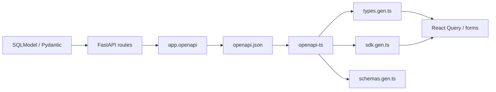

<Callout type="idea" title="文件定位">

这是后端契约到前端类型的桥梁。后端路由或模型变化后运行它，前端生成代码会同步暴露类型不兼容。

</Callout>

## 这个文件负责什么

- 在 development 环境导入 FastAPI app。
- 序列化完整 OpenAPI 文档。
- 把 schema 放入 frontend。
- 运行前端客户端生成命令。
- 执行 lint 检查生成结果和调用方。

## 执行思路

<Steps>
  <Step>

### 1. 进入 backend。

  </Step>
  <Step>

### 2. 用 uv 环境运行 Python 并导出 OpenAPI。

  </Step>
  <Step>

### 3. 返回根目录并移动 openapi.json。

  </Step>
  <Step>

### 4. 在 frontend workspace 生成客户端。

  </Step>
  <Step>

### 5. 运行 lint 发现契约变化造成的类型问题。

  </Step>
</Steps>

## 与其他模块的关系

| 模块 | 关系 |
| --- | --- |
| `app.main.app.openapi()` | OpenAPI 的事实来源。 |
| `openapi.json` | 后端与生成器之间的中间产物。 |
| `@hey-api/openapi-ts` | 生成 client/types/sdk/schemas。 |
| `frontend source` | 消费生成的服务和模型。 |
| `lint` | 验证格式、类型与调用兼容性。 |

## 契约生成链路



## 带注释源码

> 原始路径：`scripts/generate-client.sh`。以下仅增加学习性注释与代码高亮标记，不改变程序行为。

```bash title="generate-client.sh" lineNumbers
#! /usr/bin/env bash

# 任一步失败立即终止，避免用过期或不完整 schema 继续生成。
set -e
set -x

# 在后端环境导入真实 FastAPI app，并把 OpenAPI JSON 输出到仓库根。
cd backend
FASTAPI_ENV=development uv run python -c "import app.main; import json; print(json.dumps(app.main.app.openapi()))" > ../openapi.json
cd ..
# 前端生成器从自己的工作区读取 schema。
mv openapi.json frontend/
# 调用 @hey-api/openapi-ts 生成类型、SDK 与 schema。
bun run --filter frontend generate-client
bun run lint
```

## 阅读重点

- 直接从真实 app 导出比维护手写 schema 更可靠。
- 导入 app 可能触发配置校验，因此需要 FASTAPI_ENV=development 和完整环境变量。
- 生成文件通常不应手改，修改应回到后端模型或生成配置。
- `set -x` 会打印命令；确保命令行不包含秘密。
- CI 可检查运行后 git diff 是否为空，防止忘记提交生成客户端。
