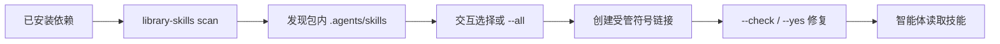

<Callout type="idea" title="目录定位">

该目录不是应用运行时代码，而是给编码智能体读取的项目级操作知识。Library Skills 会从已安装依赖中发现技能，并管理指向它们的受控符号链接。

</Callout>

## 文件组成

<Files>
  <Folder name=".agents/skills/library-skills" defaultOpen>
    <File name=".library-skills.json" />
    <File name="SKILL.md" />
  </Folder>
</Files>

## 工作模型



## 元数据文件

| 字段 | 含义 |
| --- | --- |
| `kind` | 声明这是工具技能而非普通业务技能 |
| `version` | 当前 Library Skills 格式/内容版本 |

```json title=".library-skills.json" lineNumbers
{
  "kind": "tool-skill",
  "version": "0.0.19"
}
```

## 技能说明

<Callout type="warn" title="先安装依赖">

技能链接指向依赖包内容。若 `uv sync`、`npm install` 或 `bun install` 尚未完成，链接可能看起来损坏；应先安装依赖，再运行修复命令。

</Callout>

```text title="SKILL.md" lineNumbers
---
name: library-skills
description: Use Library Skills to discover, install, refresh, repair, check, and manage agent skills from installed packages.
---

# Library Skills

Use this skill when a project might benefit from agent skills bundled by its installed packages, or when existing Library Skills-managed symlinks are stale, broken, orphaned, or need to be checked.

Run commands from the project root.

Agents bundle their own skills by including an `.agents/skills` directory. More details in [Library Skills](https://library-skills.io).

## First-Time Setup

- Make sure project dependencies are installed first, for example with `uv sync` for Python projects or `npm install` / `bun install` for Node.js projects.
- Run `uvx library-skills` or `npx library-skills` to discover skills bundled by the installed packages and install selected skills interactively.
- Use `uvx library-skills --all` or `npx library-skills --all` only when all newly discovered skills should be installed without selecting individual skills.
- Use `uvx library-skills --tool-skill` or `npx library-skills --tool-skill` to copy this Library Skills tool skill into the project so future agents know how to discover, install, update, repair, and check skills.

## Commands

- Run `uvx library-skills` or `npx library-skills` to discover package-provided skills, install selected new skills, and reconcile existing managed symlinks.
- Run `uvx library-skills list` or `npx library-skills list` to inspect discovered and installed skills.
- Run `uvx library-skills list --json` or `npx library-skills list --json` for machine-readable installed status.
- Run `uvx library-skills scan --json` or `npx library-skills scan --json` for discovery-only automation.
- Run `uvx library-skills --check` or `npx library-skills --check` to validate managed skill symlink state without changing files.
- Run `uvx library-skills --yes` or `npx library-skills --yes` to repair stale managed symlinks and remove orphaned managed symlinks non-interactively.
- Add `--claude` when `.claude/skills` should also be managed.
- Add `--skill NAME` to install a specific discovered skill by name.

## Safety

- Prefer rerunning `library-skills` over editing managed symlinks manually.
- If installed skill symlinks are broken, dependencies may not be installed yet. Try the project's normal install command first, such as `uv sync`, `npm install`, or `bun install`, then rerun `library-skills`.
- Do not delete or overwrite hand-authored skill directories.
- Library Skills only removes managed symlinks. It should not remove copied or hand-authored skill directories.
```

## 推荐维护流程

<Steps>
  <Step>

### 1. 安装项目依赖

确保技能实际来源存在。

  </Step>
  <Step>

### 2. 扫描与查看

使用 `list --json` 或 `scan --json` 获取可审计状态。

  </Step>
  <Step>

### 3. 安装或修复

交互选择技能；自动化中使用 `--yes` 修复受管链接。

  </Step>
  <Step>

### 4. 只检查不修改

CI 中使用 `--check` 验证仓库状态。

  </Step>
</Steps>

## 安全边界

- 优先重新运行工具，不手工修改受管符号链接。
- 工具只应删除自己管理的链接。
- 手写技能目录和复制的技能不能被当作孤儿链接删除。
- `--all` 会安装所有发现技能，应在明确需要时使用。
