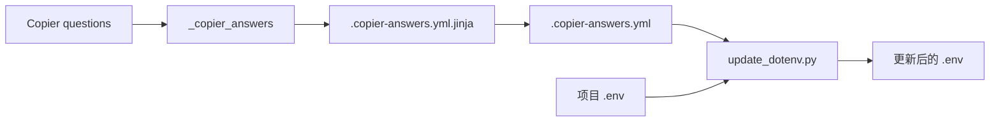

<Callout type="idea" title="目录定位">

Copier 负责从模板生成新项目并在以后合并模板升级。这里的文件连接“用户答案”与生成项目的 `.env`。

</Callout>

## 目录结构

<Files>
  <Folder name=".copier" defaultOpen>
    <File name=".copier-answers.yml.jinja" />
    <File name="update_dotenv.py" />
  </Folder>
</Files>

## 如何组织

## 组织原则

- 模板答案集中序列化，不在多个文件重复计算。
- 生成项目即使不再安装 Copier，也能直接使用普通 .env。
- 同步脚本只替换已存在且匹配的变量行。
- 模板和脚本都应保持幂等，便于多次更新。

## 推荐阅读顺序

<Steps>
  <Step>

### 1. 先读答案模板，理解数据来源。

  </Step>
  <Step>

### 2. 再读 update_dotenv.py，理解答案如何映射到环境变量。

  </Step>
  <Step>

### 3. 最后结合根 Copier 配置观察调用时机。

  </Step>
</Steps>
