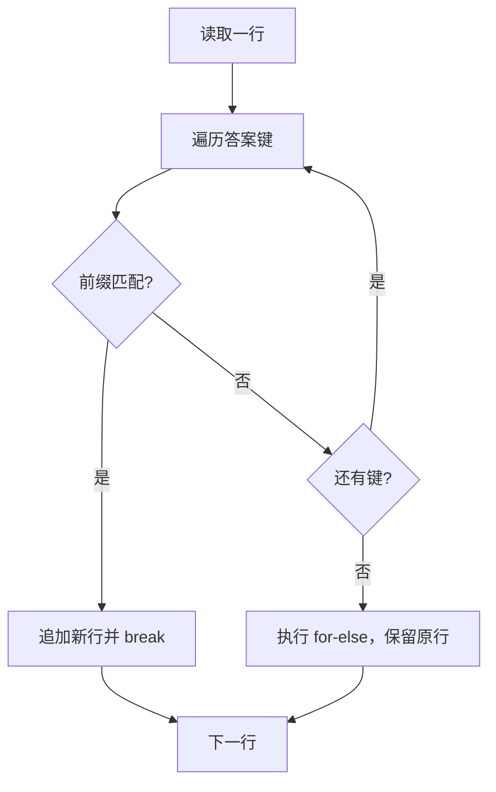

<Callout type="idea" title="文件定位">

模板不直接把整个 `.env` 变成 Jinja 文件，而是在生成后做定点替换。这样离开 Copier 后，项目仍保留普通、可直接运行的环境文件。

</Callout>

## 这个文件负责什么

- 定位项目根、答案文件和 .env。
- 解析 JSON 兼容答案。
- 把答案键转换为大写环境变量名。
- 替换匹配的已有变量。
- 为含空格值加引号。
- 保留注释和未匹配行。

## 执行思路

<Steps>
  <Step>

### 1. 读取 `.copier-answers.yml`。

  </Step>
  <Step>

### 2. 读取根 `.env`。

  </Step>
  <Step>

### 3. 逐行遍历 .env。

  </Step>
  <Step>

### 4. 对每个答案键检查 `KEY=` 前缀。

  </Step>
  <Step>

### 5. 匹配则构造新行并 break。

  </Step>
  <Step>

### 6. 无匹配则通过 for-else 保留原行。

  </Step>
  <Step>

### 7. 写回全部行。

  </Step>
</Steps>

## 与其他模块的关系

| 模块 | 关系 |
| --- | --- |
| `.copier-answers.yml.jinja` | 生成 JSON 兼容答案快照。 |
| `.env` | 被定点更新但不整体模板化。 |
| `Copier update` | 模板升级后重新同步用户答案。 |
| `Python for-else` | 区分已匹配与未匹配行。 |

## `for ... else` 控制流



## 带注释源码

> 原始路径：`.copier/update_dotenv.py`。以下仅增加学习性注释与代码高亮标记，不改变程序行为。

```python title="update_dotenv.py" lineNumbers
from pathlib import Path
import json

# Update the .env file with the answers from the .copier-answers.yml file
# without using Jinja2 templates in the .env file, this way the code works as is
# without needing Copier, but if Copier is used, the .env file will be updated
# 从 .copier 子目录回到生成项目根目录。
root_path = Path(__file__).parent.parent
answers_path = Path(__file__).parent / ".copier-answers.yml"
# 答案模板输出 JSON 兼容内容，因此可直接使用 json.loads。
answers = json.loads(answers_path.read_text())
env_path = root_path / ".env"
env_content = env_path.read_text()
lines = []
# 按原始 .env 行扫描，只替换与答案键对应的赋值。
for line in env_content.splitlines():
    for key, value in answers.items():
        upper_key = key.upper()
        # Copier 的 snake_case 答案名转换为大写环境变量名。
        if line.startswith(f"{upper_key}="):
            # 含空格的值使用 repr 加引号，避免 shell 解析成多个词。
            if " " in value:
                content = f"{upper_key}={value!r}"
            else:
                content = f"{upper_key}={value}"
            new_line = line.replace(line, content)
            lines.append(new_line)
            break
    else:
        # 内层循环没有 break：该行不匹配任何答案，原样保留。
        lines.append(line)
env_path.write_text("\n".join(lines))
```

## 阅读重点

- `for ... else` 的 else 只在循环未 break 时执行，是本脚本最值得掌握的语法。
- 当前代码假设 value 支持 `" " in value`，若答案含布尔或数字需要先转字符串。
- 只替换已存在变量，不会自动追加缺失键。
- 使用 repr 能处理空格，但不同 dotenv 解析器对引号/转义的支持应验证。
- 写回时不会保留文件末尾换行，可按格式要求补充。
