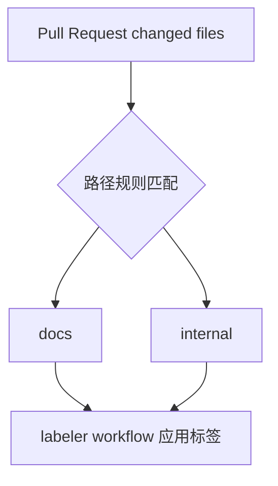

<Callout type="idea" title="目录定位">

`.github` 根配置负责仓库级自动化策略：Dependabot 定期提出依赖升级，Labeler 根据改动路径给 PR 添加分类标签。具体 Actions 工作流放在子目录单独讲解。

</Callout>

## 文件结构

<Files>
  <Folder name=".github" defaultOpen>
    <File name="dependabot.yml" />
    <File name="labeler.yml" />
    <Folder name="workflows" />
  </Folder>
</Files>

## Dependabot 设计

| 生态 | 扫描范围 | 分组 |
| --- | --- | --- |
| GitHub Actions | `/` | `github-actions` |
| Python uv | `/` | `python-packages` |
| Bun | `/` | `npm-packages` |
| Docker | `/backend`, `/frontend` | `docker` |
| Docker Compose | `/` | `docker-compose` |

<Callout type="info" title="为什么有 cooldown">

默认等待 7 天再升级，能降低刚发布版本立即引入严重回归的风险；安全更新是否应例外，需要结合仓库安全策略。

</Callout>

```yaml title="dependabot.yml" lineNumbers
# Dependabot 配置格式版本。
version: 2
# 每个条目独立描述一种包生态、目录和更新节奏。
updates:
  # GitHub Actions
  - package-ecosystem: github-actions
    directory: /
    schedule:
      interval: "monthly"
    # 延迟新版本 7 天，给上游留出发现严重回归的时间。
    cooldown:
      default-days: 7
    commit-message:
      prefix: ⬆
    labels:
      - "internal"
      - "dependencies"
      - "github_actions"
    # 把同一生态的升级合并为较少的 PR，降低维护噪声。
    groups:
      github-actions:
        patterns:
          - "*"
  # Python uv
  - package-ecosystem: uv
    directory: /
    schedule:
      interval: "monthly"
    cooldown:
      default-days: 7
    commit-message:
      prefix: ⬆
    labels: [dependencies, internal]
    groups:
      python-packages:
        patterns:
          - "*"
  # bun
  - package-ecosystem: bun
    directory: /
    schedule:
      interval: "monthly"
    cooldown:
      default-days: 7
    commit-message:
      prefix: ⬆
    labels: [dependencies, internal]
    ignore:
      - dependency-name: "@hey-api/openapi-ts"
    groups:
      npm-packages:
        patterns:
          - "*"
  # Docker
  - package-ecosystem: docker
    directories:
      - /backend
      - /frontend
    schedule:
      interval: "monthly"
    cooldown:
      default-days: 7
    commit-message:
      prefix: ⬆
    groups:
      docker:
        patterns:
          - "*"
  # Docker Compose
  - package-ecosystem: docker-compose
    directory: /
    schedule:
      interval: "monthly"
    cooldown:
      default-days: 7
    commit-message:
      prefix: ⬆
    groups:
      docker-compose:
        patterns:
          - "*"
```

## Labeler 规则



```yaml title="labeler.yml" lineNumbers
# 仅文档类改动自动标记 docs。
docs:
  # all 表示同一规则中的所有条件都必须成立。
  - all:
    - changed-files:
      - any-glob-to-any-file:
        - '**/*.md'
      - all-globs-to-all-files:
        - '!frontend/**'
        - '!backend/**'
        - '!.github/**'
        - '!scripts/**'
        - '!.gitignore'
        - '!.pre-commit-config.yaml'

# CI、脚本和仓库维护文件自动标记 internal。
internal:
  - all:
    - changed-files:
      - any-glob-to-any-file:
        - .github/**
        - scripts/**
        - .gitignore
        - .pre-commit-config.yaml
      - all-globs-to-all-files:
        - '!./**/*.md'
        - '!frontend/**'
        - '!backend/**'
```

## 阅读重点

- `all` 与 `changed-files` 组合确保 PR 的全部改动符合类别，而不是只要包含一个 Markdown 就标记 docs。
- 排除 frontend/backend/.github/scripts 可防止混合业务改动被误归类为纯文档。
- Bun 配置忽略 `@hey-api/openapi-ts`，通常意味着该生成器需要人工评估兼容性。
- 分组升级减少 PR 数量，但某个依赖失败时定位粒度也更粗。
- 标签名称必须与仓库实际存在的 labels 和工作流过滤条件一致。
