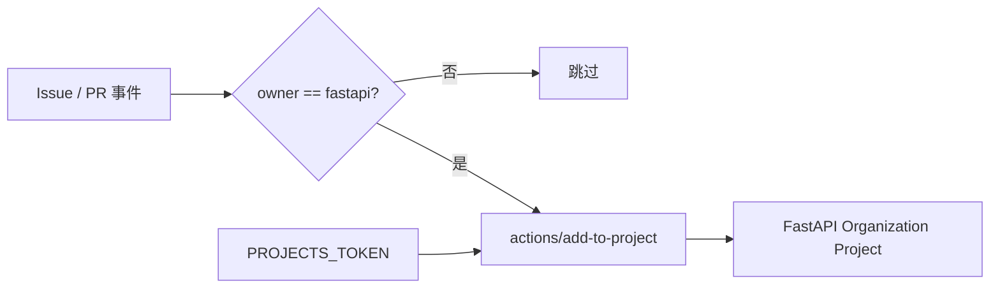

<Callout type="idea" title="工作流定位">

这是项目协作入口自动化。它只负责把新工作项送进统一看板，不负责打标签、分派成员或修改 PR 代码。

</Callout>

## 这个工作流解决什么问题

- 避免维护者手动把每个 Issue/PR 加入项目看板。
- 让新建与重新打开的工作项重新进入团队工作流。
- 把组织级 Project 写权限隔离到专用 Secret。
- 确保模板派生仓库不会误写 FastAPI 官方看板。

## 触发器与权限

<Tabs items={['触发条件', '权限与 Secrets']}>
  <Tab>

| 配置 | 含义 |
| --- | --- |
| `pull_request_target` | PR 目标仓库上下文触发；本工作流不检出或执行 PR 代码。 |
| `issues.opened / reopened` | Issue 新建或重新打开时加入看板。 |
| `job.if` | 仅当仓库 owner 为 fastapi 时运行。 |

  </Tab>
  <Tab>

| 权限或密钥 | 用途 |
| --- | --- |
| `permissions: {}` | 关闭默认 GITHUB_TOKEN 权限。 |
| `PROJECTS_TOKEN` | 向组织级 Project 写入条目。 |
| `project-url` | 明确固定目标 Project。 |

  </Tab>
</Tabs>

## 执行流程

<Steps>
  <Step>

### 1. 接收 Issue 或 PR 事件。

  </Step>
  <Step>

### 2. 检查当前仓库是否属于 FastAPI 官方组织。

  </Step>
  <Step>

### 3. 调用固定 commit 的 add-to-project Action。

  </Step>
  <Step>

### 4. 使用专用 Token 将当前条目加入组织 Project。

  </Step>
</Steps>



## 设计思路

- 使用 `pull_request_target` 是为了访问目标仓库 Secret，但工作流没有 checkout，也没有执行 PR 提供的脚本。
- 顶层 `permissions: {}` 与单独 `PROJECTS_TOKEN` 形成显式权限边界。
- Action 固定到完整 SHA，供应链版本可审计。
- owner 条件让模板本身与派生项目共享文件而不会交叉写入。

## 与其他模块的关系

| 模块 | 关系 |
| --- | --- |
| `GitHub Project` | 接收自动加入的 Issue 和 PR。 |
| `issue-manager.yml` | 后续根据评论和标签管理工作项。 |
| `labeler.yml` | 为 PR 自动补充分类标签。 |


## 带注释源码

> 原始路径：`.github/workflows/add-to-project.yml`。以下仅增加学习性注释，不改变触发器、权限、表达式或命令行为。

```yaml title="add-to-project.yml" lineNumbers
name: Add to Project

# Issue 和 PR 进入仓库时触发；pull_request_target 不会在这里执行 PR 代码。
on:
  pull_request_target: # zizmor: ignore[dangerous-triggers]
  issues:
    types:
      - opened
      - reopened

# 默认令牌不授予仓库权限；写 Project 使用单独的组织级 Token。
permissions: {}

jobs:
  add-to-project:
    name: Add to project
    # 模板用户仓库不应写入 FastAPI 官方项目看板。
    if: github.repository_owner == 'fastapi'
    runs-on: ubuntu-latest
    timeout-minutes: 5
    steps:
      # 固定到完整 commit，避免浮动标签被替换。
      - uses: actions/add-to-project@5afcf98fcd03f1c2f92c3c83f58ae24323cc57fd # v2.0.0
        with:
          # 目标是组织级 Project，而不是仓库内的经典 Project。
          project-url: https://github.com/orgs/fastapi/projects/2
          # PROJECTS_TOKEN 需要访问组织 Project 的最小必要权限。
          github-token: ${{ secrets.PROJECTS_TOKEN }} # zizmor: ignore[secrets-outside-env]
```

## 阅读重点

- 区分组织 Project Token 与默认 `GITHUB_TOKEN` 的权限范围。
- 高权限触发器的关键不是名称本身，而是是否执行不可信代码。
- 外部 Action 应固定完整 commit，并在注释中保留对应版本。

<Callout type="warn" title="维护与安全边界">

- 不要在该 `pull_request_target` 工作流中 checkout PR head 或运行来自 PR 的脚本。
- PROJECTS_TOKEN 应只授予目标 Project 所需权限，并定期轮换。
- 复制模板后若需要自己的项目看板，应同时修改 owner 条件、URL 与 Secret。

</Callout>
