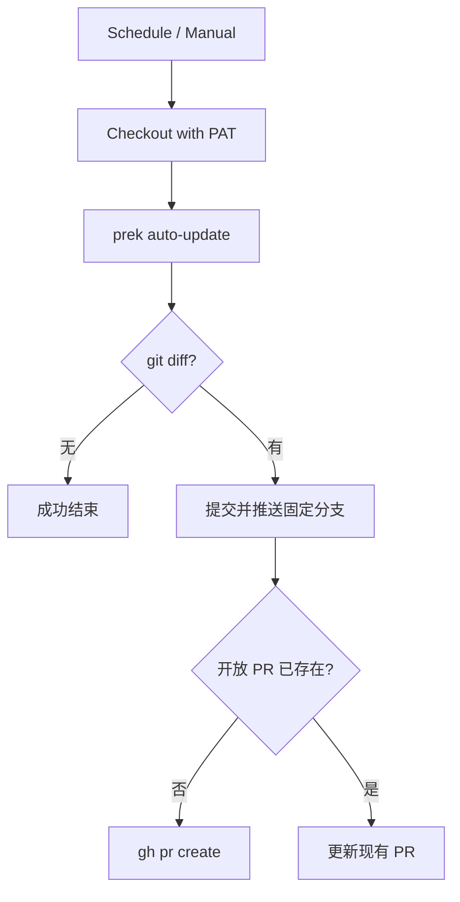

<Callout type="idea" title="工作流定位">

这是“机器人维护依赖”的完整闭环：检测更新、生成差异、推送固定分支，再保证同一时间最多存在一个更新 PR。

</Callout>

## 这个工作流解决什么问题

- 让 pre-commit/prek hooks 定期保持在较新版本。
- 把自动修改隔离在专用分支和审查 PR 中。
- 无可用更新时安静成功，避免无意义提交。
- 通过冷却期降低刚发布版本带来的供应链风险。

## 触发器与权限

<Tabs items={['触发条件', '权限与 Secrets']}>
  <Tab>

| 配置 | 含义 |
| --- | --- |
| `schedule` | 每月 1 日 12:00 UTC 自动运行。 |
| `workflow_dispatch` | 维护者可随时手动检查更新。 |
| `job.if` | 仅 FastAPI 官方仓库运行。 |

  </Tab>
  <Tab>

| 权限或密钥 | 用途 |
| --- | --- |
| `permissions: {}` | 默认 GITHUB_TOKEN 不获得写权限。 |
| `LATEST_CHANGES` | checkout、push 分支和 gh CLI 创建 PR。 |
| `GH_TOKEN` | 供 `gh pr list/create` 使用。 |

  </Tab>
</Tabs>

## 执行流程

<Steps>
  <Step>

### 1. 检出默认分支并准备 Python、uv。

  </Step>
  <Step>

### 2. 运行 `prek auto-update --freeze --cooldown-days 7`。

  </Step>
  <Step>

### 3. 若没有差异则直接结束。

  </Step>
  <Step>

### 4. 将变更提交到固定分支并 force push。

  </Step>
  <Step>

### 5. 查询开放 PR；不存在则创建，已存在则只更新。

  </Step>
</Steps>



## 设计思路

- 固定分支名与 PR 查询共同保证幂等。
- `--freeze` 把 hook 版本解析为不可变 revision，便于复现和审计。
- `--cooldown-days 7` 不追逐刚发布版本，给生态留出观察窗口。
- 在真正写仓库前先判断 diff，减少噪声和 Token 使用。

## 与其他模块的关系

| 模块 | 关系 |
| --- | --- |
| `.pre-commit-config.yaml` | 被自动更新的 hook 版本清单。 |
| `pre-commit.yml` | 在 PR 中实际运行这些 hooks。 |
| `pyproject.toml / uv.lock` | 提供 prek 与维护工具依赖。 |


## 带注释源码

> 原始路径：`.github/workflows/bump-pre-commit-hooks.yml`。以下仅增加学习性注释，不改变触发器、权限、表达式或命令行为。

```yaml title="bump-pre-commit-hooks.yml" lineNumbers
name: Bump pre-commit hooks

# 每月自动检查一次，也允许维护者手动触发。
on:
  schedule:
    - cron: "0 12 1 * *"
  workflow_dispatch:

# 仓库写入通过 LATEST_CHANGES PAT 完成，不扩大默认令牌权限。
permissions: {}

jobs:
  bump-pre-commit-hooks:
    # 该自动维护流程只服务官方模板仓库。
    if: github.repository_owner == 'fastapi'
    runs-on: ubuntu-latest
    timeout-minutes: 10
    steps:
      - name: Dump GitHub context
        env:
          GITHUB_CONTEXT: ${{ toJson(github) }}
        run: echo "$GITHUB_CONTEXT"
      # 使用可推送分支和创建 PR 的专用 Token 检出默认分支。
      - uses: actions/checkout@3d3c42e5aac5ba805825da76410c181273ba90b1 # v7.0.1
        with:
          token: ${{ secrets.LATEST_CHANGES }}
          persist-credentials: true
      - name: Set up Python
        uses: actions/setup-python@5fda3b95a4ea91299a34e894583c3862153e4b97 # v7.0.0
        with:
          python-version-file: ".python-version"
      - name: Setup uv
        uses: astral-sh/setup-uv@c771a70e6277c0a99b617c7a806ffedaca235ff9 # v9.0.0
        with:
          # Before upgrading uv version, make sure astral-sh/setup-uv knows its checksum.
          # See: https://github.com/astral-sh/setup-uv/issues/851#issuecomment-4282017837
          version: "0.11.18"
          cache-dependency-glob: |
            pyproject.toml
            uv.lock
      # --freeze 写入不可变版本，cooldown 避免刚发布版本立即进入模板。
      - name: Bump pre-commit hooks
        run: uv run prek auto-update --freeze --cooldown-days 7
      - name: Create pull request
        env:
          GH_TOKEN: ${{ secrets.LATEST_CHANGES }}
          BASE_BRANCH: ${{ github.event.repository.default_branch }}
        run: |
          set -euo pipefail
          # 无差异时直接成功结束，使定时任务保持幂等。
          if git diff --quiet; then
            echo "No pre-commit hook updates available"
            exit 0
          fi
          git config user.name "github-actions[bot]"
          git config user.email "github-actions[bot]@users.noreply.github.com"
          # 固定分支名让后续运行更新同一个 PR，而不是重复创建。
          branch="bump-pre-commit-hooks"
          git switch -C "$branch"
          git add .pre-commit-config.yaml
          git commit -m "⬆ Bump pre-commit hooks"
          git push --force origin "$branch"
          # 仅在没有开放 PR 时创建；否则只更新远端分支。
          if [ -z "$(gh pr list --head "$branch" --state open --json number --jq '.[].number')" ]; then
            gh pr create \
              --base "$BASE_BRANCH" \
              --head "$branch" \
              --title "⬆ Bump pre-commit hooks" \
              --body "Bump pre-commit hook versions via \`prek auto-update --freeze --cooldown-days 7\`." \
              --label internal \
              --label dependencies \
              --label pre-commit
          else
            echo "PR for \"$branch\" already open; branch updated in place."
          fi
```

## 阅读重点

- 理解 schedule cron 使用 UTC，而不是本地时区。
- 为什么自动更新应创建 PR，而不是直接提交默认分支。
- 为什么 `git switch -C` 与固定分支可以持续刷新同一个 PR。
- PAT 既能 push，又能让后续 CI 被正常触发。

<Callout type="warn" title="维护与安全边界">

- LATEST_CHANGES 是写权限 Secret，应限制仓库范围并启用轮换。
- `git push --force` 只应作用于机器人专用分支。
- 升级 setup-uv 版本前要确认 Action 对目标 uv 版本校验和的支持。

</Callout>
