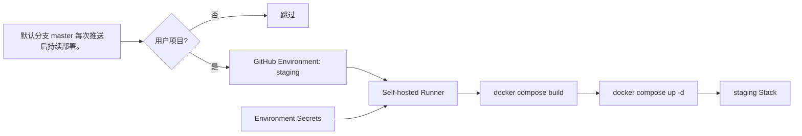

<Callout type="idea" title="工作流定位">

这是 staging 环境的 Compose 部署入口。GitHub Actions 负责选择版本与注入配置，真正构建和启动容器的是带 `staging` 标签的自托管 Runner。

</Callout>

## 这个工作流解决什么问题

- 把代码部署到隔离的 staging 主机。
- 通过 GitHub Environment 管理审批、Secrets 与部署历史。
- 复用仓库 compose.yml，保持本地与服务器编排一致。
- 阻止 FastAPI 官方模板仓库误执行用户项目部署。

## 触发器与权限

<Tabs items={['触发条件', '权限与 Secrets']}>
  <Tab>

| 配置 | 含义 |
| --- | --- |
| `push.master` | 默认分支 master 每次推送后持续部署。 |
| `job.if` | 仅仓库 owner 不是 fastapi 时执行。 |
| `environment` | 绑定 `staging` GitHub Environment。 |

  </Tab>
  <Tab>

| 权限或密钥 | 用途 |
| --- | --- |
| `contents: read` | 检出待部署版本。 |
| `DOMAIN_STAGING` | 生成 DOMAIN 与 FRONTEND_HOST。 |
| `STACK_NAME_STAGING` | 隔离 Compose project name。 |
| `SECRET_KEY / POSTGRES_PASSWORD` | 后端安全与数据库连接。 |
| `SMTP_* / SENTRY_DSN` | 邮件与错误监控，可按项目配置。 |

  </Tab>
</Tabs>

## 执行流程

<Steps>
  <Step>

### 1. 事件触发并通过 owner 条件。

  </Step>
  <Step>

### 2. 进入 `staging` Environment，等待可能的保护审批。

  </Step>
  <Step>

### 3. 调度到带 `staging` 标签的 self-hosted runner。

  </Step>
  <Step>

### 4. 检出代码并注入环境 Secrets。

  </Step>
  <Step>

### 5. 执行 `docker compose build` 构建镜像。

  </Step>
  <Step>

### 6. 执行 `docker compose up -d` 更新后台服务。

  </Step>
</Steps>



## 设计思路

- GitHub Environment 把 staging/production 的 Secret 与审批策略分开。
- Runner 标签承担“部署到哪台机器”的路由职责。
- Compose project name 防止同一主机上的多个栈发生容器和网络命名冲突。
- checkout 禁止持久化凭据，部署任务没有回写 Git 的能力。

## 与其他模块的关系

| 模块 | 关系 |
| --- | --- |
| `compose.yml` | 定义需要构建和启动的完整应用栈。 |
| `backend prestart` | 容器启动过程中完成数据库可用性检查与迁移。 |
| `GitHub Environment` | 保存对应环境的 Secrets、审批规则和部署记录。 |


## 带注释源码

> 原始路径：`.github/workflows/deploy-staging.yml`。以下仅增加学习性注释，不改变触发器、权限、表达式或命令行为。

```yaml title="deploy-staging.yml" lineNumbers
name: Deploy to Staging

# 默认分支 master 每次推送后持续部署。
on:
  push:
    branches:
      - master

# 部署只需读取仓库；环境写入通过 self-hosted runner 上的 Docker 完成。
permissions:
  contents: read

jobs:
  deploy:
    # GitHub Environment 可配置审批、Secret 和部署记录。
    environment: staging
    # Do not deploy in the main repository, only in user projects
    # 官方模板仓库不部署；只让由模板生成的用户项目执行。
    if: github.repository_owner != 'fastapi'
    # 标签把任务路由到对应环境的自托管主机。
    runs-on:
      - self-hosted
      - staging
    # Compose 运行所需配置从 Environment Secrets 注入，不写入仓库。
    env:
      ENVIRONMENT: staging
      DOMAIN: ${{ secrets.DOMAIN_STAGING }}
      FRONTEND_HOST: https://${{ secrets.DOMAIN_STAGING }}
      STACK_NAME: ${{ secrets.STACK_NAME_STAGING }}
      SECRET_KEY: ${{ secrets.SECRET_KEY }}
      FIRST_SUPERUSER: ${{ secrets.FIRST_SUPERUSER }}
      FIRST_SUPERUSER_PASSWORD: ${{ secrets.FIRST_SUPERUSER_PASSWORD }}
      SMTP_HOST: ${{ secrets.SMTP_HOST }}
      SMTP_USER: ${{ secrets.SMTP_USER }}
      SMTP_PASSWORD: ${{ secrets.SMTP_PASSWORD }}
      EMAILS_FROM_EMAIL: ${{ secrets.EMAILS_FROM_EMAIL }}
      POSTGRES_PASSWORD: ${{ secrets.POSTGRES_PASSWORD }}
      SENTRY_DSN: ${{ secrets.SENTRY_DSN }}
    steps:
      # 不保留 Git 凭据，部署阶段不需要回写仓库。
      - name: Checkout
        uses: actions/checkout@3d3c42e5aac5ba805825da76410c181273ba90b1 # v7.0.1
        with:
          persist-credentials: false
      # 先构建最新镜像，再用同一 project name 原地更新服务。
      - run: docker compose -f compose.yml --project-name ${{ secrets.STACK_NAME_STAGING }} build
      - run: docker compose -f compose.yml --project-name ${{ secrets.STACK_NAME_STAGING }} up -d
```

## 阅读重点

- 区分 GitHub Environment、runner label 与应用内 `ENVIRONMENT` 变量。
- 所有 `${{ secrets.* }}` 在 Job 级 env 中集中映射，便于 Compose 统一读取。
- build 与 up 使用相同 compose 文件和 project name。
- 自托管 Runner 是生产基础设施，应视为高信任执行环境。

<Callout type="warn" title="维护与安全边界">

- Environment Secrets 必须按环境隔离，不要让 staging 读取 production 凭据。
- 生产 Environment 建议启用 required reviewers 与分支/标签保护。
- 自托管 Runner 需要及时更新、限制网络权限并清理旧镜像。
- 当前流程没有显式回滚步骤，发布前应确保镜像和数据库迁移具备回退方案。

</Callout>
