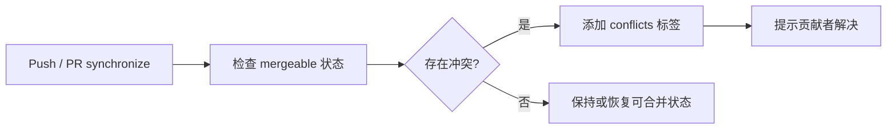

<Callout type="idea" title="工作流定位">

这是 PR 可合并性反馈层。它把 GitHub 的冲突状态转成醒目的标签和评论，让贡献者无需等待维护者人工提醒。

</Callout>

## 这个工作流解决什么问题

- 在目标分支变化后重新评估开放 PR。
- 在 PR 新提交到来时快速反馈冲突。
- 统一使用 `conflicts` 标签供筛选和自动化使用。
- 只授予修改 PR 所需的最小权限。

## 触发器与权限

<Tabs items={['触发条件', '权限与 Secrets']}>
  <Tab>

| 配置 | 含义 |
| --- | --- |
| `push` | 目标分支更新可能让既有 PR 产生或消除冲突。 |
| `pull_request_target.synchronize` | PR head 有新提交时复查。 |

  </Tab>
  <Tab>

| 权限或密钥 | 用途 |
| --- | --- |
| `contents: read` | 读取仓库合并状态所需元数据。 |
| `pull-requests: write` | 添加/移除标签并发表评论。 |
| `GITHUB_TOKEN` | 传给冲突检测 Action 调用 GitHub API。 |

  </Tab>
</Tabs>

## 执行流程

<Steps>
  <Step>

### 1. push 或 PR synchronize 触发。

  </Step>
  <Step>

### 2. Action 枚举并检查 PR mergeable 状态。

  </Step>
  <Step>

### 3. 发现冲突时添加 `conflicts` 标签。

  </Step>
  <Step>

### 4. 首次检测到冲突时写入解决提示。

  </Step>
  <Step>

### 5. 冲突解决后由 Action 更新标签状态。

  </Step>
</Steps>



## 设计思路

- push 触发很重要，因为目标分支变化会影响许多 PR，而这些 PR 本身没有新事件。
- Job 级权限比工作流全局写权限更容易审计。
- 工作流不检出 PR 代码，因此 `pull_request_target` 仅用于目标仓库 API 权限。

## 与其他模块的关系

| 模块 | 关系 |
| --- | --- |
| `labeler.yml` | 维护其他类型的 PR 标签。 |
| `GitHub mergeability` | 提供底层冲突判断。 |
| `branch protection` | 可把冲突解决作为合并前提。 |


## 带注释源码

> 原始路径：`.github/workflows/detect-conflicts.yml`。以下仅增加学习性注释，不改变触发器、权限、表达式或命令行为。

```yaml title="detect-conflicts.yml" lineNumbers
name: "Conflict detector"
# push 可能改变多个 PR 的可合并性；PR 同步时也立即复查。
on:
  push:
  pull_request_target: # zizmor: ignore[dangerous-triggers]
    types: [synchronize]

# 顶层关闭权限，Job 只申请读内容和写 PR 标签/评论。
permissions: {}

jobs:
  main:
    # 权限收窄到唯一需要写入 PR 的 Job。
    permissions:
      contents: read
      pull-requests: write
    runs-on: ubuntu-latest
    timeout-minutes: 5
    steps:
      # 第三方 Action 查询可合并状态并维护 conflicts 标签。
      - name: Check if PRs have merge conflicts
        uses: eps1lon/actions-label-merge-conflict@0273be72a0bbd58fcd71d0d6c02c209b50d1e5e1 # v3.1.0
        with:
          dirtyLabel: "conflicts"
          repoToken: "${{ secrets.GITHUB_TOKEN }}"
          commentOnDirty: "This pull request has a merge conflict that needs to be resolved."
```

## 阅读重点

- 理解“目标分支 push”为什么也需要触发冲突检测。
- `pull_request_target` 与普通 `pull_request` 的权限差异。
- 标签既是 UI 提示，也可以成为其他自动化的输入。

<Callout type="warn" title="维护与安全边界">

- 不要在该高权限事件中运行 PR head 代码。
- 第三方 Action 固定 SHA 仍需定期审查上游版本和权限需求。
- 评论内容应保持简洁，避免每次检查重复刷屏。

</Callout>
