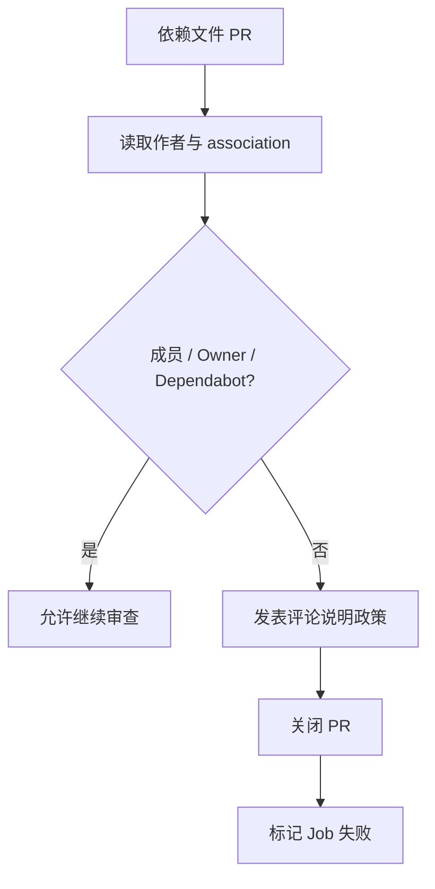

<Callout type="warn" title="工作流定位">

依赖变更会直接改变供应链和运行环境，因此这个工作流在代码审查之前先做“谁有权提出此类修改”的策略检查。

</Callout>

## 这个工作流解决什么问题

- 减少陌生贡献者直接修改核心依赖带来的供应链风险。
- 允许组织成员和 Dependabot 正常提交更新。
- 向被关闭 PR 的作者提供明确替代渠道。
- 仅在依赖文件变化时运行，避免干扰普通贡献。

## 触发器与权限

<Tabs items={['触发条件', '权限与 Secrets']}>
  <Tab>

| 配置 | 含义 |
| --- | --- |
| `pull_request_target` | 在目标仓库权限上下文检查 PR 元数据。 |
| `branches: master` | 只保护进入默认分支的依赖变更。 |
| `paths` | 仅 pyproject.toml 或 uv.lock 变化时触发。 |

  </Tab>
  <Tab>

| 权限或密钥 | 用途 |
| --- | --- |
| `contents: read` | 读取仓库上下文。 |
| `issues: write` | 通过 Issues API 在 PR 下发表评论。 |
| `pull-requests: write` | 关闭未授权 PR。 |
| `GITHUB_TOKEN` | github-script 自动使用当前工作流令牌。 |

  </Tab>
</Tabs>

## 执行流程

<Steps>
  <Step>

### 1. 路径过滤确认 PR 修改了依赖文件。

  </Step>
  <Step>

### 2. 从事件 payload 读取作者和 author_association。

  </Step>
  <Step>

### 3. 检查作者是否为 Dependabot、MEMBER 或 OWNER。

  </Step>
  <Step>

### 4. 允许者记录日志并成功结束。

  </Step>
  <Step>

### 5. 拒绝者收到解释评论，PR 被关闭，Job 标记失败。

  </Step>
</Steps>



## 设计思路

- 路径级触发器把策略精确绑定到高风险文件。
- 基于平台提供的 author_association，而不是信任 PR 内容。
- 拒绝流程先解释再关闭，降低贡献者困惑。
- 没有 checkout 是使用高权限 `pull_request_target` 的核心安全条件。

## 与其他模块的关系

| 模块 | 关系 |
| --- | --- |
| `pyproject.toml` | 声明直接依赖与工具配置。 |
| `uv.lock` | 锁定完整解析结果。 |
| `bump-pre-commit-hooks.yml` | 通过受控机器人 PR 更新 hooks。 |
| `Dependabot` | 允许的自动依赖更新来源。 |


## 带注释源码

> 原始路径：`.github/workflows/guard-dependencies.yml`。以下仅增加学习性注释，不改变触发器、权限、表达式或命令行为。

```yaml title="guard-dependencies.yml" lineNumbers
name: Guard Dependencies

# 仅在依赖清单或锁文件变化时检查作者身份。
on:
  pull_request_target: # zizmor: ignore[dangerous-triggers] -- This workflow only reads context.payload metadata, never checks out PR code
    branches: [master]
    paths:
      - pyproject.toml
      - uv.lock

# 工作流可能评论并关闭 PR，因此显式声明所需写权限。
permissions:
  contents: read
  issues: write
  pull-requests: write

jobs:
  check-author:
    runs-on: ubuntu-latest
    steps:
      # github-script 只读取事件 payload，不 checkout 或执行 PR 中的代码。
      - name: Check if author is org member or allowed bot
        uses: actions/github-script@3a2844b7e9c422d3c10d287c895573f7108da1b3 # v9.0.0
        with:
          script: |
            const pr = context.payload.pull_request;
            const author = pr.user.login;
            const assoc = pr.author_association;

            // 允许可信依赖机器人绕过组织成员限制。
            const botAllowlist = new Set(['dependabot[bot]']);
            const orgAuthorAssociations = new Set(['MEMBER', 'OWNER']);

            // GitHub author_association 是目标仓库给出的作者关系。
            const allowed =
              botAllowlist.has(author) ||
              (assoc != null && orgAuthorAssociations.has(assoc));

            // 未授权时先解释原因，再关闭 PR 并让 Job 失败。
            if (!allowed) {
              await github.rest.issues.createComment({
                owner: context.repo.owner,
                repo: context.repo.repo,
                issue_number: context.payload.pull_request.number,
                body: `This PR modifies dependency files (\`pyproject.toml\` or \`uv.lock\`), which is restricted to members of the **${context.repo.owner}** organization on GitHub.\n\nIf you need a dependency change, please [open a discussion](https://github.com/${context.repo.owner}/${context.repo.repo}/discussions/new) describing what you need and why.\n\nClosing this PR automatically.`
              });

              await github.rest.pulls.update({
                owner: context.repo.owner,
                repo: context.repo.repo,
                pull_number: context.payload.pull_request.number,
                state: 'closed'
              });

              core.setFailed('Dependency changes are restricted to organization members.');
            } else {
              console.log(`Author ${author} (author_association=${assoc}) is allowed to make dependency changes.`);
            }
```

## 阅读重点

- `author_association` 反映作者与仓库的关系，而非组织登录声明。
- Allowlist 应尽可能短，并只接受明确可信机器人。
- `core.setFailed` 让策略结果在 Checks 中可见。
- 评论和关闭分别需要 issues 与 pull-requests 写权限。

<Callout type="warn" title="维护与安全边界">

- 绝不能把 PR head checkout 或执行到这个高权限 Job 中。
- 若增加新依赖机器人，应先确认其身份字符串与安全模型。
- 该策略是权限守卫，不替代依赖审计、锁文件校验和人工 Review。

</Callout>
