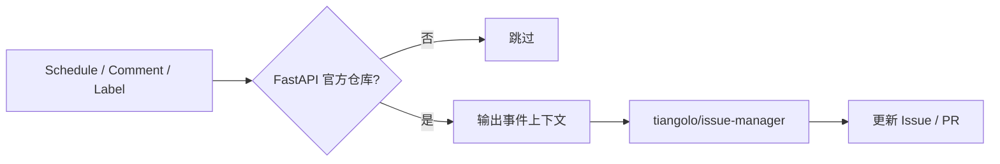

<Callout type="idea" title="工作流定位">

这是社区运维自动化入口。具体规则由 Issue Manager Action 实现，工作流负责选择事件、权限和适用仓库。

</Callout>

## 这个工作流解决什么问题

- 自动执行基于评论和标签的维护动作。
- 通过每日定时任务处理需要时间判断的规则。
- 同时覆盖 Issue 与 PR。
- 将社区规则限定在 FastAPI 官方仓库。

## 触发器与权限

<Tabs items={['触发条件', '权限与 Secrets']}>
  <Tab>

| 配置 | 含义 |
| --- | --- |
| `schedule` | 每天 17:21 UTC 执行定时维护。 |
| `issue_comment.created` | 新评论可能包含命令或状态信号。 |
| `issues.labeled` | Issue 标签变化触发规则。 |
| `pull_request_target.labeled` | PR 标签变化触发规则。 |
| `workflow_dispatch` | 维护者可手动执行。 |

  </Tab>
  <Tab>

| 权限或密钥 | 用途 |
| --- | --- |
| `permissions: {}` | 禁用无关默认权限。 |
| `issues: write` | 评论、关闭或更新 Issue。 |
| `pull-requests: write` | 管理 PR 状态和标签。 |
| `GITHUB_TOKEN` | 调用目标仓库 API。 |

  </Tab>
</Tabs>

## 执行流程

<Steps>
  <Step>

### 1. 事件进入并检查仓库 owner。

  </Step>
  <Step>

### 2. 输出 GitHub context 便于排查规则输入。

  </Step>
  <Step>

### 3. Issue Manager 读取事件与仓库配置。

  </Step>
  <Step>

### 4. 根据评论、标签或时间条件执行维护动作。

  </Step>
  <Step>

### 5. GitHub API 保存最终状态。

  </Step>
</Steps>



## 设计思路

- 把复杂社区规则封装在专用 Action，工作流保持简短。
- 多种事件复用同一 Job，避免规则分散。
- 定时触发允许处理“若干天无响应”这类没有即时事件的策略。

## 与其他模块的关系

| 模块 | 关系 |
| --- | --- |
| `labeler.yml` | 为 Issue Manager 提供稳定分类标签。 |
| `add-to-project.yml` | 把工作项送入项目看板。 |
| `GitHub Issues/PRs` | 被自动管理的对象。 |


## 带注释源码

> 原始路径：`.github/workflows/issue-manager.yml`。以下仅增加学习性注释，不改变触发器、权限、表达式或命令行为。

```yaml title="issue-manager.yml" lineNumbers
name: Issue Manager

# 同时响应定时维护、评论和标签事件，也支持手动运行。
on:
  schedule:
    - cron: "21 17 * * *"
  issue_comment:
    types:
      - created
  issues:
    types:
      - labeled
  pull_request_target: # zizmor: ignore[dangerous-triggers]
    types:
      - labeled
  workflow_dispatch:

# 顶层关闭权限，唯一 Job 只申请 Issue/PR 写权限。
permissions: {}

jobs:
  issue-manager:
    # 这些社区管理规则只适用于官方仓库。
    if: github.repository_owner == 'fastapi'
    runs-on: ubuntu-latest
    timeout-minutes: 5
    permissions:
      issues: write
      pull-requests: write
    steps:
      - name: Dump GitHub context
        env:
          GITHUB_CONTEXT: ${{ toJson(github) }}
        run: echo "$GITHUB_CONTEXT"
      # 固定版本的 Issue Manager 根据仓库配置执行维护策略。
      - uses: tiangolo/issue-manager@dc846170c36eb62fb434b3d943b36399fe240fb5 # 0.8.1
        with:
          token: ${{ secrets.GITHUB_TOKEN }}
```

## 阅读重点

- schedule 使用 UTC，实际执行时间可能有少量排队延迟。
- Issue 评论事件与标签事件提供不同 payload，Action 需要自行分支处理。
- owner 条件防止模板派生项目继承 FastAPI 社区规则。

<Callout type="warn" title="维护与安全边界">

- 输出完整 GitHub context 时要确认其中不包含不应公开的敏感数据。
- 第三方 Action 拥有 Issue/PR 写权限，升级前应审查变更。
- 自动关闭或回复规则应提供清晰、友好的恢复路径。

</Callout>
