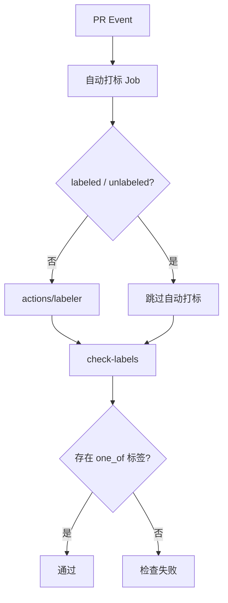

<Callout type="idea" title="工作流定位">

这个工作流分成“自动推断标签”和“验证分类完整性”两个阶段，使发布说明、筛选和审查流程都能依赖稳定标签。

</Callout>

## 这个工作流解决什么问题

- 根据 PR 改动自动补充标签。
- 人工增删标签后立即重新检查。
- 要求每个 PR 至少属于一个明确变更类别。
- 把自动写标签与只读验证权限分离。

## 触发器与权限

<Tabs items={['触发条件', '权限与 Secrets']}>
  <Tab>

| 配置 | 含义 |
| --- | --- |
| `pull_request_target.opened` | PR 创建时自动分类。 |
| `synchronize / reopened` | 代码更新或重新打开后重算。 |
| `labeled / unlabeled` | 人工标签变化后只做完整性检查。 |

  </Tab>
  <Tab>

| 权限或密钥 | 用途 |
| --- | --- |
| `labeler: contents read` | 读取改动路径和仓库标签配置。 |
| `labeler: pull-requests write` | 向 PR 添加标签。 |
| `check-labels: pull-requests read` | 验证现有标签，不修改。 |
| `GITHUB_TOKEN` | 两个 Action 调用 GitHub API。 |

  </Tab>
</Tabs>

## 执行流程

<Steps>
  <Step>

### 1. PR 事件触发 labeler Job。

  </Step>
  <Step>

### 2. 若事件不是手动标签变化，则按规则添加标签。

  </Step>
  <Step>

### 3. labeler Job 完成后启动 check-labels。

  </Step>
  <Step>

### 4. 检查是否至少存在一个允许的类别标签。

  </Step>
  <Step>

### 5. 缺少类别时让检查失败，提示维护者补充。

  </Step>
</Steps>



## 设计思路

- `needs: labeler` 保证检查发生在自动标签应用之后。
- 对 labeled/unlabeled 跳过 labeler 可避免工作流因自己写标签而循环。
- `one_of` 把发布分类规则编码为机器可验证门禁。
- 两个 Job 使用不同权限，贯彻最小授权。

## 与其他模块的关系

| 模块 | 关系 |
| --- | --- |
| `.github/labeler.yml` | 定义文件路径到标签的映射规则。 |
| `latest-changes.yml` | 可能依据 PR 标签生成变更记录。 |
| `issue-manager.yml` | 使用标签驱动社区维护规则。 |


## 带注释源码

> 原始路径：`.github/workflows/labeler.yml`。以下仅增加学习性注释，不改变触发器、权限、表达式或命令行为。

```yaml title="labeler.yml" lineNumbers
name: Labels
# PR 内容变化时自动打标签；人工标签变化时只重新检查标签集合。
on:
  pull_request_target: # zizmor: ignore[dangerous-triggers]
    types:
      - opened
      - synchronize
      - reopened
      # For label-checker
      - labeled
      - unlabeled

# 两个 Job 分别申请写标签和只读检查权限。
permissions: {}

jobs:
  labeler:
    # 第一阶段根据文件路径等规则添加标签。
    permissions:
      contents: read
      pull-requests: write
    runs-on: ubuntu-latest
    timeout-minutes: 5
    steps:
    - # labeled/unlabeled 事件无需再次执行自动打标，避免自触发循环。
      uses: actions/labeler@bf12e9b00b37c5c0ca2b87b79b2daf7891dbda13 # v7.0.0
      if: ${{ github.event.action != 'labeled' && github.event.action != 'unlabeled' }}
    - run: echo "Done adding labels"
  # Run this after labeler applied labels
  check-labels:
    # 第二阶段在自动打标完成后验证至少存在一个发布分类标签。
    needs:
      - labeler
    permissions:
      pull-requests: read
    runs-on: ubuntu-latest
    timeout-minutes: 5
    steps:
      # one_of 列表定义可接受的变更类别。
      - uses: agilepathway/label-checker@c3d16ad512e7cea5961df85ff2486bb774caf3c5 # v1.6.65
        with:
          one_of: breaking,security,feature,bug,refactor,upgrade,docs,lang-all,internal
          repo_token: ${{ secrets.GITHUB_TOKEN }}
```

## 阅读重点

- 区分“路径标签”与“发布类别标签”。
- `needs` 不只控制顺序，也会传播上游失败状态。
- 标签列表包含 breaking、security、feature、bug 等语义类别。

<Callout type="warn" title="维护与安全边界">

- `pull_request_target` 下不要运行 PR 提供的代码。
- 修改 one_of 列表时要同步发布说明和仓库标签体系。
- 自动标签配置发生变化后，应测试 opened、synchronize 和人工改标签三类事件。

</Callout>
