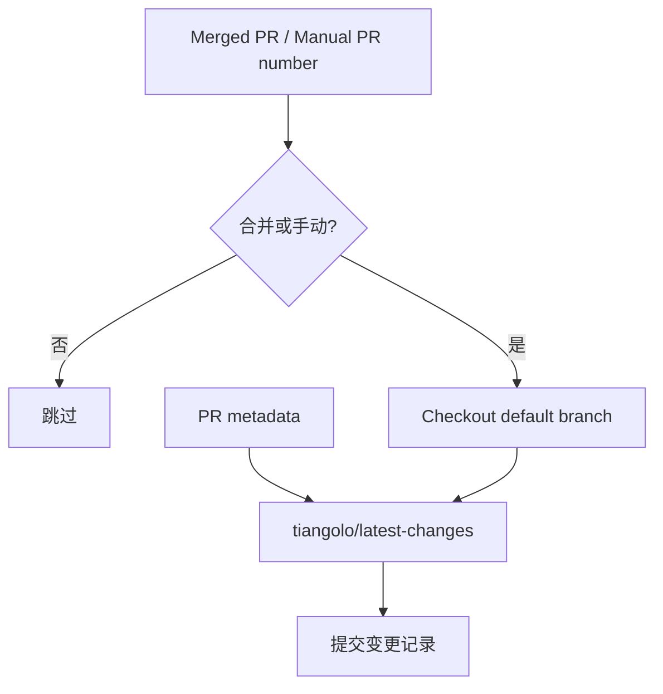

<Callout type="idea" title="工作流定位">

这是“合并完成后的文档维护”工作流。它不构建应用，而是把 PR 编号、标题、作者和标签等信息转成可发布的变更记录。

</Callout>

## 这个工作流解决什么问题

- 自动把已合并 PR 写入最新变更记录。
- 允许维护者按 PR 编号手动补跑。
- 始终基于默认分支生成和提交文件。
- 将写分支能力隔离到专用 Token。

## 触发器与权限

<Tabs items={['触发条件', '权限与 Secrets']}>
  <Tab>

| 配置 | 含义 |
| --- | --- |
| `pull_request_target.closed` | master 上 PR 关闭后触发。 |
| `job.if merged` | 自动事件仅处理已合并 PR，忽略普通关闭。 |
| `workflow_dispatch.number` | 手动指定需要补录的 PR 编号。 |
| `debug_enabled` | 当前 YAML 声明了输入，但步骤尚未使用。 |

  </Tab>
  <Tab>

| 权限或密钥 | 用途 |
| --- | --- |
| `pull-requests: read` | 读取 PR 标题、作者、标签等元数据。 |
| `LATEST_CHANGES` | 检出并向默认分支提交生成结果。 |
| `GITHUB_TOKEN` | 供 latest-changes Action 读取 GitHub API。 |

  </Tab>
</Tabs>

## 执行流程

<Steps>
  <Step>

### 1. PR 合并或维护者手动触发。

  </Step>
  <Step>

### 2. 条件判断过滤未合并的 closed 事件。

  </Step>
  <Step>

### 3. 输出事件上下文辅助诊断。

  </Step>
  <Step>

### 4. 用写权限 Token 检出默认分支。

  </Step>
  <Step>

### 5. latest-changes 生成条目并提交更新。

  </Step>
</Steps>



## 设计思路

- 自动和手动入口复用同一生成逻辑，便于补救失败任务。
- checkout 明确指定默认分支，避免在临时 merge ref 上提交。
- 把读取 PR 的 GITHUB_TOKEN 与写分支的 PAT 分开。
- 条件写在 Job 级，未合并 PR 不消耗 Runner 步骤。

## 与其他模块的关系

| 模块 | 关系 |
| --- | --- |
| `release-notes.mdx` | 解释项目发布与变更记录。 |
| `labeler.yml` | 提供变更类别标签。 |
| `add_latest_release_date.py` | 在发布阶段补充版本日期。 |


## 带注释源码

> 原始路径：`.github/workflows/latest-changes.yml`。以下仅增加学习性注释，不改变触发器、权限、表达式或命令行为。

```yaml title="latest-changes.yml" lineNumbers
name: Latest Changes

# 合并 PR 后自动记录变更，也允许输入 PR 编号手动补跑。
on:
  pull_request_target: # zizmor: ignore[dangerous-triggers]
    branches:
      - master
    types:
      - closed
  workflow_dispatch:
    inputs:
      number:
        description: PR number
        required: true
      debug_enabled:
        description: "Run the build with tmate debugging enabled (https://github.com/marketplace/actions/debugging-with-tmate)"
        required: false
        default: "false"

# 默认令牌只读 PR；写默认分支使用专用 LATEST_CHANGES Token。
permissions: {}

jobs:
  latest-changes:
    runs-on: ubuntu-latest
    timeout-minutes: 5
    permissions:
      pull-requests: read
    # 自动事件只处理真正已合并的 PR；手动事件始终允许。
    if: github.event_name == 'workflow_dispatch' || github.event.pull_request.merged == true
    steps:
      - name: Dump GitHub context
        env:
          GITHUB_CONTEXT: ${{ toJson(github) }}
        run: echo "$GITHUB_CONTEXT"
      # 始终检出默认分支，而不是 PR head。
      - uses: actions/checkout@3d3c42e5aac5ba805825da76410c181273ba90b1 # v7.0.1
        with:
          ref: ${{ github.event.repository.default_branch }}
          # To allow latest-changes to commit to the default branch
          token: ${{ secrets.LATEST_CHANGES }} # zizmor: ignore[secrets-outside-env]
          # latest-changes Action 需要使用检出时保存的凭据提交结果。
          persist-credentials: true # required by tiangolo/latest-changes
      # 根据 PR 元数据生成并提交最新变更条目。
      - uses: tiangolo/latest-changes@8a940392f4c65274539453a5d5a76d9550203ac1 # 0.7.1
        with:
          token: ${{ secrets.GITHUB_TOKEN }}
          debug_logs: true
```

## 阅读重点

- closed 不等于 merged，因此必须检查 `pull_request.merged`。
- 手动触发的 payload 与 PR 事件不同，Action 需要使用输入 number。
- `persist-credentials: true` 是后续 Action 能提交的前提。

<Callout type="warn" title="维护与安全边界">

- LATEST_CHANGES 可写默认分支，应限制仓库和权限范围。
- 高权限触发器中只检出默认分支，不要改为 PR head。
- 当前 `debug_enabled` 输入未接入任何调试步骤，维护时应删除或真正实现，避免误导。

</Callout>
