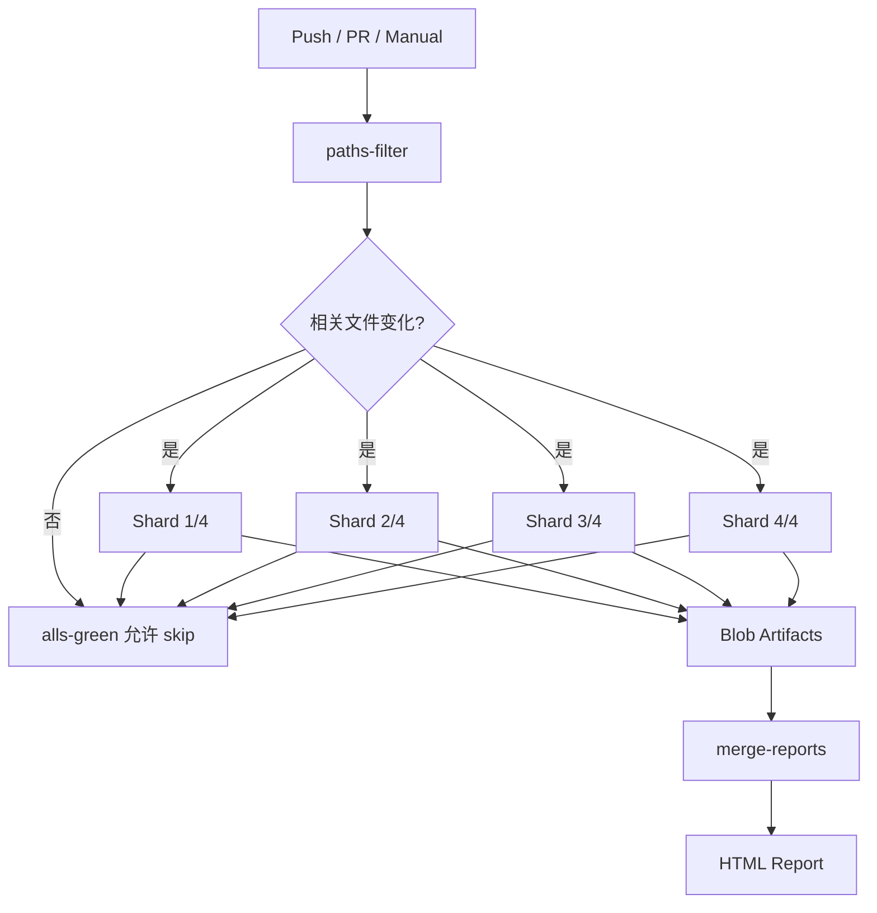

<Callout type="idea" title="工作流定位">

这是最完整的全栈质量门禁：它会准备后端与前端依赖、重新生成 API 客户端、构建 Compose 环境，再用真实浏览器验证用户流程。

</Callout>

## 这个工作流解决什么问题

- 无相关代码变化时跳过昂贵 E2E。
- 用 4 个 shard 并行缩短浏览器测试时间。
- 失败时保留 trace 和统一 HTML 报告。
- 提供受控的手动 tmate 调试入口。
- 给 branch protection 暴露稳定聚合检查。

## 触发器与权限

<Tabs items={['触发条件', '权限与 Secrets']}>
  <Tab>

| 配置 | 含义 |
| --- | --- |
| `push.master` | 默认分支更新后回归。 |
| `pull_request` | 所有 PR 进行路径判断。 |
| `workflow_dispatch` | 手动运行，可选择开启 tmate。 |
| `paths-filter` | 仅后端、前端、Compose、env 或本工作流变化时测试。 |

  </Tab>
  <Tab>

| 权限或密钥 | 用途 |
| --- | --- |
| `contents: read` | 检出代码。 |
| `debug_enabled` | 仅手动输入为 true 时开启调试会话。 |
| `Artifacts` | 上传每片 blob 与合并后的 HTML 报告。 |
| `tmate actor limit` | 只允许触发者访问调试会话。 |

  </Tab>
</Tabs>

## 执行流程

<Steps>
  <Step>

### 1. changes Job 计算相关路径是否变化。

  </Step>
  <Step>

### 2. 相关时启动 4 个并行 test-playwright shard。

  </Step>
  <Step>

### 3. 安装 Bun、Python、uv 和项目依赖，生成 API 客户端。

  </Step>
  <Step>

### 4. 构建并清理 Compose 环境，容器中运行对应 shard。

  </Step>
  <Step>

### 5. 每个 shard 上传 blob report。

  </Step>
  <Step>

### 6. merge Job 下载并合并所有 blob 为 HTML。

  </Step>
  <Step>

### 7. alls-green 聚合结果供分支保护使用。

  </Step>
</Steps>



## 设计思路

- 先做路径过滤，把昂贵 E2E 留给真正影响全栈行为的变化。
- 矩阵 shard 和 `fail-fast: false` 同时提高速度与失败诊断完整性。
- blob report 适合跨 Runner 合并，最终只生成一份 HTML。
- `if: !cancelled()` 让失败测试仍然上传证据，但用户取消时停止后处理。
- 聚合 Job 解决矩阵 Job 名变化与条件跳过对 branch protection 的影响。

## 与其他模块的关系

| 模块 | 关系 |
| --- | --- |
| `frontend/tests` | Playwright 测试用例、认证 setup 与工具函数。 |
| `frontend/playwright.config.ts` | 定义浏览器项目、baseURL、报告器和 setup dependency。 |
| `scripts/generate-client.sh` | 测试前同步 OpenAPI 客户端。 |
| `compose.yml` | 提供被测全栈与 Playwright 容器。 |

## 三阶段产物模型

| 阶段 | 输入 | 输出 |
| --- | --- | --- |
| changes | Git diff / PR 文件 | `changed=true|false` |
| test-playwright | 源码、依赖、Compose 环境 | 4 份 `blob-report-*` |
| merge-playwright-reports | 所有 blob artifacts | 单一 `html-report--attempt-*` |

## 带注释源码

> 原始路径：`.github/workflows/playwright.yml`。以下仅增加学习性注释，不改变触发器、权限、表达式或命令行为。

```yaml title="playwright.yml" lineNumbers
name: Playwright Tests

# 默认分支、PR 和手动调试三种入口。
on:
  push:
    branches:
    - master
  pull_request:
  workflow_dispatch:
    inputs:
      debug_enabled:
        description: 'Run the build with tmate debugging enabled (https://github.com/marketplace/actions/debugging-with-tmate)'
        required: false
        default: 'false'

permissions:
  contents: read

jobs:
  changes:
    # 第一阶段只判断是否存在会影响端到端行为的文件变化。
    runs-on: ubuntu-latest
    timeout-minutes: 5
    # Set job outputs to values from filter step
    # 把路径过滤结果暴露给后续 Job。
    outputs:
      changed: ${{ steps.filter.outputs.changed }}
    steps:
    - uses: actions/checkout@3d3c42e5aac5ba805825da76410c181273ba90b1 # v7.0.1
      with:
        fetch-depth: 2
        persist-credentials: false
    # For pull requests it's not necessary to checkout the code but for the main branch it is
    - uses: dorny/paths-filter@7b450fff21473bca461d4b92ce414b9d0420d706 # v4.0.2
      id: filter
      with:
        filters: |
          changed:
            - backend/**
            - frontend/**
            - .env
            - compose*.yml
            - .github/workflows/playwright.yml

  test-playwright:
    # 第二阶段将 E2E 套件拆成 4 个并行 shard。
    needs:
      - changes
    if: ${{ needs.changes.outputs.changed == 'true' }}
    timeout-minutes: 15
    runs-on: ubuntu-latest
    # fail-fast 关闭后，一个 shard 失败不会取消其他 shard 和报告。
    strategy:
      matrix:
        shardIndex: [1, 2, 3, 4]
        shardTotal: [4]
      fail-fast: false
    steps:
    - uses: actions/checkout@3d3c42e5aac5ba805825da76410c181273ba90b1 # v7.0.1
      with:
        persist-credentials: false
    - uses: oven-sh/setup-bun@0c5077e51419868618aeaa5fe8019c62421857d6 # v2.2.0
      with:
        bun-version: 1.3.12
    - uses: actions/setup-python@5fda3b95a4ea91299a34e894583c3862153e4b97 # v7.0.0
      with:
        python-version-file: .python-version
    # 仅手动显式开启时提供临时 SSH 调试会话。
    - name: Setup tmate session
      uses: mxschmitt/action-tmate@35b54afac29c97fb54faba5b513f8fbd1882f113 # v3.24
      if: ${{ github.event_name == 'workflow_dispatch' && github.event.inputs.debug_enabled == 'true' }}
      with:
        limit-access-to-actor: true
    - name: Install uv
      uses: astral-sh/setup-uv@c771a70e6277c0a99b617c7a806ffedaca235ff9 # v9.0.0
      with:
        # Before upgrading uv version, make sure astral-sh/setup-uv knows its checksum.
        # See: https://github.com/astral-sh/setup-uv/issues/851#issuecomment-4282017837
        version: "0.11.18"
    - run: uv sync
      working-directory: backend
    - run: bun ci
      working-directory: frontend
    # 测试前从后端 OpenAPI 重新生成前端客户端，防止契约漂移。
    - run: bash scripts/generate-client.sh
    - run: docker compose build
    - run: docker compose down -v --remove-orphans
    # 容器化运行，保留失败 trace，并把用例按矩阵编号分片。
    - name: Run Playwright tests
      run: docker compose run --rm playwright bunx playwright test --fail-on-flaky-tests --trace=retain-on-failure --shard=${{ matrix.shardIndex }}/${{ matrix.shardTotal }}
    - run: docker compose down -v --remove-orphans
    # 每个 shard 上传机器可合并的 blob，而不是各自生成最终 HTML。
    - name: Upload blob report to GitHub Actions Artifacts
      if: ${{ !cancelled() }}
      uses: actions/upload-artifact@043fb46d1a93c77aae656e7c1c64a875d1fc6a0a # v7.0.1
      with:
        name: blob-report-${{ matrix.shardIndex }}
        path: frontend/blob-report
        include-hidden-files: true
        retention-days: 1

  merge-playwright-reports:
    # 第三阶段无论部分 shard 是否失败，都尽量合并诊断报告。
    needs:
      - test-playwright
      - changes
    # Merge reports after playwright-tests, even if some shards have failed
    if: ${{ !cancelled() && needs.changes.outputs.changed == 'true' }}
    runs-on: ubuntu-latest
    timeout-minutes: 5
    steps:
    - uses: actions/checkout@3d3c42e5aac5ba805825da76410c181273ba90b1 # v7.0.1
      with:
        persist-credentials: false
    - uses: oven-sh/setup-bun@0c5077e51419868618aeaa5fe8019c62421857d6 # v2.2.0
      with:
        bun-version: 1.3.12
    - name: Install dependencies
      run: bun ci
    - name: Download blob reports from GitHub Actions Artifacts
      uses: actions/download-artifact@3e5f45b2cfb9172054b4087a40e8e0b5a5461e7c # v8.0.1
      with:
        path: frontend/all-blob-reports
        pattern: blob-report-*
        merge-multiple: true
    # 下载所有 blob 后生成单一 HTML 报告。
    - name: Merge into HTML Report
      run: bunx playwright merge-reports --reporter html ./all-blob-reports
      working-directory: frontend
    - name: Upload HTML report
      uses: actions/upload-artifact@043fb46d1a93c77aae656e7c1c64a875d1fc6a0a # v7.0.1
      with:
        name: html-report--attempt-${{ github.run_attempt }}
        path: frontend/playwright-report
        retention-days: 30
        include-hidden-files: true

  # https://github.com/marketplace/actions/alls-green#why
  # 稳定聚合 Job 名可用于 branch protection，即使路径过滤导致测试跳过。
  alls-green-playwright:  # This job does nothing and is only used for the branch protection
    if: always()
    needs:
      - test-playwright
    runs-on: ubuntu-latest
    timeout-minutes: 5
    steps:
      - name: Decide whether the needed jobs succeeded or failed
        uses: re-actors/alls-green@05ac9388f0aebcb5727afa17fcccfecd6f8ec5fe # v1.2.2
        with:
          jobs: ${{ toJSON(needs) }}
          allowed-skips: test-playwright
```

## 阅读重点

- `needs.changes.outputs.changed` 是跨 Job 输出传递。
- `--shard=1/4` 等分测试文件，不是浏览器内部并发参数。
- `trace=retain-on-failure` 在成功时节省空间，失败时保留重放证据。
- merge Job 的 working-directory 与 artifact 下载路径必须匹配。
- `allowed-skips` 让无相关变化成为合法结果。

<Callout type="warn" title="维护与安全边界">

- tmate 提供交互式 Runner 访问，只能在手动触发且限制到 actor 时使用。
- 路径过滤列表漏项会导致必要 E2E 被跳过，修改架构时要同步维护。
- 每个 shard 都会构建环境，需关注 CI 时间和缓存策略。
- 第三方 Actions 与运行时版本应固定并定期升级。

</Callout>
