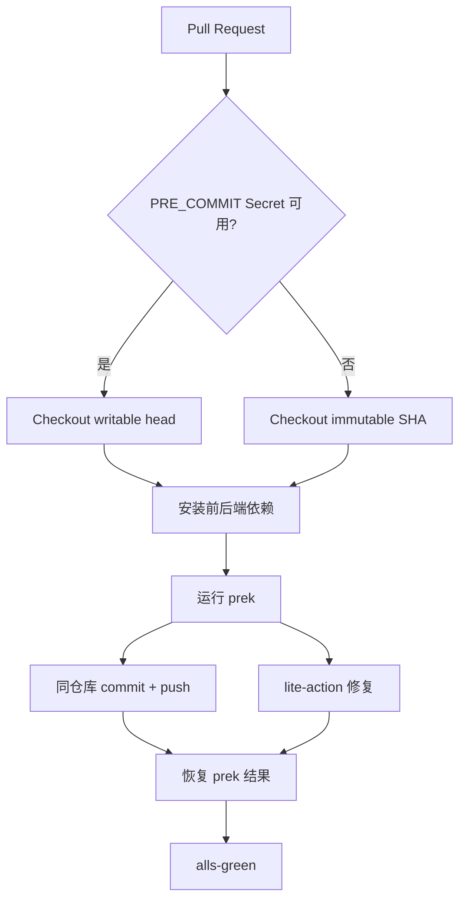

<Callout type="warn" title="工作流定位">

这个工作流既是静态质量检查，也是自动修复器。最关键的设计是区分同仓库 PR 与 Fork PR，避免把写权限 Secret 暴露给不可信代码。

</Callout>

## 这个工作流解决什么问题

- 对 PR 差异运行统一 pre-commit/prek hooks。
- 同仓库分支自动提交 formatter 修复。
- Fork PR 在无 Secret 条件下安全运行。
- 最终仍以原始 hook 结果决定检查是否通过。
- 向 branch protection 提供稳定聚合状态。

## 触发器与权限

<Tabs items={['触发条件', '权限与 Secrets']}>
  <Tab>

| 配置 | 含义 |
| --- | --- |
| `pull_request` | 每个 PR 运行。 |
| `HAS_SECRETS=true` | 同仓库或可信上下文，可使用 PRE_COMMIT PAT。 |
| `HAS_SECRETS=false` | Fork/Dependabot，无 Secret，只读执行。 |

  </Tab>
  <Tab>

| 权限或密钥 | 用途 |
| --- | --- |
| `contents: read` | 默认只读仓库。 |
| `PRE_COMMIT` | 同仓库 PR 检出真实分支并 push 自动修复。 |
| `persist-credentials=true` | 仅可写分支保留 Git 凭据。 |
| `fork checkout` | 固定到 PR head SHA 且不保留凭据。 |

  </Tab>
</Tabs>

## 执行流程

<Steps>
  <Step>

### 1. 根据 PRE_COMMIT Secret 是否存在选择 checkout 路径。

  </Step>
  <Step>

### 2. 安装 Bun、Python、uv 与前后端依赖。

  </Step>
  <Step>

### 3. 运行 `prek` 检查 base 到 HEAD 的差异。

  </Step>
  <Step>

### 4. 暂存失败结果并继续执行修复分支。

  </Step>
  <Step>

### 5. 同仓库直接 commit/push；Fork 使用 lite-action。

  </Step>
  <Step>

### 6. 若原始检查失败，最后显式退出 1。

  </Step>
  <Step>

### 7. 聚合 Job 汇总结果。

  </Step>
</Steps>



## 设计思路

- Secret 是否存在是区分可信可写路径和不可信只读路径的天然信号。
- `continue-on-error` 不是忽略错误，而是为自动修复步骤保留执行机会。
- 最后显式根据 `steps.precommit.outcome` 失败，确保质量门禁语义不丢失。
- 完整 Git 历史用于准确计算 base 与 head 之间的差异。
- 后端与前端依赖都安装，因为 hooks 可能调用跨语言工具。

## 与其他模块的关系

| 模块 | 关系 |
| --- | --- |
| `.pre-commit-config.yaml` | 定义需要运行的 hooks。 |
| `bump-pre-commit-hooks.yml` | 自动更新 hook revisions。 |
| `pyproject.toml / biome config` | 后端与前端格式化、lint 规则来源。 |
| `branch protection` | 依赖固定的 pre-commit-alls-green 检查名。 |


## 带注释源码

> 原始路径：`.github/workflows/pre-commit.yml`。以下仅增加学习性注释，不改变触发器、权限、表达式或命令行为。

```yaml title="pre-commit.yml" lineNumbers
name: pre-commit

on:
  pull_request:
permissions:
  contents: read

# Fork 和 Dependabot 无法读取 PRE_COMMIT Secret，借此选择安全分支。
env:
  # Forks and Dependabot don't have access to secrets
  HAS_SECRETS: ${{ secrets.PRE_COMMIT != '' }}

jobs:
  pre-commit:
    # 主 Job 运行 hooks，并在权限允许时自动提交修复。
    runs-on: ubuntu-latest
    timeout-minutes: 5
    steps:
      - name: Dump GitHub context
        env:
          GITHUB_CONTEXT: ${{ toJson(github) }}
        run: echo "$GITHUB_CONTEXT"
      - uses: actions/checkout@3d3c42e5aac5ba805825da76410c181273ba90b1 # v7.0.1
        name: Checkout PR for own repo
        # 同仓库分支可使用 PAT 检出真实 head 并回推修复。
        if: env.HAS_SECRETS == 'true'
        with:
          # To be able to commit it needs to fetch the head of the branch, not the
          # merge commit
          ref: ${{ github.head_ref }}
          # And it needs the full history to be able to compute diffs
          fetch-depth: 0
          # A token other than the default GITHUB_TOKEN is needed to be able to trigger CI
          token: ${{ secrets.PRE_COMMIT }} # zizmor: ignore[secrets-outside-env]
          persist-credentials: true # Required for `git push` command
      # pre-commit lite ci needs the default checkout configs to work
      - uses: actions/checkout@3d3c42e5aac5ba805825da76410c181273ba90b1 # v7.0.1
        name: Checkout PR for fork
        # Fork 只能检出不可写 SHA，且禁止保存凭据。
        if: env.HAS_SECRETS == 'false'
        with:
        # To be able to commit it needs the head branch of the PR, the remote one
          ref: ${{ github.event.pull_request.head.sha }}
          fetch-depth: 0
          persist-credentials: false
      - uses: oven-sh/setup-bun@0c5077e51419868618aeaa5fe8019c62421857d6 # v2.2.0
        with:
          bun-version: 1.3.12
      - name: Set up Python
        uses: actions/setup-python@5fda3b95a4ea91299a34e894583c3862153e4b97 # v7.0.0
        with:
          python-version-file: .python-version
      - name: Setup uv
        uses: astral-sh/setup-uv@c771a70e6277c0a99b617c7a806ffedaca235ff9 # v9.0.0
        with:
          # Before upgrading uv version, make sure astral-sh/setup-uv knows its checksum.
          # See: https://github.com/astral-sh/setup-uv/issues/851#issuecomment-4282017837
          version: "0.11.18"
          cache-dependency-glob: |
            requirements**.txt
            pyproject.toml
            uv.lock
      - name: Install backend dependencies
        run: uv sync --all-packages
      - name: Install frontend dependencies
        run: bun ci
      # 只检查 base..HEAD 差异；先记录失败，允许后续自动修复。
      - name: Run prek - pre-commit
        id: precommit
        run: uv run prek run --from-ref origin/${GITHUB_BASE_REF} --to-ref HEAD --show-diff-on-failure
        continue-on-error: true
      # 仅同仓库 PR 能直接把 formatter 结果推回作者分支。
      - name: Commit and push changes
        if: env.HAS_SECRETS == 'true'
        run: |
          git config user.name "github-actions[bot]"
          git config user.email "github-actions[bot]@users.noreply.github.com"
          git add -A
          if git diff --staged --quiet; then
            echo "No changes to commit"
          else
            git commit -m "🎨 Auto format and update with pre-commit"
            git push
          fi
      # Fork 没有写 Token，改由 lite-action 提供安全修复机制。
      - uses: pre-commit-ci/lite-action@5d6cc0eb514c891a40562a58a8e71576c5c7fb43 # v1.1.0
        if: env.HAS_SECRETS == 'false'
        with:
          msg: 🎨 Auto format and update with pre-commit
      # 自动修复步骤执行完后，再恢复原始失败状态作为质量门禁。
      - name: Error out on pre-commit errors
        if: steps.precommit.outcome == 'failure'
        run: exit 1

  # https://github.com/marketplace/actions/alls-green#why
  # 聚合 Job 名固定，便于 branch protection 配置。
  pre-commit-alls-green:  # This job does nothing and is only used for the branch protection
    if: always()
    needs:
      - pre-commit
    runs-on: ubuntu-latest
    timeout-minutes: 5
    steps:
      - name: Dump GitHub context
        env:
          GITHUB_CONTEXT: ${{ toJson(github) }}
        run: echo "$GITHUB_CONTEXT"
      - name: Decide whether the needed jobs succeeded or failed
        uses: re-actors/alls-green@05ac9388f0aebcb5727afa17fcccfecd6f8ec5fe # v1.2.2
        with:
          jobs: ${{ toJSON(needs) }}
```

## 阅读重点

- 为何同仓库 checkout 使用 `github.head_ref`，Fork 使用不可写 SHA。
- 为什么默认 GITHUB_TOKEN 不能替代 PAT 触发后续 CI。
- `git diff --staged --quiet` 防止创建空提交。
- `continue-on-error` 与最终恢复失败结果的配合。

<Callout type="warn" title="维护与安全边界">

- 不要让 Fork PR 访问 PRE_COMMIT 或其他写权限 Secret。
- 可写 checkout 只应指向作者分支，不应执行未经审查的任意部署操作。
- 自动格式化 commit 可能再次触发 CI，应确保工作流幂等。
- 升级 hooks 或工具链后应检查 5 分钟 timeout 是否仍合理。

</Callout>
