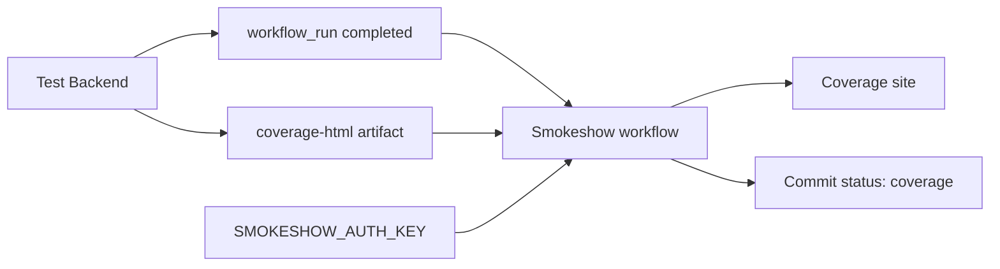

<Callout type="warn" title="工作流定位">

这是典型的“两阶段权限提升”设计：测试 Job 在低权限 PR 环境生成 artifact，后续 workflow_run Job 再使用 Secret 发布报告。

</Callout>

## 这个工作流解决什么问题

- 把 HTML coverage 发布为可访问页面。
- 在 commit/PR 上写入覆盖率状态。
- 设置 90% 覆盖率阈值。
- 将上传 Secret 与执行 PR 测试代码分离。

## 触发器与权限

<Tabs items={['触发条件', '权限与 Secrets']}>
  <Tab>

| 配置 | 含义 |
| --- | --- |
| `workflow_run` | 名为 Test Backend 的工作流完成后触发。 |
| `types: completed` | 无论上游成功或失败都进入；后续步骤依赖 artifact 是否存在。 |

  </Tab>
  <Tab>

| 权限或密钥 | 用途 |
| --- | --- |
| `actions: read` | 跨 workflow run 下载 artifact。 |
| `contents: read` | 检出可信默认分支工具配置。 |
| `statuses: write` | 向上游 head SHA 写 coverage status。 |
| `SMOKESHOW_AUTH_KEY` | 认证覆盖率托管服务。 |
| `GITHUB_TOKEN` | 下载 artifact 与写状态。 |

  </Tab>
</Tabs>

## 执行流程

<Steps>
  <Step>

### 1. Test Backend 生成 coverage-html artifact。

  </Step>
  <Step>

### 2. workflow_run 触发独立 Smokeshow Job。

  </Step>
  <Step>

### 3. 准备 Python、uv 和 GitHub Actions 依赖组。

  </Step>
  <Step>

### 4. 使用上游 run-id 下载覆盖率目录。

  </Step>
  <Step>

### 5. 上传 HTML 并计算覆盖率百分比。

  </Step>
  <Step>

### 6. 把 coverage 状态写回上游 head SHA。

  </Step>
</Steps>



## 设计思路

- 把 PR 代码执行与 Secret 使用放在不同工作流，降低 Secret 泄露风险。
- `run-id` 将下载目标绑定到触发本次任务的上游执行。
- `head_sha` 确保状态写到真正被测试的提交。
- 只安装 github-actions 依赖组，减少后处理环境。

## 与其他模块的关系

| 模块 | 关系 |
| --- | --- |
| `test-backend.yml` | 生成 backend/htmlcov 并上传 coverage-html。 |
| `coverage.py` | 计算覆盖率数据与 HTML。 |
| `GitHub commit status` | 向 PR 展示 coverage 结果。 |


## 带注释源码

> 原始路径：`.github/workflows/smokeshow.yml`。以下仅增加学习性注释，不改变触发器、权限、表达式或命令行为。

```yaml title="smokeshow.yml" lineNumbers
name: Smokeshow

# 在 Test Backend 完成后运行，用独立权限阶段发布覆盖率。
on:
  workflow_run: # zizmor: ignore[dangerous-triggers]
    workflows: [Test Backend]
    types: [completed]

# 顶层无权限，Job 仅获取 artifact、读取代码并写 commit status。
permissions: {}

jobs:
  smokeshow:
    # workflow_run Job 处理上游产物，不执行 PR head 中的代码。
    runs-on: ubuntu-latest
    timeout-minutes: 5
    permissions:
      actions: read
      contents: read
      statuses: write

    steps:
      - uses: actions/checkout@3d3c42e5aac5ba805825da76410c181273ba90b1 # v7.0.1
        with:
          persist-credentials: false
      - uses: actions/setup-python@5fda3b95a4ea91299a34e894583c3862153e4b97 # v7.0.0
        with:
          python-version-file: .python-version
      - name: Setup uv
        uses: astral-sh/setup-uv@c771a70e6277c0a99b617c7a806ffedaca235ff9 # v9.0.0
        with:
          # Before upgrading uv version, make sure astral-sh/setup-uv knows its checksum.
          # See: https://github.com/astral-sh/setup-uv/issues/851#issuecomment-4282017837
          version: "0.11.18"
          cache-dependency-glob: |
            pyproject.toml
            uv.lock
      - run: uv sync --all-packages --no-dev --group github-actions
      # 通过上游 run-id 精确下载同一次测试生成的 coverage-html。
      - uses: actions/download-artifact@3e5f45b2cfb9172054b4087a40e8e0b5a5461e7c # v8.0.1
        with:
          name: coverage-html
          path: backend/htmlcov
          github-token: ${{ secrets.GITHUB_TOKEN }}
          run-id: ${{ github.event.workflow_run.id }}
      # 上传静态覆盖率站点，并把状态写回上游 head SHA。
      - run: uv run smokeshow upload backend/htmlcov
        env:
          SMOKESHOW_GITHUB_STATUS_DESCRIPTION: Coverage {coverage-percentage}
          SMOKESHOW_GITHUB_COVERAGE_THRESHOLD: 90
          SMOKESHOW_GITHUB_CONTEXT: coverage
          SMOKESHOW_GITHUB_TOKEN: ${{ secrets.GITHUB_TOKEN }}
          SMOKESHOW_GITHUB_PR_HEAD_SHA: ${{ github.event.workflow_run.head_sha }}
          SMOKESHOW_AUTH_KEY: ${{ secrets.SMOKESHOW_AUTH_KEY }} # zizmor: ignore[secrets-outside-env]
```

## 阅读重点

- `workflow_run` 的事件上下文与普通 PR 事件不同。
- 下载 artifact 需要 actions: read 和正确 run-id。
- 覆盖率阈值既在 Smokeshow 环境变量中，也在后端测试工作流中本地校验。

<Callout type="warn" title="维护与安全边界">

- 高权限 workflow_run 不应 checkout 或执行上游 PR head 代码。
- 应验证下载 artifact 的来源工作流和名称，避免处理非预期产物。
- SMOKESHOW_AUTH_KEY 应只用于报告上传，并限制可访问项目。
- 若上游在生成 artifact 前失败，本工作流可能因找不到产物而失败。

</Callout>
